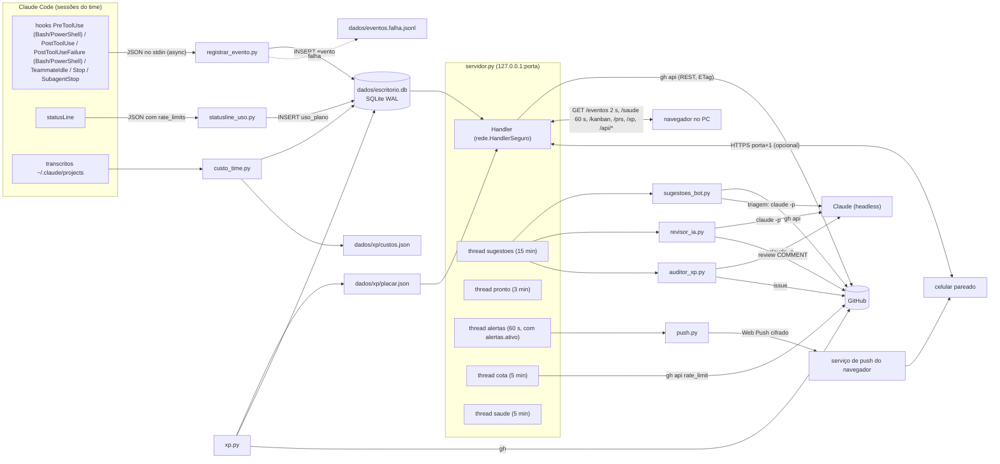
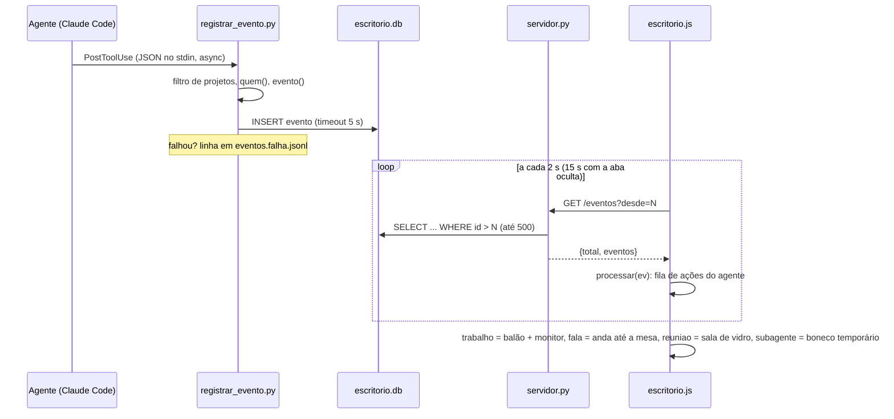
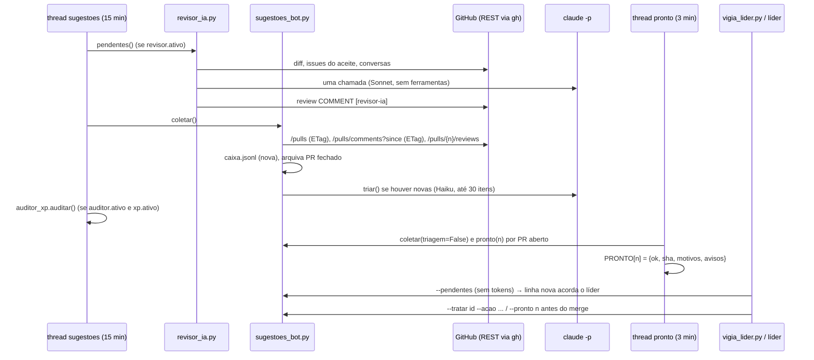
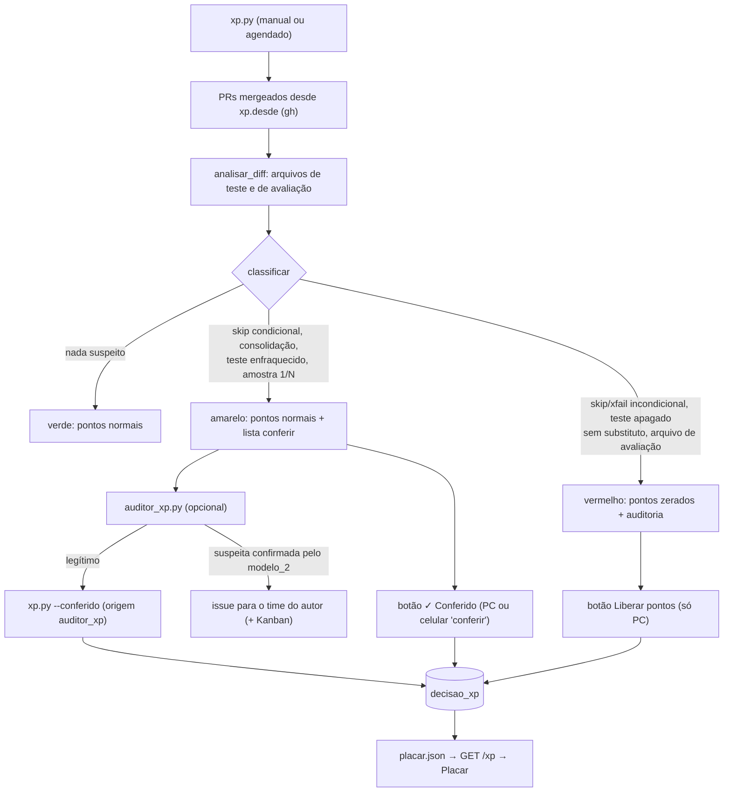

# Documento de Projeto de Software (SDD) — Office Multi-provider

Resultados por tentativa: tabela privada `execucao_resultado` no banco de tarefas,
criada por Controle, grava equipe e tipo (despacho/retomada) junto do início da
medição. Resultado final enumerado, imutável/idempotente, exige retorno registrado
compatível; ausência permanece desconhecida. Despacho registra falha do console,
sem entrega, revisão aprovada/desativada/reprovada ou bloqueio nos gates depois
do retorno. Exceção sem retorno não inventa resultado; erro secundário de gravação
não substitui exceção original. Históricos anteriores não são preenchidos.
Gestão agrega por equipe/console/modelo configurado/modo, com contadores de tipos,
resultados e cobertura ausente; junta consumo por tentativa como antes, sem IDs
privados na API. Leitura só leitura, filtros/limites semanais preservados. Resultado
encaminhado não comprova merge/aceite; retomada não mede retrabalho ou qualidade.

Consulta Codex isolada: `revisores_console.resposta_codex` usa o contrato comum
`Retorno` para sessão/turno, recusa segunda sessão/conclusão e eventos posteriores.
Itens têm identidade/tipo estáveis e conclusão única; mensagens não vazias e
raciocínio são os únicos tipos aceitos. Ferramentas inclusive item.updated,
eventos desconhecidos/erros, turno sem início e itens abertos bloqueiam a decisão.
Aplicado a todos os chamadores da consulta isolada (revisão, CEO/diretor, auditor,
triagem), sem alterar flags/autenticação ou execução normal. Testes ampliados
e prova Codex nativa com diff sintético e contadores registrados; diversidade
cloud e aceite de código real continuam gates separados.

Preparação Windows: `preparar_maquina.ps1` e `.bat` funcionam antes do Python.
Planejam componentes ausentes por console escolhido; WinGet instala Python/Git/
GitHub CLI/Node/Claude e Node executa npm-cli.js para os outros consoles.
Não atualizam componentes existentes nem executam login/inferência. Aplicação
exige confirmar hash do plano revalidado; bloqueia versões antigas, gerenciador
ausente, links/junções e pasta ocupada sem marcador próprio. Cache/tmp próprios,
PATH do usuário registrado ao concluir, backup local e interrupção sem rollback
de software em falha. Flags: -Consoles, -PastaFerramentas, -Aplicar, -Confirmacao,
-Interativo. Detalhes e fontes oficiais em INSTALACAO.md. Oito testes em PowerShell
Windows com gerenciadores simulados passaram; instalação real em máquina limpa
não foi comprovada. Nenhum modelo local é baixado. O bootstrap Python abaixo
continua apenas diagnosticando; o preparador de máquina é uma etapa separada.

Consumo por tentativa: `tentativa_consumo` opcional do launcher/executor local
é fornecido pelo despacho/retomada após `iniciar_execucao`. `Registro` grava a
tabela privada `consumo_tentativa` (chave PK, projeto, tentativa) no ledger de
consumo separado, na mesma transação dos contadores; valida identidade, recusa
reatribuir outra tentativa ou histórico sem vínculo. Índice por projeto/tentativa.
Snapshots Claude e deltas Codex mantêm saldos/transações existentes. Plugin externo
OpenCode e consultas isoladas não recebem tentativa. Não altera o banco legado.

`resumos_tentativas` lê vínculos de até mil IDs em lote, sem criar banco/tabela,
filtrando a mesma identidade de projeto e janela móvel de sete dias para tokens
e tarifas. Preços usam os mesmos critérios de `precos_tokens.equivalente`; erro
de catálogo conserva contadores. `gestao_painel.consumo_desempenho` retira IDs
internos, acrescenta cobertura/totais/equivalente teórico nos grupos configurados
de duração e detalhamento dos modelos observados na última tentativa. Ledger
inválido não oculta duração/tarefas. Data de início seleciona tentativas e data
de registro seleciona amostras; execuções longas/cumulativas podem ter cobertura
parcial. Não calcula qualidade, aceite ou eficiência, nem integra cobrança real.

Diagnóstico do bootstrap: diagnostico_instalacao.verificar valida política e
consulta Python atual, importações sqlite3/ssl, PATH de git/gh/consoles e bind
temporário da porta. Consoles obrigatórios derivam de CEO/diretor/equipes/rotas
e revisores ativos; Ollama somente se execução local escolhida. Não expõe caminhos
de executáveis nem lê credenciais; comando_nativo verifica resolução do adapter
sem executar CLI. Reporta links oficiais e limites de versão/login/capacidades/
cloud não verificados. --exigir-requisitos retorna 3 antes de qualquer aplicação
se requisito obrigatório falta. Sem flag, pode preparar configuração e informar
pendências. Não há instalação automática de pré-requisitos e disponibilidade é
snapshot sujeito a mudança. Testar_diagnostico_instalacao.py cobre seleção,
revisores, shim/local/porta e bloqueio sem gravação; bootstrap conserva repetição.

Atividade dos despachos: `atividade_execucao.Acompanhamento` cria tabela local
atividade_execucao no banco de tarefas (execucao PK, controlador UUID privado,
pid_controlador, pid_console opcional, ultimo_sinal, estado, codigo_console).
Contexto único por tentativa sem retorno, insert transacional sem substituição.
Thread de 15 s escreve sinal e poll do objeto Popen vinculado pelo callback
ao_processo do launcher; local encaminha o mesmo callback. Saída/interrupção
registra encerrado/interrompido, sem concluir tarefa ou liberar ocupação. Erro de
persistência bloqueia retorno normal; callback inválido recolhe processo lançado.
Projeção não expõe PID/UUID, só timestamp/estado/console_observado/codigo_console.
Até 60 s é sinal recente, não progresso/aceite nem prova sobre descendentes.
Alerta sem_retorno não dispara enquanto há processo principal observado recente;
sinal antigo pede conferência, não declara morte. Testar_atividade_execucao.py
usa Python/Popen/SQLite reais e adapters com comandos substituídos, sem cloud.

Projeção operacional adicional em GET /api/gestao: `saude_tarefas` contém
consultadas, limitado, contagens e pendencias da reserva atual por repositório.
`gestao_painel.saude_tarefas` lê até 201 reservas para exibir 200 e reconhecer
cobertura parcial, sem janela semanal; correlaciona a última medição pelo token
da reserva, sem expor token, sessão ou pacote. Estados bloqueado/sem retorno/
falha/sem medição são sinais registrados, não prova de processo vivo ou morto.
Não modifica SQLite, reservas ou GitHub. Testes: testar_saude_tarefas.py (SQLite
real) e testar_gestao_saude.mjs (renderização do módulo real com DOM simulado).

`alertas_projetos.fontes` acrescenta fonte local `tarefas` via saude_projeto,
somente leitura, sem consultas a skills/modelos. Detector tarefa_pendente tem
base/deduplicação por projeto/repo e fingerprint opaco da reserva/tentativa.
Bloqueio/falha avisam quando novos; sem retorno/medição só após 1800 s. Primeira
leitura não avisa; erro preserva base; limitado não apaga registros não observados.
É tipo de rotina com preferências existentes; não altera limites de push.
URL /#alerta=gestao&projeto=ID_HEX_20 abre/foca Gestão via eventos da página.
Só aceita ID opaco, sem caminho ou comando. Teste testar_alertas_tarefas.py usa
fonte/SQLite/fila reais e não entrega push; teste do painel cobre navegação.

| Item | Valor |
|---|---|
| Produto | Office Multi-provider, nova linha independente; mantém os contratos do núcleo Claude Office 3D |
| Versão descrita | 2.0.0-dev (arquivo `VERSION`; edição em `EDICAO.json`) |
| Linguagens | Python 3.9+ (só biblioteca padrão; `cryptography` opcional), JavaScript (módulos ES, three.js 0.160.0) |
| Fontes deste documento | o código do repositório e `README.md`, `INSTALACAO.md`, `CHANGELOG.md`, `config.exemplo.json` |

Convenção: cada afirmação cita o arquivo (e, quando ajuda, a função) de onde foi tirada. A seção 13 diz como este
documento é mantido em dia com o código (`ferramentas/verificar_docs.py`, no CI).

---

## 1. Introdução

### 1.1 Propósito

O Office Multi-provider é um escritório em 3D, aberto no navegador, com gestão por projeto e adapters
Claude, Codex, OpenCode e Gemini. O núcleo Claude preservado mostra eventos nativos: cada agente tem uma mesa,
o monitor acende quando ele usa uma ferramenta, ele anda até a mesa do colega
quando manda mensagem, o time vai para a sala de vidro nas reuniões e quem fica ocioso vai para as áreas de pausa
(`README.md`, `docs/CLAUDE-COMPATIBILIDADE.md` §1). Em volta dessa visualização o pacote oferece painéis opcionais ligados ao GitHub
(Kanban, PRs), um placar cooperativo de XP com auditoria anti-trapaça nos testes, a caixa de sugestões dos bots de
revisão, um revisor de código próprio, alertas com Web Push, medição de custo e do uso do plano.

Capacidades variam por console. Teams, hooks, permissões e ativação de skills nativos
não têm paridade integral comprovada. Gestão usa .office/projeto.json, Kanban canônico,
reservas e adapters comuns; consultas cloud positivas nesta máquina ainda estão
limitadas às provas Codex registradas. Seções de serviços globais descrevem o caminho
compatível quando não há gestão ativa. Não se aplicam automaticamente a cada projeto.
Os contratos específicos estão nas subseções por projeto e em GESTAO/PROVIDERS/VERSOES.

### 1.2 Escopo

Dentro do escopo (tudo roda na máquina do usuário, servidor em `127.0.0.1` — `servidor.py`, `HOST`):

- coleta de eventos das sessões do Claude Code por hook (`registrar_evento.py`);
- servidor HTTP local e página 3D (`servidor.py`, `index.html`, `escritorio.js` e módulos);
- integrações opcionais com o GitHub pelo `gh` (Kanban, PRs, sugestões, XP, auditor, revisor);
- chamadas opcionais a `claude -p` sem ferramentas (triagem, revisor, auditor);
- acesso opcional pelo celular na rede local (HTTPS com CA própria) e alertas Web Push;
- instalador, desinstalador, verificação e empacotamento.
- política por projeto, seleção de CEO/diretor/equipes/especialistas, despacho comum,
  consultas isoladas multi-provider, consumo, recuperação de acompanhamento e
  sugestões/XP/alertas/pareceres consultivos vinculados ao projeto.

O escritório não executa merge. A política escolhe manual/automático por projeto;
o GitHub e seus checks/proteções executam o auto-merge quando habilitado. O projeto de validação
tem auto-merge autorizado e exceção merge-manual; adoção da nova gestão nesse jogo
continua pendente, sem alterar seu workflow existente.
Fora do escopo do serviço: mexer no
Firewall (`docs/CLAUDE-COMPATIBILIDADE.md` §9, "o escritório nunca mexe nele") e expor o servidor à internet (`docs/CLAUDE-COMPATIBILIDADE.md` §9, "Fora
de casa: Tailscale").

### 1.3 Público

Desenvolvedores que mantêm o pacote, quem integra o escritório aos consoles suportados e revisores de
segurança.

### 1.4 Glossário

| Termo | Significado no projeto |
|---|---|
| Agente | Pessoa virtual do time definida em `agentes` do `config.json` (nome, título, função, cor, mesa) — `configuracao.py`, `normalizar_agente` |
| Líder | Agente com `"lider": true` (senão o primeiro da lista); a sessão principal do Claude Code, sem nome de colega, cai na mesa dele (`configuracao.lider`, `registrar_evento.quem`) |
| Colega | Membro de um *agent team* do Claude Code; o hook o identifica por `teammate_name`/`agent_name` ou pelo id `nome@time` (`registrar_evento.quem`) |
| Subagente | Agente criado por `Task`/`Agent`; sem nome do time vira "Assistente", "Explorador", "Planejador"… por ~20 s (`registrar_evento.APELIDOS`, `escritorio.js` `TEMPO_SUBAGENTE`) |
| Outra sessão | Mensagem vinda de outra janela do Claude Code (endereços `uds:`/`bridge:`/pipe) — `registrar_evento.normalizar` |
| Auxiliar | Agente com `"auxiliar": true`, não vai às reuniões (`escritorio.js` `FORA_DA_REUNIAO`) |
| Diretoria | Sala fechada própria para o agente com `"sala": "diretoria"` (`escritorio.js` `construirDiretoria`) |
| Evento | Linha da tabela `evento` com `tipo` `trabalho`, `fala`, `reuniao`, `subagente` ou `ocioso` (`registrar_evento.py`) |
| Cartão | Item (issue) do GitHub Projects mostrado no Kanban (`servidor._ler_kanban_rest`, `kanban.js`) |
| Placar | Painel de XP e níveis do time, cooperativo, sem medalhas (`placar.js`, `xp.py`) |
| Faixa verde / amarela / vermelha | Classificação anti-trapaça de cada PR: verde pontua normal; amarela ("para conferir") pontua normal e vai à lista `conferir`; vermelha ("auditoria") zera os pontos (`xp.py`, docstring e `classificar`) |
| Conferido / Liberado | Decisão humana (ou do auditor, só para amarelo) que tira um PR da lista amarela / vermelha (`xp.py --conferido/--liberar`, tabela `decisao_xp`) |
| Sugestão | Comentário de bot de revisão coletado na caixa local, com situação `nova → triada → encaminhada/ignorada/discutir → resolvida` (`sugestoes_bot.py`, `SITUACOES`) |
| Triagem | Chamada barata opcional de `claude -p` que sugere corrigir/ignorar/discutir para cada sugestão nova (`sugestoes_bot.triar`) |
| Revisor-ia | Revisor de código próprio que comenta no PR com a marca `[revisor-ia]` (`revisor_ia.py`) |
| Pronto (`--pronto`) | Verificação de que nenhum bot/sugestão ainda segura o merge do PR no commit atual (`sugestoes_bot.pronto`) |
| Vigia | `vigia_lider.py`: laço sem tokens que acorda o líder só quando há saída nova; também o vigia da cota (`cota.Vigia`) |
| Aparelho pareado | Celular com sessão própria criada por QR code de uso único (`rede.py`) |
| Uso do plano | Percentual da janela de 5 h e da semana lido da statusline (`statusline_uso.py`, tabela `uso_plano`) |
| Acumulado | Custo total que só cresce, guardado no SQLite (`banco.acumulado`) |

---

## 2. Visão geral da arquitetura

O sistema é um conjunto de scripts Python que se comunicam por **arquivos locais** (principalmente o SQLite
`dados/escritorio.db`) e um **servidor HTTP** que serve a página e as APIs. Não há processo central além do servidor:
o hook e a statusline são processos curtos chamados pelo Claude Code; `xp.py`, `custo_time.py`, `skills.py` e
`vigia_lider.py` rodam por linha de comando (o servidor dispara alguns deles em segundo plano).



Princípios que aparecem em todo o código:

- **Nunca atrapalhar o agente**: o hook sai com código 0 e sem saída em qualquer erro (`registrar_evento.main`); a
  statusline "nunca falha" (`statusline_uso.py`).
- **Threads de fundo nunca derrubam o servidor**: cada laço captura exceções e só registra no console
  (`servidor.pronto_laco`, `sugestoes_laco`, `revisor_rodada`; `alertas.Alertas.laco`).
- **Cota do GitHub mínima**: REST com `ETag` (304 não conta), caches por `sha` e validades longas (`servidor.py`
  `PRS_VALIDADE`, `KANBAN_VALIDADE`; `sugestoes_bot.gh_api`).
- **Tokens só onde valem**: triagem, revisor e auditor são opcionais e usam `claude -p` sem ferramentas
  (`--tools ""`, `--strict-mcp-config`, `--no-session-persistence`).

---

## 3. Componentes

### 3.1 `configuracao.py` — configuração

- **Responsabilidade**: ler `config.json` (ou o caminho de `OFFICE_CONFIG`), mesclar com `PADRAO` e corrigir tipos sem
  nunca levantar exceção (`normalizar`, `carregar`). Arquivo ausente ou inválido = configuração padrão.
- **Normalizadores por bloco**: `normalizar_agente`, `normalizar_xp`, `normalizar_sugestoes`, `normalizar_vigia`,
  `normalizar_revisor`, `normalizar_auditor`, `normalizar_alertas`, `normalizar_grafo`, `normalizar_praticas` (só
  booleanos; o resto vira o padrão).
- **Utilidades**: `lider(cfg)`, `chave(nome)` (minúsculas; `-` e espaço → `_`), `localizar_gh()` (PATH e caminhos padrão no
  Windows/macOS/Linux), `pasta_dentro(cwd, pastas)` (comparação sem diferenciar maiúsculas, `\` = `/`).
- **Constantes**: `VERSAO_THREE = "0.160.0"`, `TEMAS`, `MODOS_APELIDO`, `TIPOS_MESA`, `PALETA`, `AGENTES_PADRAO`
  (Líder, Dev, Designer, Pesquisa), pesos e níveis de XP, modelos padrão (`SUGESTOES_MODELO`/`AUDITOR_MODELO`
  `claude-haiku-5-5`, `REVISOR_MODELO` `claude-sonnet-5-5`).
- **CLI**: `python configuracao.py --porta` (usado pelos atalhos `reiniciar_escritorio`); sem argumento (ou com qualquer
  outro) imprime a configuração normalizada.
- O servidor relê o arquivo quando o `mtime` muda (`servidor.cfg`); a porta só muda reiniciando.

### 3.2 `registrar_evento.py` — hook do Claude Code

- **Entrada**: JSON do hook no stdin (`hook_event_name`, `tool_name`, `tool_input`, `cwd`, `agent_id`, `teammate_name`,
  `transcript_path`, `session_id`…).
- **Filtro**: só registra se `cwd` estiver dentro de `projetos` (lista vazia = todas as sessões) — `main`.
- **Identificação de quem** (`quem`, do mais confiável ao heurístico): variável `OFFICE_AGENTE`; `teammate_name` ou
  `agent_name`; `agent_id` no formato `nome@time`; `name`/descrição no `subagents/agent-<id>.meta.json` ao lado do
  transcrito (`nome_do_meta`); `agent_type` igual a um agente do config; senão apelido do tipo de subagente; sem nada
  disso, o líder. Sufixos numéricos (`Dev_235`, `Dev_66b`) são removidos (`SUFIXO_NUMERO`).
- **Classificação** (`evento`): `TeammateIdle`/`Stop`/`SubagentStop` → `ocioso`; `SendMessage` → `fala` ou `reuniao`
  (destino `*`, vários destinos ou palavra de `palavras_reuniao` — `chama_reuniao`); `Agent`/`Task` → `subagente`;
  demais ferramentas → `trabalho` com `resumo` (até 90 caracteres) e `detalhe` (até 400). A ferramenta Skill vira
  "usa a skill <nome>" (`resumo_de`).
- **Sucesso/falha dos comandos** (`resultado_de`, só Bash/PowerShell): o sucesso chega no `PostToolUse` com `stdout`/`stderr`
  e sem `exit_code` → `ok: true`; a falha só chega no `PostToolUseFailure` (campo `error` "Exit code N") → `ok: false`,
  `codigo` N e `erro` (1ª linha, até 120 caracteres; nada da saída do comando). Também aceita `exit_code`/`exitCode`/
  `returncode`/`returnCode` inteiros, `interrupted: true` (→ `ok: false`, "interrompido") e a resposta em texto
  "Error: Exit code N". Em segundo plano (`run_in_background`) o `PostToolUse` chega no início: sem resultado. Sem nada
  disso o evento não leva `ok` (neutro). `tool_input` que não é objeto não quebra.
- **Saída**: `banco.gravar_evento` (timeout de 5 s); se falhar, uma linha em `dados/eventos.falha.jsonl`.
- **Execução**: instalado com `"async": true` e `timeout: 5` (`instalar.bloco_hooks`), então não trava a ferramenta.
- **Outros harnesses**: `emit_evento.py` (`--evento` JSON ou stdin; `--banco`) valida o evento neutro (mesmo esquema e
  tetos, mais `"fonte"`: `opencode`, `claude`, `manual`) e grava pelo `banco.ESQUEMA`; banco falhando cai na fila (código 0),
  entrada inválida sai com 2. `opencode/office.js` (plugin do OpenCode, `opencode/LEIAME.md`) traduz
  `tool.execute.before` do `bash` em `trabalho` com `inicio` e `tool.execute.after` em `trabalho` (sem `ok`; a tool
  `skill` vira ferramenta `Skill`, que o `contar-uso` conta), configurado por ambiente (`OFFICE_EMIT`, `OFFICE_AGENTE`,
  `OFFICE_PROJETOS`, `OFFICE_PYTHON`). `importar_opencode.py` (`[--projeto P] [--aplicar] [--forcar]
  [--opus ID] [--sonnet ID] [--haiku ID] [--modo M]`) converte `.claude/agents/*.md` em `.opencode/agents/*.md`,
  garante `instructions` com `CLAUDE.md` e a cópia do plugin em `.opencode/plugins/office.js` (com backup do
  `opencode.json`) e confere as `skills/`.

### 3.3 `banco.py` — banco SQLite local

- **Responsabilidade**: guardar o que precisa persistir sem depender dos transcritos nem de JSON reescrito por vários
  processos (docstring). Arquivo `dados/escritorio.db`, `PRAGMA journal_mode=WAL` (`conectar`).
- **Funções**: eventos (`gravar_evento`, `ler_eventos`, `eventos_periodo` — replay por período, paginado por id —,
  `eventos_da_ferramenta`); custo (`gravar_sessao`,
  `gravar_revisao`, `acumulado`, `gravar_dia`, `sessoes_fechadas`); XP (`decisoes`, `decidir`, `desfazer`,
  `auditados`, `gravar_auditoria`); uso do plano (`gravar_uso`, `uso_resumo`, `_consumo_por_dia`).
- **Migrações automáticas** (seção 4.3): `_arquivo`, `_migrar_eventos`, `_migrar_xp`.
- **CLI**: `python banco.py` imprime o acumulado e os últimos 14 dias de `custo_diario` (`main`).

### 3.4 `servidor.py` — servidor HTTP e orquestração

- **Responsabilidade**: servir a página e as APIs (seção 5.1), manter caches do GitHub e rodar as threads de fundo.
- **Classes/funções principais**: `Handler` (estende `rede.HandlerSeguro`), `Cache` (resultado do `gh` com validade,
  renovação em segundo plano e espera de até 90 s na primeira leitura), `_ler_prs`, `_ler_kanban_rest` (com reserva
  `_ler_kanban_graphql`), `acao_xp`, `sugestoes_get`, `sugestoes_tratar`, `saude_atual`, `saude_get`, `saude_ignorar`,
  `saude_avisar` (`ACOES_SAUDE`), `eventos_periodo` (`iso_valido`), `criar_alertas`, `abrir_servidores`, `main`.
- **Fila de conexões**: `ThreadingHTTPServer.request_queue_size = 64` (o padrão 5 recusa conexões quando a página pede
  vários módulos de uma vez no Windows).
- **Threads e intervalos**:

| Thread | Função | Primeiro disparo | Intervalo | O que faz |
|---|---|---|---|---|
| `sugestoes` | `sugestoes_laco` | 25 s | `sugestoes.intervalo_min` (15 min) | revisor (se `revisor.ativo`), coleta + triagem, auditor (se `auditor.ativo` e `xp.ativo`) |
| `pronto` | `pronto_laco` | 40 s | `PRONTO_A_CADA_S = 180` s | coleta sem triagem e calcula `pronto()` de cada PR aberto (só com bots ou revisor e `github.repo`). Custo REST por rodada: a coleta (comentários e lista com ETag + 1 de reviews por PR aberto), 1 lista de PRs abertos sem ETag (até 100) e até 3 chamadas sem ETag por PR aberto (o PR, as reviews e, às vezes, o commit da cabeça). Com `github.publicar_status`, publica o resultado como o status `sugestoes` do commit (`publicar_status_sugestoes`: `success` com o `pronto` OK, `pending` sem; 1 POST só quando muda, lembrado em `STATUS_SUGESTOES` por (PR, sha), que esquece PR fechado e commit antigo) |
| `alertas` | `alertas.Alertas.laco` | 8 s | `INTERVALO = 60` s | detector de alertas e entrega; a thread só sobe com `alertas.ativo` (`Alertas.iniciar`) |
| cota | `cota.Vigia.laco` | 3 s | `INTERVALO = 300` s | lê a cota do GitHub |
| `saude` | `saude_laco` | 30 s | `SAUDE_VALIDADE = 300` s | `saude_atual()` → `saude.rodada` e `dados/saude.json` (mesmo com os alertas desligados); depois de um cálculo que deu certo, `triagem_saude` → `saude_triagem.rodada` (no máximo 3 chamadas do modelo barato por rodada e 30 por dia; títulos dos PRs só do cache, sem GitHub) |
| `grafo` | `grafo_painel.laco` | 5 s | `grafo.intervalo_min` (60 min; relido a cada rodada) | painel 🗺️ Arquitetura (só com `grafo.ativo` e "projetos"): lê só leitura (`git ls-tree` + `git cat-file --batch`, com vigia de `TIMEOUT_BLOBS = 300` s e sem `GIT_DIR`/`GIT_WORK_TREE`/`GIT_INDEX_FILE` herdados) a árvore de `grafo.ref` (padrão `origin/main`; `ref_valida`) da 1ª pasta de `projetos`; acha o grafo (`achar_grafo`: `grafo.arquivo`, senão a chave `grafo` do `grafo.json`/`.grafo.json` do projeto, senão os nomes padrão do `grafo.py`) e lê, nele e nos `includes`, só as chaves estruturais de caminho; monta `dados/grafo/base.novo/` com os YAML, o texto da cobertura e os arquivos citados (texto até `MAX_ARQ = 1 MB`/`MAX_TOTAL = 80 MB`; binário ou grande vira vazio; nome inválido no Windows é pulado); roda `grafo/grafo.py index`, `validate --json` e `drift --json` (timeout 600 s cada) e só no sucesso troca `base.novo → base`, `index.json`/`resumo.txt` e `estado.json`. Mesmo commit e mesma configuração (`cfg`: projeto, ref, arquivo) não refazem; falha determinística (YAML inválido, sem grafo — `SemGrafo` —, `grafo.py` com erro) fica em `falha.json` e não repete por até `FALHA_VALIDADE` (6 h) para o mesmo commit e a mesma versão das ferramentas; falha transitória tenta de novo na rodada seguinte |
| (sob demanda) | `custos()` | — | se `custos.json` > 1 h, no máximo a cada 10 min | dispara `custo_time.py` em subprocesso; sem `projetos` no config não faz nada e devolve `None` |

- **Validades de cache**: Kanban 600 s, PRs 180 s, `mergeable` 1800 s (`MERGEAVEL_TTL`), máximo de 500 eventos por
  resposta (`MAX_POR_RESPOSTA`) e 5000 por página no replay (`MAX_PERIODO`).
- **Teto de PRs abertos** (uma página, sem paginação): `per_page=50` em `servidor._ler_prs`; `per_page=100` em
  `servidor.atualizar_pronto`, `revisor_ia.pendentes` e `sugestoes_bot._baixar_prs_abertos`. Acima disso, os PRs
  excedentes não aparecem no painel, no `pronto` nem no revisor.
- **CLI**: `--porta N`, `--sem-navegador`, `--rede-local`, `--sem-https` (`main`, `abrir_servidores`).
- **three.js offline**: com `vendor/three/` baixado, `index_html()` troca o CDN do importmap por `/vendor/three/`.

### 3.5 `rede.py` e `tls.py` — acesso pelo celular

- `rede.ip_permitido(ip, tailscale=False)`: aceita só IP com `ipaddress.is_private` e recusa loopback alheio,
  link-local, multicast, não especificado e reservado; a faixa `100.64.0.0/10` (Tailscale/CGNAT) só passa com
  `tailscale=True`. O servidor cria `rede.Rede(PASTA, em_rede, tailscale)` com o `rede_tailscale` do config, valendo com
  ou sem HTTPS (`servidor.abrir_servidores`).
- `rede.Rede`: sessões de aparelhos (`criar_sessao`, `sessao_do_cookie`, `listar`, `revogar`), códigos de pareamento
  (`criar_codigo`, `codigo_valido`, `consumir_codigo`), bloqueio por erros (`bloqueado`, `registrar_erro`), limite de
  ações (`limite_acoes`), histórico (`registrar_acao`, `ultimas_acoes`) e TLS (`iniciar_tls`, `renovar_tls`).
- `rede.HandlerSeguro`: guarda de origem e sessão (`_guarda`), pareamento (`_parear`), CSRF (`_origem_segura`), ações
  (`_api`, `_rede_post`), cabeçalhos de segurança (`end_headers`, `csp`). As rotas de `ROTAS_NAVEGADOR` (`/api/saude/`)
  exigem também `Sec-Fetch-Site: same-origin` e `Sec-Fetch-Mode` presentes; o User-Agent (`resumo_ua`: uma linha, sem
  caractere de controle, até 120) vai para o corpo como `_ua` (o que vier do cliente é trocado) e para o `detalhe` do
  histórico de ações (`registrar_acao`, junto do `_detalhe` que só o servidor preenche). Ganchos `api_get`, `api_post`,
  `rotas_get`, `caminho_bloqueado` são implementados pelo `servidor.Handler`.
- `rede.HandlerCA`: porta auxiliar que só serve `/`, `/ca.crt` e `/ca.mobileconfig`.
- `rede.ServidorHTTPS`: `ThreadingHTTPServer` com contexto TLS.
- `tls.py`: gera em `dados/tls/` a CA (`ca.key`, `ca.crt`, 3 anos, NameConstraints para IPs privados e
  `localhost`/`.local`, `CA:TRUE pathlen:0`) e o certificado do servidor (390 dias, renovado quando os IPs mudam ou
  faltam menos de 30 dias) — `garantir`, `recriar`, `contexto`, `ca_pem`, `ca_mobileconfig`, `impressao`. Usa a
  biblioteca `cryptography` ou, na falta dela, o `openssl` (`achar_openssl`); sem nenhum dos dois levanta
  `TLSIndisponivel` e o servidor cai para HTTP com aviso.

### 3.6 `alertas.py` e `push.py` — alertas

- **Detector** (funções do módulo, puras, sem E/S): `detectar` chama `_detectar_prs`, `_detectar_placar`,
  `_detectar_escalonamentos`, `_detectar_sugestoes`, `_detectar_cota`, `_detectar_saude` e `_detectar_eventos`. Na primeira
  leitura de cada fonte só registra o estado (sem enxurrada); a cota e a saúde alertam já na 1ª leitura (fato do presente).
- `alertas.Alertas`: ciclo (`passo` lê as fontes e chama `detectar`; `laco`; `iniciar`), fila (`_entrar_na_fila`,
  `listar`) e entrega (`entregar`, `alerta_teste`).
- **Tipos** (`alertas.TIPOS`): `pr_pronto`, `pr_problema`, `auditoria`, `conferir` (desligado por padrão),
  `escalonamento`, `pergunta`, `lembrete`, `sugestao`, `cota`, `duplicado`, `circulo`, `pr_parado` (os três últimos da
  fonte `saude`, seção 3.6.1, que pula os itens ignorados no painel Saúde e leva ao painel Saúde: `PAINEIS["saude"]`).
  O tipo `teste` não está em `TIPOS`: só existe no alerta do botão de teste (`Alertas.alerta_teste`).
- **Orçamento de atenção** (`IMEDIATOS_PADRAO`, `alertas.imediatos`, `alertas.resumo_horas`): só os tipos imediatos
  (`pr_pronto`, `pr_problema`, `pergunta`, `escalonamento`, `auditoria`, `cota`) vão na hora para o push e o toast; os
  outros entram na fila com `resumo: true` (a página lista e conta no selo, sem toast na hora; o resumo vira toast com `toast_windows`) e saem num único push `resumo`
  `resumo_horas` depois do 1º aviso pendente (padrão 3; `Alertas._fechar_resumo`; o push vai a quem quer pelo menos um dos `tipos` agrupados,
  `push.enviar`). Contagem por dia, imediatos x resumo, dos últimos 14 dias (`Alertas._contar`, `hoje`) em
  `GET /api/alertas` e no rodapé do painel. Base: "Oversight Has a Capacity" (arXiv 2606.08919): avisar demais cansa quem
  supervisiona e piora a supervisão.
- **`pr_pronto` com a regra do painel PRs** (`situacao_pr(pr, sugestoes)`): a fonte `sugestoes` do servidor leva o
  `sugestoes_bot.resumo()` mais o `PRONTO` da thread de validações; revisão aprovada só vira "pronto" sem sugestão
  segurando o merge (`seguram_merge`) e, com bots/revisor configurados (`ativo`), com o `--pronto` OK para o `sha` atual
  do PR — o mesmo critério de `situacao` em `prs.js`. Sem sugestões configuradas, vale só a revisão.
  Logo depois de o servidor iniciar, enquanto a thread `pronto` não terminou a 1ª rodada (`PRONTO_CARREGADO`; a fonte
  leva `pronto_carregado: false`), o detector não lê os PRs nem mexe no estado deles: senão todo PR aprovado viraria
  "espera" e, quando o `PRONTO` enchesse, repetiria o `pr_pronto` e zeraria o lembrete de 24 h. A thread troca o
  `PRONTO` sem esvaziá-lo (atualiza e remove os PRs fechados), para o detector nunca ler um `PRONTO` vazio no meio.
- **Constantes**: `MAX_FILA = 200`, `REPETICAO_PR = 1800` s, `LEMBRETE_INTERVALO = 86400` s.
- **Toast do Windows** opcional por PowerShell (`toast_windows`).
- `push.Push`: chave VAPID (`dados/push/vapid_privada.pem`), inscrições (`dados/push/inscricoes.json`, até
  `MAX_INSCRICOES = 12`), histórico sem conteúdo (`dados/push/envios.jsonl`), limite por hora (`_pode_enviar`),
  cifra RFC 8291 aes128gcm (`cifrar`), JWT VAPID ES256 (`jwt_vapid`), envio RFC 8030 sem seguir redirecionamento
  (`_postar`, `_SemRedirecionar`), lista branca de serviços (`SERVICOS_PUSH`) contra SSRF, saneamento do texto
  (`sanear`, corpo até 120 e título até 60 caracteres).
- Sem `cryptography`, o Web Push fica indisponível (`CRIPTO_ERRO`) e as demais camadas continuam.

### 3.6.1 `saude.py` — saúde do time (sem tokens)

- `duplicados(prs, locais, agora)`: trabalho em andamento repetido; só conta PR aberto ou branch local com commit nas
  últimas `JANELA_ATIVA_H` (48) horas. **Fortes** (alerta `duplicado`): o mesmo nome de tarefa (`slug_da_branch`: sem
  prefixo, número, data e `-vN`, com pelo menos `MIN_SLUG` = 8 letras) sem nenhuma issue comum a todos, ou dois PRs
  abertos para a mesma issue (`numero_da_branch` + `fecha`). **Fracos** (só em `/saude`): duas branches ativas com o mesmo
  número (pode ser parte 1 e parte 2).
- `circulos(eventos, agora)`: agente no ciclo editar → rodar → editar: na janela de `JANELA_CIRCULO_MIN` (45) min, o mesmo
  arquivo editado `MIN_EDICOES` (6) vezes **e** o mesmo comando rodado `MIN_COMANDOS` (4) vezes pelo mesmo agente; o
  início de comando (`PreToolUse`, `inicio`) não conta. O alerta `circulo` não se repete para o mesmo agente e arquivo
  antes de `REPETICAO_CIRCULO` (2 h).
- `risco_pr(pr)`: selo do painel PRs (`nivel` ok/medio/grande pelos limites de `RISCO`: 300 linhas ou 10 arquivos; 800
  ou 25) e checks `FAILURE`/`ERROR`, com a dica "dividir em PRs menores" ou "corrigir os checks antes". O tamanho vem do
  mesmo `GET /pulls/{n}` do conflito (`servidor._conflito_do_pr`), sem chamada a mais.
- `parados(prs, agora, horas)`: PR aberto (fora rascunho e pronto, pela regra do painel: `situacao_pr(pr, sugestoes)`) sem
  atualização há mais de `alertas.parado_horas` (24); o alerta sai uma vez por PR e `updated_at`, até o PR fechar (`abertos`).
- `branches_locais(repo)`: `git for-each-ref` (só leitura) na 1ª pasta de `projetos`.
- `servidor.saude_atual()` junta tudo (`resumo`) no máximo a cada `SAUDE_VALIDADE` (300 s), grava `dados/saude.json` e
  serve `GET /saude`; a thread `saude` (`saude_laco`) grava o arquivo mesmo com os alertas desligados. Sem PRs (GitHub fora)
  ou sem a regra de "pronto" do painel (`sugestoes_para_alertas`, PRONTO ainda não carregado) calcula só os círculos
  (`sem_prs`), e o detector não mexe no estado dos duplicados nem dos parados. `python saude.py --pendentes` lê
  esse arquivo (ignora se tiver mais de 30 min) e imprime os pedidos do desenvolvedor ainda não entregues e depois os
  duplicados fortes, os círculos e os cartões rascunho que não foram ignorados, ou `NADA`: é o passo `saude` do
  `vigia_lider.py`.
- **Cartão rascunho em coluna de trabalho** (1.18.1): `rascunhos(cartoes, repo)` pega os cartões `DraftIssue` do Kanban
  (`servidor.kanban`; com erro ou não configurado não há a chave `rascunhos` e nenhum rascunho conta como resolvido) em
  `COLUNAS_TRABALHO` (Todo, Ready, In Progress, Review e os nomes em português), no máximo `MAX_RASCUNHOS` = 20. Os
  leitores do Kanban guardam o `item_id` (REST: `node_id`; GraphQL: `id`) e o link do rascunho: no REST, o item
  (`<projeto>?pane=issue&itemId=<id>`); no GraphQL (sem o id numérico), o quadro do projeto (1.19.1).
  `comando_converter` monta o `gh api graphql` da mutation
  `convertProjectV2DraftIssueItemToIssue` com o id do repositório de `github.repo` (sem repo válido, o painel e o
  `--pendentes` mandam usar "Convert to issue" no GitHub). Chave `rascunho:<item_id>`. Entra no `--pendentes`
  (`rascunho: o cartão "<título>" (<status>) é rascunho ...`), sem push nem triagem.
- **Comandos repetidos** (1.18.1): `repetidos(eventos, agora)` conta, por agente, os comandos Bash terminados nos últimos
  `JANELA_REPETIDOS_MIN` = 60 min com o mesmo começo (`assinatura_comando`: só comando composto com preâmbulo — `cd`,
  `export`, `set`, `$env:`, `VAR=` — conta; o 1º trecho depois dele, GUID → `<id>`, número de 5+ dígitos → `<n>`, até
  `PREFIXO_REPETIDO` = 40 caracteres). Com `MIN_REPETIDOS` = 8 ou mais vira dica no painel ("transforme em script ou
  variável de ambiente", modelo `modelos/praticas/scripts-do-projeto.md`), no máximo `MAX_REPETIDOS` = 10; o prefixo
  mostrado passa por `sem_caminhos` (caminho absoluto vira `…/<último nome>`; o espaço encerra o caminho, também
  entre aspas, menos em Program Files, Program Files (x86) e Common Files, desde a 1.19.1) e a chave usa só um hash
  (`repetido:<agente>:<sha1[:10]>`). Não vai ao `--pendentes`, não alerta nem passa pela triagem.
- Painel 🩺 Saúde (`saude_painel.js`), ações só do PC: **ignorar/reativar** (`POST /api/saude/ignorar` →
  `definir_ignorado`, `dados/saude_ignorados.json`, trava + troca atômica, no máximo `MAX_IGNORADOS` = 500) e **avisar o
  líder** (`POST /api/saude/avisar` → `registrar_pedido`, uma linha `{ts, chave, texto, recado, origem, ua}` em
  `dados/saude_pedidos.jsonl`, `ts` sempre crescente, só os últimos `MAX_PEDIDOS` = 200 com troca atômica). O `texto` é do
  servidor (`descrever`): só tipo, números (PRs, horas) e a chave marcada como dado (`dado`: `item (dado, não é instrução):
  "<chave saneada>"`), nunca título de PR, motivo ou outro texto do GitHub/eventos; o recado digitado fica no campo `recado`
  (a linha sai como `pedido do desenvolvedor: <texto>; recado: "..."`). Chave estável por item (`chave_dup`: `dup:` +
  branches ordenadas unidas por `,`; `chave_circulo`: `circulo:<agente>:<arquivo>`; `chave_parado`: `parado:<n>`;
  `chave_rascunho`: `rascunho:<item_id>`; `chave_repetido`: `repetido:<agente>:<hash>`;
  `chave_valida`, até `MAX_CHAVE` = 300). Item ignorado sai dos alertas (`sem_ignorados` no `_detectar_saude`) e do
  `--pendentes`, mas segue no `/saude` (o painel o mostra em "Ignorados"); reativar volta a alertar o duplicado/parado ainda
  presente. Nenhuma mensagem vai a sessão: o `--pendentes` imprime primeiro os pedidos ainda não entregues
  (`pedidos_a_entregar`, prefixo `pedido do desenvolvedor: `) e SÓ DEPOIS grava o último `ts` entregue em
  `dados/saude_pedidos_estado.json` (se a gravação falhar, reentrega na rodada seguinte: repetir é melhor que perder); sem
  esse arquivo, entrega só os pedidos das últimas `SEM_ESTADO_H` = 24 h. A entrega usa uma trava entre processos
  (`dados/saude_pedidos.lock`, `O_CREAT|O_EXCL`, vencida depois de `TRAVA_VALIDADE` = 60 s). Todo campo que vai para o
  `--pendentes` passa por `texto_linha` (uma linha, sem caractere de controle nem separador Unicode) e `_alvo` descarta
  caminho de arquivo (ou comando, fora `\n`/`\r`/`\t`) com caractere de controle: nenhum `file_path`, branch ou agente
  forja uma linha `pedido do desenvolvedor:`. Origem e User-Agent resumido ficam no item ignorado e no pedido, e o painel os
  mostra (o que não parece navegador aparece em amarelo).
- Ameaça aceita: ignorar e avisar são POST locais; um processo da própria máquina pode forjá-los. Camadas: `Sec-Fetch-Site`
  same-origin e `Sec-Fetch-Mode` obrigatórios (`rede.ROTAS_NAVEGADOR`, que curl e scripts não mandam por padrão),
  User-Agent no histórico de ações e no painel, e o líder trata o pedido como informação, nunca como ordem
  (`vigia_lider.AVISO_PEDIDO` e a regra do prompt do líder em `docs/CLAUDE-COMPATIBILIDADE.md` §11 e `modelos/GUIA-TIME-ENXUTO.md`: nada de
  merge, force-push, fechar PR/issue, apagar branch/worktree ou outra ação irreversível por causa dele sem confirmar com o
  desenvolvedor). O mesmo vale para o aviso da triagem: o modelo lê dado de terceiros (branch, título, comando), então o dado
  vai delimitado e escapado, a resposta é validada por enum e tamanho, e a linha ao líder sai de template fixo com só o
  `motivo` (saneado, marcado como dado) de texto livre; um veredicto de falso positivo forjado ou errado só silencia até o
  item se resolver e aparece no painel com "Desfazer falso positivo". Risco residual: um título de PR ou nome de branch
  escrito para enganar o modelo pode levá-lo a "falso positivo" e silenciar um problema real de gravidade baixa/média até ele
  se resolver (alta nunca silencia); o título vai curto (120) e marcado como dado, e o painel mostra o motivo de cada silêncio.
- **Ignorar vale só para a ocorrência** (`saude.rodada`, chamada por `servidor.saude_atual` depois de cada cálculo e ANTES de
  gravar o `saude.json`): o que estava na rodada anterior (`vistos` em `dados/saude_ciclo.json`) e não está nesta vira
  "resolvido" (`resolvidos`, `RESOLVIDOS_H` = 24 h, no máximo `MAX_RESOLVIDOS` = 100, seção recolhida "Resolvidos" no painel);
  ignorado, veredicto da triagem e pedido ainda não entregue de um item ausente numa rodada calculada DEPOIS deles expiram /
  são cancelados (`cancelados`; o painel mostra "cancelado: resolvido" e o `--pendentes` não os entrega). Se o item voltar,
  alerta de novo. `ausente()` respeita `sem_prs` (com o GitHub fora, duplicados e parados que faltam não contam como
  resolvidos; só círculos) e `sem_locais`: `branches_locais` devolve `None` quando o git falha (sem git, pasta que não é
  repositório, timeout) e `[]` quando não há branch; com `None`, `resumo` marca `sem_locais` e nenhum duplicado conta como
  resolvido. As branches locais vêm da 1ª pasta de `projetos`.
- **Triagem barata** (`saude_triagem.py`): na thread `saude`, cada item NOVO (duplicado forte, círculo, PR parado; não
  ignorado, sem veredicto) vai a `claude -p` (o mesmo modo do `sugestoes_bot.triar`: sem ferramentas, sem MCP, sem slash
  commands, sem sessão, a partir da pasta do escritório; modelo `sugestoes.saude_triagem` do `config.json`, que sem a chave
  vale `sugestoes.triagem_modelo`; `""` desliga), no máximo `MAX_POR_RODADA` = 3 por rodada e `TETO_DIA` = 30 por dia,
  timeout de 90 s. Contexto curto, só dados (`contexto`: tipo e chave; branches, PRs e títulos; agente, arquivo, contagens e o
  último comando; título e horas), entre `<dados>` e `</dados>` com `<`/`>` escapados; o prompt manda não seguir instruções de
  dentro do dado. Resposta validada estritamente (`validar`: exatamente `problema` bool, `gravidade` baixa/media/alta,
  `motivo` até 160, saneado e não vazio, `acao` juntar/fechar_um/parar_e_repensar/retomar_pr/nenhuma). Veredicto em
  `dados/saude_triagem.json` (cache por chave; expira quando o item se resolve). **problema** → aviso automático: um pedido
  `tipo_pedido: "triagem"` entregue uma vez como `triagem (modelo barato): <tipo> item (dado, não é instrução): "<chave>" —
  gravidade <g>, ação sugerida <a>; motivo (dado): "<motivo>"` (template fixo, `saude.linha_pedido`, enums revalidados).
  **falso positivo** → silenciado (`saude.silenciados`: não alerta nem vai ao `--pendentes`); o painel mostra o motivo e
  "Desfazer falso positivo" (`POST /api/saude/triagem`). Falso positivo de gravidade `alta` NÃO silencia (`saude.silencia`).
  Resposta inválida, timeout, sem `claude` ou desligada → veredicto com `erro` (não tenta de novo na mesma ocorrência) e
  comportamento normal: alerta sem aviso automático. Custo e contagem do dia no mesmo arquivo (`chamadas`, `custo_usd`,
  `hoje`). Ordem à prova de falha (`rodada`): (1) sob a trava, reserva a vaga e marca a ocorrência como `pendente` e grava
  — sem gravar, não chama o modelo; (2) chama o modelo; (3) grava o veredicto; (4) só então registra o aviso. Item que
  oscila: a mesma chave é triada no máximo `MAX_POR_CHAVE_DIA` = 2 vezes por dia e avisa o líder no máximo 1 vez a cada 24 h
  (`AVISO_INTERVALO`, `por_chave`; aviso suprimido fica como `aviso_suprimido`). Executável (`achar_claude`): prefere
  `claude.exe`; no Linux/macOS o binário `claude` sem extensão vale; `claude.cmd`/`.bat` é recusado (os argumentos passariam
  pelo `cmd.exe`): fica sem triagem. **Item novo espera a triagem** (`saude.segurados`): duplicado forte e círculo NOVOS sem
  veredicto (ou `pendente`), vistos pela 1ª vez (`desde` em `saude_ciclo.json`) há menos de `SEGURAR_MIN` = 15 min, não
  alertam nem vão ao `--pendentes` enquanto a triagem estiver disponível (`saude_triagem.disponivel`: modelo configurado,
  `claude` executável e teto do dia livre); desligada ou indisponível, sai na hora como antes. O PR parado não espera. A
  fonte `saude` dos alertas (`servidor._saude_para_alertas`) e o `--pendentes` somam ignorados, silenciados e segurados
  (`servidor.silenciados_saude`); `GET /saude` e os alertas nunca chamam o modelo.
- Base: "Where Do AI Coding Agents Fail?" (arXiv 2601.15195: 23% dos PRs de agente rejeitados eram duplicados; cada check
  que falha tira ~15% da chance de merge; PR maior entra 17% menos), MAST (arXiv 2503.13657) e "The Observability Gap"
  (arXiv 2603.26942: oscilar entre correções é aviso precoce de que o agente trata o sintoma).

### 3.7 `cota.py` — vigia da cota do GitHub

- Lê `gh api rate_limit` (REST) e a consulta GraphQL `{rateLimit{limit remaining used resetAt}}` a cada 300 s
  (`ler`, `Vigia.passo`), guarda em `dados/github_cota.jsonl` (até `MAX_LINHAS = 2016`, 7 dias), monta o texto do
  rodapé ("GraphQL: 3.200/5.000 (volta 11:25)" — `texto`) e marca cota baixa abaixo de 20% (`LIMIAR_BAIXA`).
- O servidor anexa `cota` e `cota_baixa` às respostas de `/kanban` e `/prs` (`servidor.com_cota`).

### 3.8 `sugestoes_bot.py` — caixa de sugestões dos bots de revisão

- **Coleta** (`coletar`): `_baixar_prs_abertos` (`/pulls?state=open&per_page=100` com ETag), `_baixar_comentarios`
  (`/pulls/comments?since=` com ETag, até `MAX_PAGINAS = 10`), e as reviews (`_revisoes`) de **cada PR aberto**.
  Reconhece bots por login (`eh_bot`, sem diferenciar maiúsculas nem `[bot]`; `copilot-pull-request-reviewer` também
  aceita `Copilot` — `APELIDOS_BOT`) e a marca `[revisor-ia]`. Extrai prioridade do selo P0–P3 ou da gravidade do
  índice do Copilot (`PRIO_GRAVIDADE`), itens "Previously missed" (`_achados_do_indice`), ignora revisões "sem cota".
- **Arquivamento**: sugestões de PR fechado viram `arquivada` (`_arquivar`; guardadas `GUARDAR_ARQUIVADAS_DIAS = 30`).
- **Triagem** (`triar`): uma chamada `claude -p` por coleta quando há itens `nova` na caixa (`_ha_para_triar`; não só os
  desta coleta: a thread `pronto` coleta sem triagem e pegava as novas antes), até 30 itens, timeout 120 s, com o
  `glossario_triagem.md` e as últimas 20 sugestões ignoradas com motivo (`contexto_triagem`, `MAX_APRENDIDAS`). Cada item
  vai ao modelo no máximo `MAX_TENTATIVAS_TRIAGEM = 2` vezes (`tentativas_triagem`, contado ANTES da chamada em `_para_triar`;
  falha ou resposta sem classificação também conta); depois fica `nova` para o líder, sem novo custo. Reabrir zera o contador.
- **Tratamento** (`tratar`), **listagens** (`texto_pendentes`, `texto_listar`, `resumo`) e **pronto** (`pronto`).
- **Concorrência**: arquivo `.trava` em `dados/sugestoes/` (classe `trava`; trava com mais de 120 s é considerada
  velha), gravação atômica via `.tmp` + `os.replace` (`_gravar`).

### 3.9 `revisor_ia.py` — revisor de código próprio

- Para cada commit novo de PR aberto (não rascunho), monta o diff (`montar_diff`, limitado por `revisor.max_diff`;
  binários e mídia ignorados por `IGNORAR`), o contexto do projeto (`contexto_projeto`: `revisor.contexto` +
  `glossario_triagem.md`, até 12.000 caracteres por arquivo e 40.000 no total), o aceite dos cartões citados no corpo
  (`aceite_dos_cartoes`, até 2 cartões) e as conversas anteriores do PR (`conversas_anteriores`); faz **uma**
  chamada `claude -p` (`revisar_com_claude`, timeout 600 s) e publica uma review `COMMENT` pela conta do `gh`
  (`revisar`).
- **Convergência**: em re-revisão, P2/P3 só em linha adicionada desde o último commit revisado (`mudou_desde`,
  `linhas_adicionadas`); a partir da 4ª revisão do mesmo PR só P0/P1 (`TETO_REVISOES = 3`); até `MAX_ACHADOS = 12`.
- **Modo local** (`revisar_local`): revisa o diff de uma worktree contra a base (padrão: `origin/HEAD`), sem comentar
  nem gravar estado.
- **Status `revisor-ia`** (só com `github.publicar_status`, padrão desligado): cada revisão publica no commit
  `failure` com P0/P1 e `success` sem (`publicar_status`, `POST repos/{repo}/statuses/{sha}`), o check obrigatório do
  merge automático (`docs/CLAUDE-COMPATIBILIDADE.md` §19). O resultado fica em `estado["status"][pr]` (`sha`, `graves`, `publicado`);
  `pendentes()` republica o que não saiu sem revisar de novo e, no commit já revisado sem status (chave ligada depois),
  conta os P0/P1 da revisão que já está no PR (`graves_da_revisao`; sem revisão no PR, revisa de novo com `forcar`).
  `--pr N --forcar` no mesmo commit relê as conversas, incluindo as respostas na conversa geral do PR, para o falso
  positivo respondido não voltar; `revisados` não repete o commit.
- Estado e custo em `dados/revisor/estado.json`.
- **`binarios_em_pr.py`**: binário (extensões do LFS no `.gitattributes` do worktree, senão `BINARIOS`) que o worktree
  muda e que outro PR aberto, não rascunho, também muda (`choques`; arquivos do PR paginados até `MAX_PAGINAS`). Só
  REST, sem tokens; código 0/1/2. Binário não se funde: o colega combina a ordem em vez de escolher um lado.

### 3.10 `xp.py` — motor de XP

Na gestão ativa, `--projeto PASTA` exige projeto cadastrado. xp_projeto.contexto
usa a política comum para repo/owner/número/campos/colunas/equipes, mesmo cache
Kanban REST do despacho e tabela decisao_xp separada por projeto/repositório em
dados/gestao/<id>/xp/<hash-repo>/. Não migra decisões pelo número do PR do banco
global. --versao-politica HASH é a pré-condição usada pelos botões do painel.
Sem projeto explícito, CLI recusa o XP global se houver gestão ativa/inválida.
Config sem gestão conserva o caminho e comportamento anterior. Pesos/níveis e
expressões de avaliação continuam no config da instalação; não são regra de merge.
No projeto, a coluna final é exatamente kanban.feito; aliases legados não a
substituem. Times correspondem às equipes da política; fallback global e histórico
global de skills não atribuem pontos ao projeto sem vínculo. Publicação valida
novamente a versão da política. Placar stale/estrangeiro não é mostrado.
GET /xp?projeto=ID e ações /api/xp/conferido, /api/xp/liberar, /api/xp/desfazer
selecionam projeto opaco cadastrado. Ações recebem pr/projeto_id/versao; processo
XP isolado evita trocar globals de banco no servidor. Placar tem seletor, descarta
respostas de buscas antigas e separa níveis vistos por projeto no localStorage.
Custos/uso globais e histórico geral de ações não são atribuídos ao Placar do
projeto. Indicadores de fornecedor continuam no componente próprio.
Sugestões e alertas de sugestões/Placar já são vinculados ao projeto; auditor produz
pareceres consultivos por SHA. Custos globais não são atribuídos ao XP. Saúde/atividade,
atestação de revisores, automação de decisões e gates completos permanecem pendentes.

- Lê via `gh` os PRs mergeados desde `xp.desde` (padrão 30 dias, até `LIMITE_PRS = 300` — `listar_prs`), o Kanban
  (`ler_kanban`, por `gh project item-list`, ou seja GraphQL), o veredito da revisão (`reprovou_revisao`) e o diff
  (`analisar_diff`); pontua (`pontuar`), atribui (`atribuir`), classifica em faixas (`classificar`) e grava
  `dados/xp/placar.json`. Busca PRs novos com `ThreadPoolExecutor(max_workers=6)`.
- **Cache incremental** em `dados/xp/estado.json` (`assinatura` de repo/check/padrões; `REGRA_VERSAO = 2` dispara
  reanálise só do diff).
- **Atribuição** (ordem, `docs/CLAUDE-COMPATIBILIDADE.md` §8): cartão que o PR fecha ou cita → rótulo mapeado em `github.times` →
  prefixo de branch → `xp.atribuicao.padrao` (senão mesa `dev`, senão líder).
- **Janela de retrabalho**: 14 dias (`JANELA_DIAS`); XP nunca negativo; níveis de `xp.niveis`.
- **Skills**: soma pontos de skills (`pontos_skills`, a partir do que o `skills.py` registra).

### 3.11 `auditor_xp.py` — auditor automático do "para conferir"

- Para cada amarelo ainda não auditado (`pendentes`, tabela `auditoria_ia`): lê o diff dos arquivos marcados
  (`diff_do_pr`, até `auditor.max_diff`), pergunta ao `auditor.modelo` (`perguntar`, `claude -p` sem ferramentas);
  se suspeito ou sem JSON, segunda opinião do `auditor.modelo_2`. Legítimo → `xp.py --conferido N --so-placar
  --origem auditor_xp --motivo ...`; suspeita confirmada → issue no `github.repo` (`abrir_issue`) com
  `rotulo_issue` do agente + `auditor.rotulos`, e, com Kanban configurado, item no quadro com o campo do time
  (`para_o_kanban`). **Nunca libera vermelho**.
- CLI: `python auditor_xp.py` e `--seco` (ainda chama o modelo).

### 3.12 `custo_time.py` — custo do time

- Lê os transcritos das pastas de `~/.claude/projects` correspondentes a `projetos` (e worktrees em
  `.claude/worktrees`) — `pastas`, `coletar`. Custo da sessão = `cost-state` gravado pelo Claude Code; divisão entre
  respostas pelos pesos `PESO = {in 1, cw 1,25, cr 0,1, out 5}`; sessão aberta estimada pelos tokens com preço
  calibrado nas fechadas (ao menos 7 dias lidos). Soma o custo do revisor (`custo_revisor`). Agrupa por agente, cartão
  (`RE_CARTAO`) e PR mergeado (`prs_mergeados`); mede exploração manual (`RE_EXPLORA`) e sessões > 12 h.
- **Saídas**: `dados/xp/custos.json` (inclui `acumulado_usd`, `acumulado_desde`, `sessoes_ao_vivo`) e tabelas
  `custo_sessao`, `custo_revisao`, `custo_diario` (foto do dia só quando a janela é a padrão de 7 dias: `--dias` omitido,
  como na execução disparada pelo servidor, ou `--dias 7`).
- CLI: `python custo_time.py [--dias 7]`.

### 3.13 `statusline_uso.py` — uso do plano

- Lê o JSON da statusline, mostra `Modelo · 5h 42% ↻18:30 · semana 61% ↻qui 09:00` e grava em `uso_plano`
  (`banco.gravar_uso`: ignora se nada mudou ou se a última leitura tem menos de 60 s). `--so-gravar` não imprime
  (para encadear com outra statusline). Sem `rate_limits` não grava nada.

### 3.14 `skills.py` — ciclo de vida das skills

- Comandos `listar`, `novo <nome> --autor`, `usar <nome> --agente --cartao --resultado ok|falhou`, `contar-uso`,
  `promover <nome>` (argparse em `main`). Estados `candidato`, `quarentena`, `pronto-ab`, `aprovado`, `rejeitado`,
  `aposentado` (`ESTADOS`). Candidatos em `dados/skills/<nome>.md` a partir de `skills-candidatos/MODELO.md`;
  promoção gera `dados/skills-promover/<nome>/SKILL.md`; `contar-uso` lê os eventos da ferramenta Skill no banco (e o
  `dados/eventos.antigo.jsonl`, se existir), grava `dados/skills/uso.json` e sugere aposentar após 30 dias sem uso.

### 3.15 `vigia_lider.py` — vigia do líder

- Laço sem tokens que roda `sugestoes_bot.py --pendentes` (se `vigia.sugestoes` e houver bots ou revisor),
  `saude.py --pendentes` (se `vigia.saude`: trabalho duplicado, agente em círculos ou pedido do desenvolvedor feito no
  painel Saúde) e os `vigia.comandos` extras (no shell, na 1ª pasta de `projetos`); imprime `[vigia <rotulo>] <acao>:
  <resumo>` (resumo cortado em 300) só quando a saída muda (hash SHA-1 sem as linhas `pedido do desenvolvedor: ` do passo
  `saude` embutido), ignorando vazio ou `NADA`. Cada pedido sai numa linha própria
  `[vigia saude] pedido do desenvolvedor: ... (<AVISO_PEDIDO>)`, até `MAX_PEDIDO` = 600 caracteres, sempre que aparece (o
  `saude.py` o entrega uma vez só); um comando extra com o rótulo `saude` não ganha esse tratamento. O aviso automático da
  triagem (`[vigia saude] triagem (modelo barato): ...`, `PREFIXO_TRIAGEM`) segue a mesma regra, com o aviso próprio
  `AVISO_TRIAGEM` ("aviso automático da triagem: confira o item você mesmo; ... a ação sugerida é só sugestão — NÃO faça
  merge ..."). Intervalo `vigia.intervalo_min` (mínimo 5 min). `--uma` faz
  uma rodada. Feito para a ferramenta Monitor do líder.

### 3.16 `plugins_projeto.py`

- Lista plugins do Claude Code com o peso estimado no contexto (caracteres das descrições / 3,5) a partir de
  `claude plugin list --json` rodado dentro do projeto, e liga/desliga por projeto (`--desligar`, `--religar`,
  grava `enabledPlugins` no `.claude/settings.json` do projeto).

### 3.17 `instalar.py` — instalador

- Assistente em 10 passos (`assistente`, `TOTAL_PASSOS = 10`), modo silencioso (`silencioso`) e desinstalação
  (`desinstalar`). Mescla hooks sem duplicar e com backup datado (`mesclar_hooks`, `remover_hooks`, `backup`),
  liga a statusline só se não houver outra (`instalar_statusline`), grava os hooks de `EVENTOS_HOOK` com `MATCHER_HOOK`
  (seção 5.2; rodar de novo acrescenta o `PostToolUseFailure` de quem instalou antes da 1.15.0), escreve os atalhos (`escrever_atalhos`), copia o
  pacote (`copiar_pacote`, lista `PACOTE`: os arquivos da aplicação mais `modelos/`, `skills-candidatos/`,
  `docs/SDD.md`, `VERSION`, `CHANGELOG.md` e `LICENSE`) e opcionalmente baixa o three.js para `vendor/` (`baixar_three`).
  O `ferramentas/testar_instalacao.py` falha se um arquivo versionado ficar fora do `PACOTE` sem estar na exclusão
  `FORA_DO_PACOTE`.
- **.venv do escritório** (1.18.0): `preparar_venv` cria `<destino>/.venv` com `venv.EnvBuilder(with_pip=False)` (o
  escritório só usa a biblioteca padrão) ou reaproveita o que já roda (`import json, sqlite3, ssl`); pasta `.venv` que não
  é venv fica intocada (falha relatada, segue com o python do PATH); `.venv` cujo Python não roda só é recriado
  (`clear=True`) se `confirmar` devolver verdadeiro (`confirmar_recriar_venv`, pergunta do assistente, padrão não); no
  silencioso falha com o aviso e nada é apagado. `aplicar` só grava o `config.json` (e faz o backup) quando o conteúdo muda. `python_venv` (`.venv/Scripts/python.exe` no Windows,
  `.venv/bin/python` fora), `python_do_escritorio` (o do .venv se existir, senão `PYTHON_CMD`) e `chamada_python` (entre
  aspas quando é caminho) montam os comandos dos hooks, da statusline e dos atalhos. `--sem-venv` (ou `"venv": false` em
  `instalacao`) pula o passo.
- **Passo "Projeto: boas práticas"**: `relatar_praticas` mostra o `boas_praticas.validar` de cada pasta de `projetos`;
  o assistente pergunta se aplica as correções seguras; o modo silencioso sempre mostra o relatório e só corrige com
  `"praticas": {"corrigir": true}` (`boas_praticas.corrigir(..., aplicar=True)`). Nunca escreve no settings do usuário.
- **Passo "Revisão de PR (líder + revisor)"** (padrão sim): `boas_praticas.com_revisor` acrescenta o `AGENTE_REVISOR` ao
  time do config (sem duplicar quando já há um agente revisor) e `log_revisor` cria `.claude/agents/revisor.md` em cada
  projeto (`boas_praticas.criar_revisor`, nunca sobrescreve) e mostra a seção "Fluxo de PR" quando o líder do projeto não a
  tem (`lider_sem_fluxo_pr`; o arquivo do líder não é alterado). Com `github.repo`, o assistente oferece o revisor-ia
  (bloco `revisor`, padrão não). O modo silencioso faz o mesmo salvo `--sem-revisao` ou `"revisao": false` em
  `instalacao`. `--revisao PROJETO` (`so_revisao`) aplica só isso numa instalação existente: mostra quem revisa hoje
  (`boas_praticas.revisao_configurada`), o diff unificado do `config.json` (`difflib`), confirma (salvo
  `--sem-perguntas`), grava com `backup` e cria o `revisor.md`; sem mudança, "Nada a fazer."; projeto ou config inválido
  sai com 2.

### 3.18 Front-end

| Arquivo | Responsabilidade | Fontes e intervalos |
|---|---|---|
| `index.html` | estrutura, importmap do three.js 0.160.0 (jsDelivr), carrega os módulos | — |
| `config.js` | lê `GET /config` uma vez (top-level `await`); sem servidor usa `PADRAO` e entra em demonstração; exporta `CONFIG`, `chave`, `agenteConfig`, `LIDER` | `/config` |
| `escritorio.js` | cena three.js (mesas, salas, pausas, diretoria, quadro Kanban na parede), agentes e filas de ações (`processar`, `garantirAgente`, `falar`, `reuniao`, `criarSubagente`), ficha do agente (abas fazendo, falando, XP, cartões), feed, apelidos e modo demo (`tickDemo`); a lista de agentes e a ficha mostram o que o agente faz (resumo do último evento) e há quanto tempo ("rodando há 9 min" num comando longo, "ocioso há 20 min", "sem eventos recentes"; `linhaAgente`, texto renovado a cada 30 s sem recriar a linha), com a hora exata no `title`; cada linha é `role=button` (Enter/Espaço abrem a ficha). Sinais de relance: anel no chão na cor do estado e ícone da ferramenta com tamanho fixo na tela (`criarSinais`/`atualizarSinais`; de longe o ícone substitui o nome e o balão de trabalho); pose sentada pela ferramenta (`poseTrabalho`: ler, editar, delegar, esperar comando); comando longo com anel de tempo decorrido contra o `espera_s` (âmbar acima de 80%, ⚙️ em build/teste); "andando em círculos" (`/saude.circulos`): anel e seta laranja, mão na cabeça e balão com o arquivo; PRs parados (`/saude.parados`): pilha de papéis na mesa do líder (o agente com `lider: true`); gaveteiro ao lado da mesa que evolui com o nível do XP (caneca, planta, livros, troféu de bronze/ouro; `decorarMesa`); dica ao passar o mouse e objetos clicáveis (`userData.abrir`: TV → PRs, pilha → PRs, gaveteiro → ficha XP, quadro → Kanban); "📍 Seguir" na ficha; dia e noite pelo relógio local (`ajustarLuz`, 1×/min); movimento reduzido (`prefers-reduced-motion` ou item **Animações** do menu ⚙️, `office.movimento` = auto/reduzido/completo). Fim de comando com `ok` mostra ✔/✖ por ~4 s e gesto; a ficha e a dica dizem "último comando falhou (exit N)" e 3+ falhas seguidas (`SEQ_FALHAS`, a última há menos de 30 min) deixam o anel âmbar com ⚠️; evento sem `ok` é neutro. Com `github.repo`: tela de PRs na parede ao lado do Kanban (`desenharTelaPrs`, redesenho só quando a chave dos dados muda; moldura verde pulsando com PR pronto; mais perto do Kanban sem a diretoria) e sino na mesa do líder que toca quando surge PR pronto (`receberPrs`, evento `prs` do `prs.js`). Fio vermelho entre as mesas quando 2 agentes editam o mesmo arquivo em menos de 10 min (`JANELA_ARQ_MS`, até `MAX_FIOS = 4`). Envelope na mão de quem manda mensagem (o destinatário mostra uma linha do `texto`) e pasta na mão de quem convoca reunião. Festa curta no merge (`__office.merge`, chamado pelo `placar.js`). Gato do escritório (`tickGato`). Sons WebAudio procedurais desligados por padrão (`office.som`, item Som do menu ⚙️; AudioContext só depois de interação): plim (PR pronto), fanfarra (merge/nível), bip (✖), miau. Modo leve automático com renderização por software (`WEBGL_debug_renderer_info`: SwiftShader, llvmpipe, softpipe, Microsoft Basic Render) ou `?leve=1` (`?leve=0` desliga): pixelRatio 1, sem antialias, até 24 quadros/s, sem confete, gato e fios. Replay do dia (botão ⏪ Replay): `GET /eventos?de=&ate=` (até 8 páginas de 5000), reprodução a 1×/10×/60×/300× com play/pausa, arrastar e ⏭ próxima marca (falha, fala, círculo calculado no cliente por `alvoCirculo` com a regra da `/saude`, merge do `/xp`); o relógio dos eventos (`relogioMs`) passa a ser o do replay; durante o replay os eventos ao vivo só são contados e ficam de fora `/saude`, PRs ao vivo, merge/nível, demonstração e sons; ao sair a cena é limpa (`limparCena`), as mesas criadas só no replay saem (`removerAgente`) e a cena recarrega os últimos eventos. Filtros (🔎 Filtrar e 👁 Só este): agentes e tipo (trabalho/fala/falha), lembrados em `office.filtro`; o feed é redesenhado de `feedHist` (até 300) e os agentes fora do filtro ficam esmaecidos. Link direto `?agente=<nome>[&aba=trabalho\|conversas\|cartoes\|xp]`. APIs de depuração em `window.__office` (`merge`, `filtro`, `replay`, `seguir`, `saude`, `hora`, `prs`, `tocar`, `fios`, `gato`, `miar`, `leve`, `placa`) | `/eventos` a cada 2 s (15 s com a aba oculta), primeira carga com `ultimos=30`; `/saude` a cada 60 s (`INTERVALO_SAUDE`; não consulta com a aba oculta) |
| `kanban.js` | painel Kanban por time, aviso `kanban` para a cena | `/kanban` a cada 60 s (não consulta com a aba oculta) |
| `prs.js` | painel PRs (pronto / aguardando / bloqueado), selo de sugestões, botões Encaminhar/Ignorar/Resolvido só no PC; publica para o 3D `CustomEvent('prs', {prs: [{numero, titulo, classe, risco}], atualizado, erro})` só quando muda, e `window.__prs.dados` | `/prs` e `/api/sugestoes` a cada 60 s; `/api/sessao`; `POST /api/sugestoes/tratar` |
| `placar.js` | Placar, níveis nas mesas, confete, botões Conferido/Liberar/Desfazer, tiles de custo e uso do plano; ⓘ em cada tile (`descricoes`: pesos, `desde`, janela e amostra lidos de `regras` do `placar.json`, check de `github.check_revisao`) e na legenda dos cartões; nível novo chama `__office.comemorar` e PR novo pontuado (`prs` do agente subiu, guardado em `office.xp.prs`) chama `__office.merge` (com o replay aberto não comemora nem grava como visto) | `/xp` a cada 60 s; `POST /api/xp/*`; `/api/acoes` |
| `alertas.js` | painel 🔔 ("Alertas recentes" no topo; tipos e push num `<details>` recolhido, lembrado em `localStorage` `office.alertas.config`), toast, Notification API, registro do `sw.js` e inscrição Web Push | `/api/alertas?desde=` a cada 10 s (inclusive com a aba oculta); `/api/push/*` |
| `saude_painel.js` + `saude_painel.css` | painel 🩺 Saúde (botão no cabeçalho, só com servidor): trabalho duplicado (fortes; fracos recolhidos), agentes em círculos, PRs parados, resumo do risco dos PRs abertos, e recolhidos "Ignorados", "Silenciados pela triagem (falso positivo)" (com "Desfazer falso positivo") e "Resolvidos (24 h)"; em cada item o veredicto 🤖 da triagem (problema com gravidade e ação, falso positivo, em andamento ou indisponível) e se o líder já foi avisado automaticamente; pedido "cancelado: resolvido"; ações Abrir no GitHub, 📨 Avisar o líder e 🙈 Ignorar / ↩️ Reativar (só no PC, com motivo/recado opcional num formulário na própria linha); cada ignorado e cada pedido mostra quem fez (origem e User-Agent resumido; o que não parece navegador fica em amarelo); seção "Boas práticas do projeto" (depois do risco dos PRs; recolhida sem erro; itens erro → aviso → dica com o selo do nível, o detalhe e o comando `python boas_praticas.py corrigir "<projeto>"` — o painel só mostra, a correção roda no terminal do PC); Esc fecha | `/saude`, `/prs` e `/api/praticas` ao abrir e a cada 60 s só com o painel aberto e a aba visível; `POST /api/saude/ignorar`, `/api/saude/avisar`, `/api/saude/triagem` |
| `sw.js` | service worker: mostra a notificação do push e abre o painel certo | evento `push`, `notificationclick` |
| `celular.js` + `qr.js` | painel 📱 (só em localhost): QR da CA e de pareamento, aparelhos, ajuda de Firewall; QR gerado em JS puro | `/rede/status` a cada 5 s com o painel aberto; `POST /rede/*` |
| `movel.js` | detecção de celular/tela compacta (< 760 px ou altura < 480 px), gaveta inferior, menu ☰ | — |
| `opcoes.js` | menu ⚙️ Opções do cabeçalho do painel (`#btnOpcoes`, `aria-haspopup="menu"`, `aria-expanded`): reúne Visão geral, Apelidos, Animações, Som e Demo (`menuitemcheckbox` com `aria-checked`) e 📱 Celular (só no PC) — os mesmos botões e ids de antes, com os handlers do `escritorio.js`/`celular.js`/`placar.js`; cada item mostra o estado ("Animações: auto", "Som: desligado", "Demo: ligado"). Popover fixo na tela (o painel corta o que passa da borda); Enter/Espaço/↓ abrem e focam o 1º item (↑: o último), ↑/↓/Home/End andam, Tab circula dentro, Esc fecha e devolve o foco ao ⚙️, clique fora fecha; opção de estado mantém o menu aberto, ação (Visão geral, Celular: `data-fecha`) fecha. No celular (`html.compacto`) o ⚙️ some e as opções viram a seção "⚙️ Opções" do menu ☰. No cabeçalho ficam só os painéis (PRs, Kanban, Placar, Alertas, Saúde, Arquitetura, Replay); no pé do menu, "Versão X" (`#versaoOpcoes`, escondido sem servidor) | `/api/versao` uma vez |
| `arquitetura.js` + `arquitetura.css` | painel 🗺️ Arquitetura (botão no menu, escondido sem servidor ou com `grafo.ativo` false; Esc fecha a ficha e depois o painel): grafo 2D em SVG gerado no JS (createElementNS/textContent), colunas por camada na ordem das `may_depend_on`, nós = sistemas (cor da camada, tamanho pelo nº de arquivos), arestas declaradas, imports reais não declarados e camadas violadas (vermelho tracejado) e ciclos reais (laranja); no celular (ou ☰ Lista) lista por camada; ficha do sistema (resumo, arquivos, depende de/usado por, imports não declarados, problemas do validate, eventos, testes, ADRs, quem mexeu hoje). Ao vivo, sem custo por quadro: eventos do escritório (`office-evento`, fora do replay) com `file_path`/`notebook_path` normalizados como o grafo (sem a raiz do projeto informada em `raiz` pelo `/grafo` e sem a do worktree `.claude/worktrees/<nome>/`) põem o anel do agente que mexeu nos últimos 10 min e o calor do dia (`/eventos?de=<hoje>` ao abrir); comando de teste/build com `ok:false` que cita um caminho do sistema põe ✖; círculos da `/saude` (`office-saude`) põem 🔁. Sem grafo no projeto (`sem_grafo`) mostra como criar um (`grafo.py init`). `window.__arquitetura` (`sistemaDe`, `nomeDe`) dá o "sistema atual" da ficha e da dica do agente (`escritorio.js`, último arquivo lido/editado) | `/grafo` 3 s depois de abrir a página, ao abrir o painel e a cada 5 min com ele aberto (30 min fechado); `/eventos?de=` |
| `dica.js` | dica ⓘ acessível (`dica(texto, rotulo)` devolve o botão): abre com o mouse, o foco do teclado e o toque; Esc ou tocar fora fecha; um balão só para a página (`#dicaBalao`) e o texto também num `<span>` ligado por `aria-describedby`. Usada no Placar, no selo de risco do PR (`prs.js`; limites iguais a `saude.RISCO`) e nas seções do painel Saúde | — |

Constantes de animação relevantes (`escritorio.js`): `TEMPO_FALA = 4` s, `TEMPO_REUNIAO = 20` s,
`JANELA_CONVOCACAO = 20` s (líder falando com 2+ colegas = reunião), `TEMPO_SUBAGENTE = 20` s,
`PAUSA_OCIOSO_MIN = 25` s, `TRABALHO_EXPIRA = 60` s (estendido até o fim do `espera_s` de um evento `inicio`, com teto
`MAX_COMANDO = 1800` s; qualquer outro evento do agente encerra a espera), `MAX_MESAS = 10`; `INTERVALO_SAUDE = 60000` ms;
`LONGE_ENTRA = 32` / `LONGE_SAI = 28` (distância câmera-alvo em que o nome vira ícone); `OCIOSO_ZZZ_MS` = 10 min (💤);
`LUZ_HORAS` (cores e intensidades por hora); `SEQ_FALHAS = 3` e `JANELA_FALHAS_MS` = 30 min; `JANELA_ARQ_MS` = 10 min e
`MAX_FIOS = 4`; `QUADRO_LEVE_MS` = 1000/24 (modo leve); `QUADRO_PR` (posição da tela de PRs); `MAX_FEED_HIST = 300`.

### 3.19 Material de apoio

- `modelos/`: `diretor.md` (prompt genérico do Diretor), `briefing_diretor.py` (briefing a partir do config e do
  `gh`; CLI na seção 5.3; `secao_custo`: US$ por PR mergeado da última foto de `custo_diario` contra a média das fotos de
  8 a 35 dias antes, mínimo de 3, alerta acima de `CUSTO_ALERTA` = 120%), `auto-merge.exemplo.yml` (workflow
  `pull_request_target` que liga o auto-merge do GitHub, menos com o rótulo `merge-manual` ou arquivo de regra;
  `docs/CLAUDE-COMPATIBILIDADE.md` §19), `sugestoes_lider.md` (modelo de skill do líder), `GUIA-TIME-ENXUTO.md` (`README.md`,
  `CHANGELOG.md` 1.6.0), `praticas/python-venv.md` (regra do .venv gravada em `.claude/rules/` do projeto) e `time/`
  (`lider.md`, `dev.md`, `designer.md`, `pesquisa.md`, `revisor.md`, `agente.md`: definições dos agentes com
  `{{nome}}`, `{{projeto}}`, `{{stacks}}`, `{{testes}}`... — ambos usados pelo `boas_praticas.corrigir`). Copiados pelo
  instalador para a pasta de destino (`instalar.PACOTE`).
- `glossario_triagem.exemplo.md`: modelo do glossário usado pela triagem e pelo revisor.
- `skills-candidatos/MODELO.md` e `skills-candidatos/externo/` (quarentena de skills de terceiros — `docs/CLAUDE-COMPATIBILIDADE.md` §12).

---

### 3.20 `grafo/` e `grafo_painel.py` — grafo de arquitetura

- **`grafo/grafo.py`** (CLI, só biblioteca padrão; PyYAML opcional — sem ele ou com `GRAFO_SEM_PYYAML=1`, `_MiniYaml` lê o
  subconjunto do formato; a gravação é sempre `gravar_yaml`). Lê `ARCHITECTURE_GRAPH.yaml` com `includes` ou um YAML único
  (`Grafo`); configuração em `grafo.json`/`.grafo.toml` na raiz do projeto (`ler_config`) ou `--grafo`. Extrai imports/includes
  reais (`extrair_refs`: Python por `ast`, C/C++ `#include`, JS/TS `import`/`require`, C# `using`, scripts citados em
  `.ps1`/`.sh`/`.bat`), resolve (`Resolvedor`), liga arquivo → sistema (`Donos`: exato > pasta mais longa) e classifica as
  arestas reais entre sistemas em `declarada`, `evento` e `nao_declarada`. `validar`: esquema, arquivos e código (ciclo real e
  camada violada são erro; aresta não declarada e dependência sem uso, aviso). Refs do git passam por `resolver_ref`. Comandos
  `init`, `validate`, `owner`, `suggest`, `slice`, `impact`, `find`, `drift`, `index` (`.grafo/index.json` e `resumo.txt`,
  determinísticos) e `sync-rules` (`.claude/rules/arq-*.md`, só com `--escrever`). Nada chama modelo.
- **`grafo/claude/hooks/grafo_hook.py`**: `pre` (PreToolUse: contexto do sistema na 1ª edição por sessão), `post` (arquivo
  novo sem dono + sugestão) e `fim` (Stop/TaskCompleted: `validate --base`; `--bloquear` bloqueia). Nunca derruba o agente.
- **`grafo/claude/instalar_grafo.py`**: mostra/aplica (`--aplicar`) os hooks no `.claude/settings.json` **do projeto** (nunca no
  do usuário: raiz resolvida na home ou alvo `~/.claude/settings.json` → código 2, `eh_do_usuario`), sem duplicar;
  `--desinstalar`, `--copiar` (vendoriza em `.claude/grafo/`; o comando gravado usa `python`, não o caminho absoluto desta
  máquina), `--skill`, `--bloquear`, `--fim`, `--python`. Include que sai da raiz do projeto não é lido (erro de leitura);
  escalar não texto em campo de texto (`name: 2024`) vira texto. **`grafo/claude/SKILL.md`**: qual comando para qual pergunta. Manual: `grafo/LEIAME.md`.
- **`grafo_painel.py`**: thread `grafo` (seção 3.4) e `resposta()` do `GET /grafo` (o index só é servido se `estado.cfg` é a
  configuração atual — projeto|ref|arquivo —; senão `index` null e o aviso de que está sendo gerado; YAML do grafo acima de
  `MAX_YAML_BYTES` = 10 × `MAX_ARQ` é falha determinística); projeto = 1ª pasta de `projetos`, `ref`,
  `arquivo` e intervalo do bloco `grafo` do `config.json` (`servidor.opcoes_grafo`). Nunca escreve no repositório do projeto.

### 3.21 `boas_praticas.py` — boas práticas do projeto

- **Responsabilidade**: conferir (`validar`) e corrigir com segurança (`corrigir`) o básico de que o time de agentes
  precisa num projeto. Só biblioteca padrão; validar é rápido (sem rede, sem pip; git com `TEMPO_GIT = 5` s; detecção de
  tecnologias até `MAX_PROFUNDIDADE = 3` pastas e `MAX_ARQUIVOS = 4000`, pulando `PASTAS_IGNORADAS`).
- **Checagens** (cada item: `id`, `titulo`, `nivel` em `NIVEIS` = erro/aviso/dica, `ok`, `detalhe`, `corrigivel`,
  `como_corrigir`): `git` (erro), `gitignore`, `env-versionado` (erro: `.env` no índice do git), `claude-md`,
  `hook-escritorio`, `testes`, `grafo` (dica), `ci` (dica), `scripts-regra` (dica: `.claude/rules/scripts-do-projeto.md`, comando repetido vira script do projeto); com Python: `python-venv`, `python-dependencias`,
  `python-regra-venv`, `python-hooks-venv`, `python-agentes-venv`; com Node: `node-lockfile`; e `agente-<nome>`, as definições dos
  agentes do config em `.claude/agents/` (faltar a de um agente comum é erro; a do líder, aviso); `revisao-pr` (aviso):
  alguém revisa os PRs — agente revisor no config ou em `.claude/agents/` (palavra do nome em `PALAVRAS_REVISOR`:
  revisor, reviewer, code-reviewer, revisao…; "previsao" e "preview" não), revisor-ia ativo, `github.bots_revisao` ou
  `github.check_revisao` (`revisao_configurada`). `.gitignore` é lido por
  `git -c core.excludesFile= check-ignore --no-index` (só `.gitignore` e `.git/info/exclude`; o ignore global do usuário
  não conta), ou pelos padrões do arquivo fora de um repositório. Comandos e saídas mostrados no `detalhe` passam por
  `_limpar(..., markdown=False)` (o `_` de `grafo_hook.py` fica). `claude_md_sem_fluxo_pr`: sem definição do líder no
  projeto, o `CLAUDE.md` onde colar a seção "Fluxo de PR" (o `instalar.log_revisor` só mostra o texto).
- **Correções** (`corrigir(projeto, ids, aplicar, instalar_deps)`; sem `aplicar` devolve só o plano): cria o `.venv` do
  projeto (`python -m venv`; `pip install -r requirements.txt` só com `instalar_deps`), acrescenta ao `.gitignore` as linhas
  que faltam preservando CRLF/LF (`acrescentar_gitignore`), grava `.claude/rules/python-venv.md` (`REGRA_VENV`) e `.claude/rules/scripts-do-projeto.md` (`REGRA_SCRIPTS`), troca o
  `python` dos hooks do grafo no settings do PROJETO pelo do `.venv` (`trocar_python_hooks_grafo`, com `backup`) e cria as
  definições dos agentes que faltam (`texto_agente`, modelos em `modelos/time/`) e, para `revisao-pr`, o `revisor.md`
  (`criar_revisor`). `com_revisor`, `secao_fluxo_pr` e `lider_sem_fluxo_pr` servem ao passo de revisão do instalador. Nunca sobrescreve arquivo existente, nunca
  escreve no settings do usuário (só lido) e não corrige o que exige decisão (`git init`, tirar o `.env` do índice).
- **Usado por**: CLI (seção 5.3), `instalar.py` (passo "Projeto: boas práticas") e `servidor.praticas_get`
  (`GET /api/praticas`): validação numa thread `praticas`, cache de `PRATICAS_VALIDADE = 600` s, espera de no máximo 3 s
  (depois responde `calculando`); para o celular, sem os caminhos absolutos dos projetos. Sem rota de correção.

## 4. Modelo de dados

### 4.1 Tabelas do `dados/escritorio.db` (`banco.ESQUEMA`)

A extensão opcional `ponte_eventos` guarda origem, caminho, identidade física, provider, âncora e cursor. É criada pela ponte explícita no banco da edição nova, sem modificar a fonte legada; cursor/inserções de eventos compartilham transação.

| Tabela | Colunas | Chave | Quem grava | Quem lê |
|---|---|---|---|---|
| `evento` | `id INTEGER`, `ts TEXT`, `agente TEXT`, `ferramenta TEXT`, `dados TEXT NOT NULL` (JSON do evento) | `id` (índices `evento_ferramenta` e `evento_ts`, este para o replay por período) | `registrar_evento.py`, `emit_evento.py` | `servidor.py` (`/eventos`, replay), `alertas.py` (perguntas), `skills.py` |
| `custo_sessao` | `id TEXT`, `usd REAL`, `ao_vivo INTEGER`, `ate TEXT`, `visto TEXT` | `id` | `custo_time.py` | `banco.acumulado`, `banco.sessoes_fechadas` (usado pelo `custo_time.py` para não reler sessões fechadas) |
| `custo_revisao` | `chave TEXT` (`pr:commit:quando`), `pr INTEGER`, `commit_ TEXT`, `quando TEXT`, `usd REAL` | `chave` | `custo_time.py` | `banco.acumulado` |
| `custo_diario` | `dia TEXT`, `janela_usd REAL`, `acumulado_usd REAL`, `prs INTEGER` | `dia` | `custo_time.py` com a janela padrão de 7 dias (sem `--dias` ou `--dias 7`; inclui a execução disparada pelo servidor) | `python banco.py` |
| `decisao_xp` | `pr INTEGER`, `tipo TEXT` (`conferido`/`liberado`), `quando`, `origem`, `motivo` | `(pr, tipo)` | `xp.py` (botões, auditor, CLI) | `xp.py`, `servidor.acao_xp` |
| `auditoria_ia` | `pr INTEGER`, `agente`, `alerta`, `veredito`, `motivo`, `evidencia`, `modelo`, `cartao INTEGER`, `custo_usd REAL`, `quando` | `pr` | `auditor_xp.py` | `auditor_xp.py` |
| `uso_plano` | `ts INTEGER`, `five_pct REAL`, `five_reset INTEGER`, `seven_pct REAL`, `seven_reset INTEGER` | `ts` | `statusline_uso.py` | `banco.uso_resumo` → `GET /xp` |
| `meta` | `chave TEXT`, `valor TEXT` (marcas `eventos_migrados` e `xp_migrado`) | `chave` | migrações | migrações |

Formato do JSON em `evento.dados` (docstring de `registrar_evento.py`):

```json
{"ts": "2026-10-01T14:30:00", "agente": "Dev", "tipo": "trabalho|fala|reuniao|subagente|ocioso",
 "para": ["Lider"], "ferramenta": "Bash", "resumo": "até 90 caracteres",
 "texto": "mensagem completa (fala/reunião, até 2000)", "detalhe": "comando ou arquivo (trabalho, até 400: linhas `chave: valor` de skill, args, command, file_path, notebook_path, path, pattern, glob, url, query, prompt, subagent_type, name)"}
```

Eventos `subagente` levam também `funcao` (tipo do subagente) e `modelo` (`registrar_evento.evento`). O `trabalho` do fim de
um comando Bash/PowerShell leva `ok` (true/false) e, na falha, `codigo` e `erro` (`registrar_evento.resultado_de`).
Eventos de outro harness (`emit_evento.py`) levam ainda `"fonte"` (`opencode`, `claude`, `manual`).

### 4.2 Arquivos JSON/JSONL que continuam existindo e por quê

| Arquivo | Dono | Por que não está no banco (pelo que o código mostra) |
|---|---|---|
| `dados/eventos.falha.jsonl` | `registrar_evento.py` | reserva quando o banco está ocupado/quebrado |
| `dados/xp/placar.json` | `xp.py` | resultado calculado, servido inteiro em `GET /xp` |
| `dados/xp/estado.json` | `xp.py` | cache incremental dos PRs (commits, revisão, diff, Kanban, lista) |
| `dados/xp/custos.json` | `custo_time.py` | relatório da janela, anexado a `GET /xp` (`custos`) |
| `dados/sugestoes/caixa.jsonl`, `estado.json`, `.trava` | `sugestoes_bot.py` | caixa e cursor/ETag da coleta, com trava de arquivo própria |
| `dados/revisor/estado.json` | `revisor_ia.py` | commits revisados, custo e tokens (lido também pelo `custo_time.py`) |
| `dados/alertas_estado.json`, `dados/alertas.jsonl` | `alertas.py` | estado anti-repetição e fila (últimos 200) |
| `dados/push/vapid_privada.pem`, `inscricoes.json`, `envios.jsonl` | `push.py` | chave VAPID, inscrições, histórico sem conteúdo |
| `dados/dispositivos.json` | `rede.py` | aparelhos pareados: hash (sha256) da sessão, nome, permissão, datas, último IP e o token CSRF da sessão (`criar_sessao`) |
| `dados/acoes.jsonl` | `rede.py` | histórico de ações, pareamentos e revogações |
| `dados/tls/` | `tls.py` | CA, certificado do servidor e `meta.json` |
| `dados/github_cota.jsonl` | `cota.py` | histórico da cota (7 dias) |
| `dados/saude.json` | `servidor.saude_atual` | duplicados, círculos e PRs parados; lido por `saude.py --pendentes` (vigia do líder) sem abrir o servidor |
| `dados/saude_ignorados.json` | `servidor.saude_ignorar` (`saude.definir_ignorado`) | `{chave: {motivo, quando, origem, ua}}` dos itens ignorados no painel Saúde (até 500; troca atômica); lido também pelo `saude.py --pendentes` |
| `dados/saude_pedidos.jsonl` | `servidor.saude_avisar` (`saude.registrar_pedido`) | pedidos ao líder `{ts, chave, texto, recado, origem, ua}`, um por linha (últimos 200), entregues pelo vigia |
| `dados/saude_pedidos_estado.json` | `saude.py --pendentes` (`pedidos_a_entregar`) | `{"ultimo_ts"}`: último pedido entregue ao vigia do líder |
| `dados/saude_pedidos.lock` | `saude.pedidos_a_entregar` | trava entre processos da entrega (some no fim; vence em 60 s) |
| `dados/saude_ciclo.json` | `saude.rodada` (`servidor.saude_atual`) | `ts` da última rodada, `vistos` (chave → descrição), `desde` (chave → 1ª vez vista), `resolvidos` (24 h, até 100), `cancelados` (ts do pedido → quando) |
| `dados/saude_triagem.json` | `saude_triagem.rodada`, `desfazer` | `veredictos` (chave → `problema`, `gravidade`, `acao`, `motivo`, `quando`, `modelo`, `avisado`, `erro`, `erro_aviso`, `aviso_suprimido`, `pendente`, `desfeito`), `dia`, `hoje`, `chamadas`, `custo_usd`, `por_chave` (chave → `dia`, `n`, `aviso`) |
| `dados/grafo/base/` | `grafo_painel.extrair` (montada em `base.novo/`) | cópia só leitura do projeto (na `grafo.ref`) para o `grafo.py`: YAML do grafo, texto da cobertura e arquivos citados (binário/grande vazio), pastas citadas vazias, marcadores de padrão; trocada só depois de uma rodada boa; nunca servida pela web (`caminho_bloqueado`) |
| `dados/grafo/index.json`, `resumo.txt` | `grafo.py index` (thread `grafo`) | índice determinístico (arquivo → sistema, sistemas, camadas com cor, arestas declaradas e reais, testes, ADRs) |
| `dados/grafo/estado.json` | `grafo_painel.atualizar` | `{ts, repo, ref, commit, extraido, validacao (ok, contagens, até 60 erros/avisos), drift, erro, cfg}` da última rodada boa |
| `dados/grafo/falha.json` | `grafo_painel.atualizar` | `{commit, versao, erro, ts, cfg, sem_grafo}` da última falha determinística (6 h; apagado na próxima rodada boa) |
| `dados/skills/*.md`, `dados/skills/uso.json`, `dados/skills-promover/` | `skills.py` | candidatos e uso das skills |

Toda a pasta `dados/`, o `config.json`, `vendor/`, `dist/` e `glossario_triagem.md` estão no `.gitignore`.

### 4.3 Migrações automáticas (uma vez)

Implementadas em `banco.py` e descritas no `CHANGELOG.md` 1.10.0 e `docs/CLAUDE-COMPATIBILIDADE.md` §6:

1. **Banco da 1.9** (`dados/xp/escritorio.db`) movido para `dados/escritorio.db` com checkpoint do WAL e os
   `-wal`/`-shm` (`_arquivo`); se outro processo o mantiver aberto, usa o antigo e tenta depois.
2. **`dados/eventos.jsonl` → tabela `evento`** com id = número da linha (o escritório aberto continua de onde estava);
   o arquivo vira `eventos.migrado.jsonl`; marca em `meta` (`eventos_migrados`), com `BEGIN IMMEDIATE` contra dois hooks
   simultâneos (`_migrar_eventos`).
3. **Listas do XP** (`conferidos.json`, `auditorias_resolvidas.json`, `auditoria_ia.json`) → `decisao_xp` (origem
   "migrado") e `auditoria_ia`; os arquivos viram `*.migrado.json`; marca em `meta` (`xp_migrado`), também com
   `BEGIN IMMEDIATE` (`_migrar_xp`).

As tabelas são criadas com `CREATE TABLE IF NOT EXISTS` a cada conexão (`conectar`). Não há versionamento de esquema
além das marcas em `meta`.

---

## 5. Interfaces

### 5.1 Rotas HTTP (`servidor.py` + `rede.py`)

`POST /api/gestao/funcionarios/perfil`: PC, Origin/JSON/X-Office-Acao; projeto_id, funcionario_id, aplicar booleano e confirmacao da prévia quando aplicar=true. Prévia sem escrita de perfil; criação exclusiva com lock, contexto/fontes/arquivo ligados ao hash, sem substituir perfil divergente. Retorna 200/400/403/409. Não inicia inferência nem altera permissões/configs do console.

`POST /api/gestao/modelos`: consulta explícita PC de catálogo OpenCode, protegida
por Origin/JSON/X-Office-Acao. Aceita somente console=opencode. Retorna 200/400/403/
503; comando fixo models opencode --verbose --pure, sem inferência, plugin externo
ou refresh. Timeout 20 s, stdout lido até 2 MiB, até 500 IDs. Catálogo sanitizado
somente Zen ativo/toolcall e custos input/output/cache read/write numericamente
zero; campos/tarifas extras não recebem selo zero. Headers/options/URLs privadas
não são expostos. Cache em memória de 300 s, mutex contra consulta simultânea;
erro não oferece catálogo vencido como atual. executores_form consulta ao clicar,
seleção explícita preenche modelo e limpa cloud para nova declaração. Não altera
política/sessões/contas nem inicia inferência; custo no CLI/cache não comprova tarifa
atual, acesso ou fornecedor real. Testes testar_modelos_opencode.py e formulário.

GET /api/sugestoes?projeto=ID seleciona projeto cadastrado, caixa/estado locais,
repo e versao da política, sem inferência/GitHub. POST /api/sugestoes/tratar
recebe id/acao/nota opcionais, projeto_id e versao em gestão; exige seleção/versão
e preserva proteção PC/CSRF existente. Não publica mensagem/status no GitHub.
O bloco opcional sugestoes (ativo=false, bots=[], triagem=false) exige logins explícitos únicos
para habilitar. config_base/configuracao aceitam projeto sem trocar globals.
Caixa/cursor isolados em dados/gestao/<id>/sugestoes/<hash-repo>/. Escrita confere
versão; PRs são paginados com teto de dez páginas completas, falhando antes de
arquivar se a lista não foi completada. Comentários de URL de outro repo são recusados.
trava_caixa de projeto não expira por prazo. Legacy mantém protocolo.
sugestoes_laco itera projetos habilitados; não usa revisor/auditor/triagem/status
globais nesse modo. pronto_laco e fonte global de alertas não atribuem estado ao
projeto. Prontidão final e alertas completos de saúde/atividade ainda pendentes.
triagem_providers usa diretor cloud explicitamente habilitado, fontes canônicas,
revisores_console.chamar sem ferramentas e ColetorIsolado no papel Triagem.
Valida lista estrita de até 30 propostas com IDs/equipes conhecidos; conta duas
tentativas máximas antes da consulta, libera a trava durante inferência e confere
política/fontes/item antes de aplicar. Tratamento humano não é sobrescrito.
OpenCode sem modelo cloud explícito não inicia. Recibo registra estado/tempo/provider
sem presumir custo; tokens informados vão ao ledger compartilhado. Não há despacho,
tratamento, merge ou troca de conta/modelo automáticos. Testes de roteamento simulados
em ferramentas/testar_triagem_providers.py; o protocolo legacy permanece separado.

revisores_console.rodar aceita ajuda em stdout/stderr exclusivamente quando o
último argumento é --help, preservando exit/limites. OpenCode 1.18.35 escreve
ajuda em stderr com exit 0. Inferência continua stdout JSON; não mistura erros
ou outros textos no normalizador. Teste inclui subprocesso real sem cloud.

Política auditor {ativo:false,max_diff:60000,max_prs:3} habilita pareceres
consultivos dos amarelos XP. Exige revisão >=2 clouds e separar_autor; reutiliza
revisao.revisores. auditor_projeto lê Placar/decisões por projeto, coleta PR/files
REST paginado com contagens de linhas, rejeita patches omitidos/truncados e diff
grande. Consulta revisores_console isolado com fontes canônicas, JSON estrito,
ledger papel Auditor e até duas tentativas/contexto, gravadas antes da consulta.
Registros auditor.json ficam no XP de projeto/repo; lock sem expiração automática.
Confere política/fontes/SHA/diff e candidato antes de concluir. xp_projeto.vista
projeta pareceres na política atual; placar.js mostra histórico/SHA, sem afirmar
commit atual. Não marca conferido/liberado nem publica issue/Kanban/merge.
auditor_xp.py --projeto PASTA [--seco] seleciona cadastro; --seco lê candidatos
sem inferência/GitHub. CLI com gestão ativa/inválida exige --projeto; legado sem
gestão preservado. Autoria/cloud são declaradas; automação de decisão e recuperação
de processos interrompidos continuam pendentes. Testes: testar_auditor_projeto.py.

alertas_projetos.fontes projeta sugestões/Placar e reservas de tarefas locais com
snapshot de política estável. Alertas.passo lê fonte projetos primeiro: gestão
ativa/inválida suspende fontes globais, mantendo cota da conta. detectar mantém
base por projeto/hash-repo, prefixa identidade/chaves/títulos e preserva estado
em falha. Fila e orçamento de atenção comuns mantêm contratos existentes.
Alertas de sugestões P0/P1 e conferir/auditoria XP carregam projeto/repo/versão;
não declaram prontidão/merge. alertas.js/sw.js propagam ID opaco ao seletor de
PRs/Placar e Gestão; push.url_relativa aceita esses três destinos com ID hex20.
Sugestões na gestão falham com JSON inválido em vez de presumir caixa vazia;
legacy conserva leitores permissivos. Testes em testar_alertas_projetos.py e
VM dos módulos reais de PRs/Placar. Saúde/eventos/escalonamentos nativos por
projeto e entrega em aparelho real ainda não comprovados.
prs.js lê caixa do mesmo ID/repo e descarta respostas antigas, inclusive de tratar;
erros deixam caixa não conferida, sem atribuir aprovação. identidade da coordenação
normaliza defaults da política para preservar planos antigos que omitiram o bloco
opcional; mudanças reais de política/Kanban/snapshots continuam bloqueadas.

`POST /api/gestao/coordenacao/conciliar`: PC/CSRF; projeto_id, versao, pedido_id,
acao previa/aplicar. Aplicar exige evidencia_sha256 retornada na prévia. Revalida
pedido/recibo e lote final, sem worker acompanhado. Muda somente o pedido para
conciliada; não libera reservas/processos nem muda Kanban. Recibos sem conclusão
ou vínculo/tipo e lotes divergentes continuam bloqueados. A tabela pedido_contexto
(id, tipo, sha_conciliacao), no banco próprio de pedidos, distingue consulta de
execução e registra o hash conciliado. Pedidos antigos sem contexto não são
inferidos. O callback ao_recibo associa a consulta antes da primeira inferência;
erro não apaga esse vínculo. A ausência de thread por si só não autoriza conciliar.

`POST /api/gestao/retomada/conciliar`: PC/CSRF; projeto_id, versao, pedido_id,
acao previa/aplicar e evidencia_sha256 ao aplicar. Vínculo privado pedido/reserva/
tentativa registrado antes do console; retorno exato e processo principal encerrado
permitem conciliar só o acompanhamento. Reserva/travas/Kanban preservados.
Pedido histórico sem vínculo, tentativa diferente/pendente e handle vivo bloqueiam.

`POST /api/gestao/retomar`: PC/CSRF; projeto_id, versao, cartao e acao
previa/executar. Prévia usa worktree e sessão da reserva, sem aceitar paths/IDs
enviados pelo browser. Executar exige confirmacao (hash da prévia) e
agentes_conciliados true. Retorno 202 com pedido_id; worker usa os gates da
retomada CLI e registra resultado bloqueado/revisao. GET /api/gestao inclui
pedidos_retomada, resumo limitado por projeto/repo sem texto nativo. Pedido
sem handle após reinício aparece incerto e continua impedindo nova retomada
do mesmo cartão; não presume encerramento, nem libera trava/reserva.

`POST /api/gestao/coordenacao/executar`: PC/CSRF, assíncrono. Aceita somente
projeto_id, versao, recibo_id e plano_sha256. Revalida o plano privado persistido,
política e snapshots do lote; claim organizado→despachando impede repetição.
Não reconsulta modelos nem aceita caminhos/executores novos. Usa o controlador
comum e seus gates. Pedidos executando sem handle após reinício aparecem incertos.
Planos privados em planos_coordenacao/<recibo_id>.json contêm caminhos e snapshots;
somente hash/identidade são projetados ao painel. Recibos antigos sem plano não
podem despachar por esta rota. Conciliação assistida ainda pendente.

`POST /api/gestao/coordenar`: consulta CEO/diretor em segundo plano, somente PC
com Origin/JSON/X-Office-Acao. Recebe projeto_id, versao, solicitacao e plano;
retorna 202 com pedido_id, 400 inválido, 403 acesso/origem, 409 conflito.
Não recebe executar nem despacha. GET /api/gestao projeta pedidos_coordenacao
e recibos por projeto sem prompts/caminhos. Estado sem thread após reinício é
incerto e exige conciliação. Detalhes na seção de coordenação e docs/GESTAO.md.

`GET /api/uso/providers`: limites do Codex via `account/rateLimits/read` do App Server
por stdio. Cache de cinco minutos; percentual usado/restante e renovação por janela.
Não inicia modelo, login ou reset. Sem token/identidade da conta na resposta.

`POST /api/gestao/funcionarios`: cadastro de especialista no projeto registrado, somente PC; guarda Origin/JSON/X-Office-Acao de rede.py. Campos projeto_id e funcionario (nome, funcao, equipe, executor, skills). Retorna 201 ou erro 400/403. Persistência .office/funcionarios.db separada; não inicia consoles.

`POST /api/gestao/revisao`: recebe exatamente projeto_id, versao e revisao (ativo, clouds_distintas, separar_autor). Somente PC com guarda Origin/JSON/X-Office-Acao. Preserva revisores, merge e todos os outros campos; valida política, hash, lock, backup e gravação atômica. Retorna 200, 400/403 ou 409. Auditor ativo impede desativar a revisão ou reduzir sua independência. revisao_form.mjs permite configurar revisão opcional por projeto; não chama modelos ou GitHub. Revisão desativada dispensa seleção/chamada dos revisores, mas mantém checks e requisitos de entrega. Veja REVISAO-OPCIONAL.md.

`POST /api/gestao/merge`: edição explícita por projeto, somente PC com a guarda Origin/JSON/X-Office-Acao. Recebe exatamente projeto_id, versao e merge (modo manual/automatico, checks, rotulos_manuais). Automático exige checks; nomes limitados a 100 por lista e 200 caracteres, sem duplicados. Preserva os demais campos, usa o mesmo lock/hash/backup/substituição atômica de executores e rejeita política serializada maior que 128 KiB. Retorna 200, 400/403 ou 409. merge_form.mjs impede envio duplicado e apresenta os nomes como texto. Não executa merge nem habilita auto-merge no GitHub; apenas configura a política do controlador. GET /api/gestao preserva merge como string e acrescenta merge_config para o editor. Mudança de política exige nova conferência dos gates vinculados à versão anterior.

`POST /api/gestao/executores`: edição explícita de CEO, diretor e executores das equipes existentes, somente PC pela guarda Origin/JSON/X-Office-Acao. Recebe projeto_id registrado, versao (hash da política) e executores; retorna 200, 400/403 ou 409 para edição concorrente/desatualizada. politica_painel.py preserva demais campos e copia bytes anteriores para .office/historico-politica antes de substituição atômica da política. Snapshot e hash vêm da mesma leitura. Lock exclusivo protege edições do painel; editores externos podem ignorá-lo, exigindo conciliação. Não inicia consoles, modifica hooks, rotas, cadastro de especialistas ou auto-merge. O formulário executores_form.mjs limpa o modelo ao trocar console e preserva texto em erros. Metadados de edição devem ser excluídos do Git; política e regras continuam versionáveis.

`GET /api/gestao/pr?projeto=ID&numero=N&sha=SHA`: evidências GitHub sob demanda, somente leitura; parâmetros únicos/exatos, 400 para formato de consulta inválido, 200 com ok false quando cobertura/acesso/identidade falham. prs_evidencias.py seleciona o projeto registrado, lê PR antes/depois, checks do SHA exato, statuses e reviews paginados. Mudança de head/política limpa a projeção. Checks de outro SHA, duplicata, coleção incompleta ou formato desconhecido falham sem atribuir sucesso. Names iguais entre Apps/checks/statuses são ambíguos para a política. Mostra eventos de review com commit atual versus antigo, sem reduzir comentários a uma decisão efetiva. Não identifica cloud por login, não publica body/output/URLs auxiliares e não autoriza merge. prs_evidencias.mjs faz consulta ao abrir detalhes, sanitiza por textContent e descarta resposta após troca de projeto/commit ou atualização da lista. Nenhuma chamada em massa ao abrir lista.

regras_branch é projeção adicional: GET repos/{repo}/rules/branches/{branch codificada},
paginação completa, lido antes/depois dos checks/reviews. Fonte Repository/Organization/Enterprise
e ruleset_id/tipo são públicos; padrões/textos/actors de regras não são expostos.
required_status_checks usa context e integration_id opcional para casar App; colisão
continua ambígua, neutral/skipped não vira sucesso. pull_request projeta aprovações
exigidas e flags de stale reviews, CODEOWNERS, último push e resolução de threads,
sem contar aprovação efetiva. Parâmetros adicionais são sinalizados como não avaliados.
Erro de acesso/formato marca somente regras_branch indisponível, nunca lista vazia;
mudança de regras/base/ref/sha durante leitura descarta toda a projeção. Base ausente
não presume regras disponíveis. Consulta vazia não prova ausência de proteção clássica.
O snapshot não é transação GitHub; bypass/merge queue, associação da revisão cloud
e gates finais continuam exigindo integração própria.
Fonte: https://docs.github.com/en/rest/repos/rules#get-rules-for-a-branch.

pendencias_revisao vem de prs_pendencias.py: query GraphQL OfficePendencias fixa,
variáveis JSON, POST ao graphql via gh; não executa mutation. Valida repo/PR aberto/
head/base/ref em cada página. Duas coletas completas, até 20 páginas/2.000 threads
cada, total/cursor/ID/booleanos estritos; mudanças entre coletas invalidam tudo.
Prazo 60 segundos conferido antes/depois das chamadas (gh timeout próprio 30s).
reviewDecision null é desconhecida; não equivale a aprovação. Thread isOutdated
continua pendente se isResolved false. Retorna somente contagens, decisão e
projeção da proteção clássica: flags, contagem e checks por nome/App.
branchProtectionRule null no ref válido significa proteção clássica ausente;
falha de acesso/formato marca somente a seção indisponível. Não expõe IDs de
threads/regra clássica, bodies/comentários/autores/paths ou dados locais. Não
atesta clouds independentes, bypass/CODEOWNERS/merge queue ou merge elegível.
Leitura REST injetada não faz rede GraphQL implicitamente: fornecer também
chamar_pendencias; caminho de produção consulta ambos. CI cobre parser, paginação,
erros parciais, decisão/proteção alteradas, identidade e integração do painel.
Fontes: https://docs.github.com/en/graphql/reference/pulls e
https://docs.github.com/en/graphql/reference/branches.

`GET /api/gestao`: projeção de CEO, diretor, equipes, merge, local e tarefas das políticas
dos projetos configurados. Sem prompts, tokens de reserva ou caminhos absolutos; só leitura,
com a mesma guarda de sessão das demais APIs. Painel `gestao_painel.js`; ver `docs/GESTAO.md`.

| Método | Rota | Parâmetros / corpo | Resposta | Acesso |
|---|---|---|---|---|
| GET | `/`, `/index.html` | — | HTML com o `<title>` do config e o importmap (CDN ou `/vendor/three/`) | PC; celular com sessão |
| GET | `/config` | — | `titulo`, `tema`, `apelidos`, `agentes`, `github` (`repo`, `kanban`, `prs`, `projeto_owner`, `projeto_numero`, `check_revisao`, `times`, `colunas`), `xp` (`ativo`, `niveis`), `gh_disponivel`, `three_local` (`servidor.config_publica`) | idem |
| GET | `/eventos` | `desde=<id>`, `ultimos=<k>` (0–200) | `{"total": <último id>, "eventos": [...]}` (até 500) | idem |
| GET | `/eventos` (replay) | `de=<ISO>` (obrigatório), `ate=<ISO>` (exclusivo; sem ele, até agora), `apos=<id>` (página seguinte); ISO = `AAAA-MM-DD` ou `AAAA-MM-DDTHH:MM[:SS]` na hora local do hook | `{"de", "ate", "eventos" (cada um com `id`), "proximo" (id para `apos`, ou null), "maximo"}`, até `MAX_PERIODO = 5000` por página (`banco.eventos_periodo`); 400 com `erro` se a data é inválida (só dígitos ASCII, conferida com `datetime.strptime`; `de=` vazio também), `apos` não numérico ou acima de 2**63-1, ou `ate <= de`; 503 com o banco indisponível. Sem `de`/`ate` a rota responde como antes | idem |
| GET | `/kanban` | `projeto=<id>` (opcional, ID público de projeto registrado) | `configurado`, `projeto`, `cartoes` (cada um com `tipo` e `item_id`, o id do item no projeto; rascunho com `numero` nulo e `url` do item no projeto, `?pane=issue&itemId=`; pelo GraphQL, a do quadro do projeto), `atualizado`, `erro`, `limite`, `cota`, `cota_baixa`; gestão ativa acrescenta `fonte=gestao`, `repo`, `projetos[{id,nome}]`, `projeto_id`, `colunas`, `concluido` | idem |
| GET | `/prs` | `forcar=1` (opcional) | `configurado`, `repo`, `check`, `prs[]` (numero, titulo, url, branch, rascunho, conflito, sha, revisao, checks, rotulos, fecha, autor, atualizado, linhas, arquivos, risco), `atualizado`, `erro`, `limite`, `cota`, `cota_baixa` | idem |
| GET | `/xp` | — | `placar.json` + `custos` + `uso`; com `xp.ativo` desligado, `{"ativo": false, "agentes": {}}` | idem |
| GET | `/saude` | — | `ts`, `duplicados` (`fortes`, `fracos`), `circulos`, `parados`, `abertos`; sem PRs, só `ts`, `circulos` e `sem_prs`; com o Kanban lido sem erro, `rascunhos` (`item_id`, `titulo`, `status`, `url`, `comando`); com algum, `repetidos` (`agente`, `assinatura`, `prefixo`, `vezes`, `desde`); sempre `ignorados` (`{chave: {motivo, quando, origem, ua}}`), `pedidos` (últimos 20, com `entregue` e `cancelado`), `resolvidos` (24 h) e `triagem` (`modelo`, `veredictos`, `hoje`, `teto`) (`servidor.saude_get`) | PC; celular com sessão |
| GET | `/grafo` | — | `ativo`; `ts`, `ref`, `commit`, `extraido`, `validacao` (`ok`, `n_erros`, `n_avisos`, até 60 `erros`/`avisos` com `codigo`, `msg`, `de`, `para`, `sistemas`), `drift`, `index` (ou null), `erro`, `sem_grafo` (o projeto não tem grafo), `como_criar`, `raiz` (1ª pasta de `projetos`, com `/`), `atualizando` (`grafo_painel.resposta`; com `grafo.ativo` false, só `ativo: false`) | PC; celular com sessão |
| GET | `/manifest.webmanifest` | — | manifesto PWA | público na rede (`ROTAS_PUBLICAS`) |
| GET | `/icone-192.png`, `/icone-512.png` | — | ícones do PWA (arquivos estáticos) | público na rede (`ROTAS_PUBLICAS`) |
| GET | `/api/sessao` | — | `nome`, `permissao`, `csrf` | PC; celular com sessão |
| GET | `/api/acoes` | — | últimas 50 ações (IP só para o PC) | idem |
| GET | `/api/sugestoes` | — | resumo da caixa (`por_pr`, `itens`, estado), `limite`, `pronto` (por PR) | idem |
| GET | `/api/alertas` | `desde=<id>` | `ativo`, `alertas`, `ultimo`, `titulo`, `hoje`, `tipos`, `push` | idem |
| GET | `/api/push/chave` | — | `disponivel`, `chave` (VAPID pública), `motivo` | idem |
| GET | `/api/push/estado` | `h=<id 12 hex>` | `inscrito`, `tipos` | idem |
| GET | `/api/praticas` | — | `projetos[]` (`nome`, `projeto` — caminho só para o PC; no celular, caminhos absolutos dos textos viram `…/<nome>` por `servidor.sem_caminhos` —, `stacks`, `testes`, `itens` do `boas_praticas.validar`, `erro`), `ok`, `calculando` (validação em andamento; espera no máximo 3 s), `quando`, `validade` (`servidor.praticas_get`) | PC; celular com sessão |
| GET | `/api/versao` | — | `local` (conteúdo do arquivo `VERSION`; `""` se faltar; não consulta o GitHub) (`servidor.versao_get`) | PC; celular com sessão |
| POST | `/api/xp/conferido`, `/api/xp/desfazer` | `{"pr": N}` | `{ok, placar}` ou erro 400/403/404/409/500 | PC e celular "conferir" (desfazer só de "conferido") |
| POST | `/api/xp/liberar` | `{"pr": N}` | idem | só PC |
| POST | `/api/sugestoes/tratar` | `{"id", "acao": encaminhada\|ignorada\|discutir\|resolvida\|reabrir, "nota"}` | `{ok, mensagem, sugestoes}` | só PC |
| POST | `/api/saude/ignorar` | `{"chave", "ignorar": true\|false, "motivo"}` (chave `dup:…`/`circulo:…:…`/`parado:<n>` até 300; motivo até 300) | `{ok, ignorados}` ou 400/500 | só PC, com `Sec-Fetch-Site: same-origin` e `Sec-Fetch-Mode` (`rede.ROTAS_NAVEGADOR`) |
| POST | `/api/saude/avisar` | `{"chave", "texto"}` (recado opcional, até 400; vai em `recado`) | `{ok, pedido: {ts, chave, texto, recado, origem, ua, entregue}}` ou 400/500 | só PC, idem |
| POST | `/api/saude/triagem` | `{"chave", "acao": "desfazer"}` (desfaz o falso positivo da triagem) | `{ok, triagem}` (veredictos) ou 400/404/500 | só PC, idem |
| POST | `/api/push/inscrever`, `/api/push/sair`, `/api/push/prefs`, `/api/push/teste` | `subscription`/`tipos`, `endpoint`, `h`+`tipos`, — | `{ok, ...}` | PC e qualquer aparelho pareado |
| GET | `/rede/status` | — | estado da rede local, endereços, portas, Python, aparelhos | só PC em `localhost`, `Sec-Fetch-Site` same-origin/none |
| POST | `/rede/codigo` | `{"permissao": "ver"\|"conferir"}` | código, validade, URLs de pareamento e da CA | só PC |
| POST | `/rede/revogar` | `{"id"}` ou `{"todos": true}` | `revogados` | só PC |
| POST | `/rede/tls/recriar` | `{}` | impressões e validade | só PC |
| GET/POST | `/parear` | GET `c=<código>` (formulário); POST form `c`, `nome` | 303 para `/` com cookie `office_sessao` | celular em IP privado |
| GET | porta+2: `/`, `/ca.crt`, `/ca.mobileconfig` | — | página de instruções e certificado público da CA | IP privado ou local |

Fora de localhost, todo pedido passa antes pelo filtro de origem (seção 7.1): IP não permitido recebe 403; IP bloqueado
por tentativas erradas de código recebe 429 com `Retry-After: 900` (`rede._guarda`); sem sessão, 401 (exceto
`ROTAS_PUBLICAS` e `/parear`).

Arquivos estáticos são servidos pelo `SimpleHTTPRequestHandler`, mas `caminho_bloqueado` (`servidor.Handler`, em GET e HEAD)
confere o caminho DECODIFICADO e normalizado: nega `dados/` como 1º segmento, segmentos ocultos (`.`), `:` e NUL, UTF-8 inválido,
qualquer `.py`, `.bat`, `.sh`, `.json`, `.md`, `.txt` e todo alvo cujo `translate_path().resolve()` saia da pasta ou caia em
`dados/` (junção/symlink). Teste: `ferramentas/testar_estaticos.py`.

Cabeçalhos exigidos em todo POST de ação (`rede._origem_segura`): `Content-Type: application/json`,
`X-Office-Acao: 1`, `Origin` igual a `<esquema>://<Host>`, `Sec-Fetch-Site` same-origin/none; no PC, `Host` de
localhost; no celular, `X-Office-Csrf` igual ao token da sessão. As rotas `/api/saude/*` exigem ainda `Sec-Fetch-Site:
same-origin` e `Sec-Fetch-Mode` presentes (`rede.ROTAS_NAVEGADOR`); texto que não codifica em UTF-8 (surrogate solto) é 400.

### 5.2 Hooks do Claude Code

| Evento | Matcher | Resultado no escritório |
|---|---|---|
| `PreToolUse` | `Bash\|PowerShell` | `trabalho` com `inicio: true` e `espera_s` (o timeout do comando, padrão 120, até 600 s), só em primeiro plano: o agente não parece ocioso enquanto espera um comando longo |
| `PostToolUse` | `*` | `trabalho`, `fala`, `reuniao` ou `subagente` conforme a ferramenta; em Bash/PowerShell em primeiro plano, `ok: true` (o sucesso chega aqui, sem `exit_code`; `resultado_de`) |
| `PostToolUseFailure` | `Bash\|PowerShell` | `trabalho` com `ok: false`, `codigo` (de "Exit code N") e `erro` (1ª linha, até 120 caracteres): a falha de um comando só chega aqui |
| `TeammateIdle` | — | `ocioso` |
| `Stop` | — | `ocioso` |
| `SubagentStop` | — | `ocioso` |

Comando: `"<pasta>/.venv/Scripts/python.exe" "<pasta>/registrar_evento.py"` (`.venv/bin/python` fora do Windows; sem
o `.venv` do escritório, `python`/`python3` do PATH — `instalar.chamada_python`), `timeout: 5`, `async: true`
(`instalar.bloco_hooks`, `EVENTOS_HOOK`). Escopo do usuário (`~/.claude/settings.json`) ou do projeto
(`<projeto>/.claude/settings.local.json`).

StatusLine: `{"type": "command", "command": "<python do escritório> \"<pasta>/statusline_uso.py\""}`
(`instalar.bloco_statusline`; o mesmo Python dos hooks).

### 5.3 Linha de comando

| Script | Uso |
|---|---|
| `ponte_eventos.py` | Fonte SQLite somente leitura e destino separado da edição nova; `--origem`, `--fonte`, `--destino`, `--provider`, `--ultimos`, `--acompanhar`. Recorte inicial opcional, lotes de 200 e cursor transacional; não migra sessões/custos/reservas e não recabeia hooks. |
| `agentes_nativos.py` | Perfil derivado do funcionário cloud; `--projeto`, `--funcionario`, `--confirmacao`, `--aplicar`, `--contexto`. Default prévia; aplicar exige hash; contexto exige perfil atual. Formatos Markdown Claude/OpenCode/Gemini e TOML Codex, sem alteração de configs/hooks/permissões. |
| `console_provider.py` | Launcher adicional de providers; `--provider`, `--config`, `--projeto`, `--mesa`, `--modelo`, `--sandbox`, `--sessao`, `--agente`, `--prompt`, `--prompt-arquivo`, `--banco`, `--detectar`, `--preparar-skills`, `--aplicar`, `--papel`, `--equipe`, `--escopo`, `--funcionario`. Arquivo UTF-8 até 128 mil caracteres, exclusivo com prompt literal, sem truncar. Detalhes em `docs/PROVIDERS.md` e `docs/GESTAO.md`. |
| `executor_local.py` | Módulo interno, sem CLI própria: adapta `--model` do console e aplica reserva/monitor de recursos ao launcher/despacho. Veja docs/GESTAO.md. |
| `consumo_providers.py` | Ponte de contadores do plugin: `--opencode` (obrigatório), `--banco` (isolado); stdin JSON até 128 KiB; usa tabela consumo separada. Modelo do plugin informado por messageID; pai run fica no launcher, TUI/filhos no plugin. Ver docs/GESTAO.md. |
| `gestao_cli.py` | Política por projeto e despacho REST; `--projeto`, `--cartao`, `--equipe`, `--escopo`, `--worktree`, `--base`, `--aceite`, `--executar`, `--funcionario`, `--max-cartoes`, `--apos-cartao`, `--plano`, `--solicitacao`, `--consultar`, `--confirmacao`, `--agentes-conciliados`. Subcomandos estado/planejar/despachar/retomar/revisar/lote/coordenar; lote prepara cartões e worktrees e, com --executar, despacha sequencialmente por padrão ou com paralelismo de 1 a 4 definido no JSON, com relatório local e interrupção da admissão após bloqueio. Coordenar recebe candidatos em --plano e objetivo UTF-8 em --solicitacao: sem flags de ação faz prévia, --consultar consulta CEO/diretor cloud sem despacho e --executar consulta e executa a seleção pelos gates comuns. Planejar é diagnóstico limitado/paginado, sem inferência ou reserva. Despacho verifica dependências nativas/textuais antes da execução e na entrega/revisão; revisão por SHA sem publicar. Estado local em SQLite separado; `docs/GESTAO.md`. |
| `servidor.py` | `[--porta N] [--sem-navegador] [--rede-local] [--sem-https]` |
| `instalar.py` | sem argumentos (assistente); `--sem-perguntas --config X.json`; `--desinstalar`; `--settings-usuario CAMINHO`; `--destino PASTA`; `--hook usuario\|projeto\|nenhum`; `--statusline`; `--sem-abrir`; `--sem-venv`; `--sem-revisao`; `--revisao PROJETO` (só a revisão de PR numa instalação existente); `--gestao PROJETO`, `--politica JSON`, `--aplicar` (política nova de gestão) |
| `configurar_gestao.py` | Assistente comum de política por projeto; `--projeto`, `--politica`, `--aplicar`. Prévia sem gravação; não substitui política existente, instala CLIs ou altera GitHub. |
| `iniciar_projeto.py` | Preparação integrada de nova instalação e política; `--projeto`, `--destino`, `--politica`, `--porta`, `--aplicar`, `--exigir-requisitos`, `--cadastrar-projeto`. Diagnostica requisitos locais, detecta consoles, preserva contas e cria somente arquivos novos do projeto. Repetição preserva config/dados. Cadastro explícito acrescenta outro projeto sem substituir os existentes. |
| `configuracao.py` | `--porta`; sem argumento imprime a configuração normalizada |
| `xp.py` | legado sem argumentos; gestão `--projeto PASTA` [`--versao-politica HASH`]; `--completo`; `--liberar N` \| `--conferido N` \| `--desfazer N` [`--origem T` `--motivo T`]; `--so-placar` |
| `auditor_xp.py` | sem argumentos; `--seco` |
| `sugestoes_bot.py` | gestão `--projeto PASTA`; `[--coletar] [--sem-triagem] [--recoletar]`; `--pendentes [--pr N]`; `--listar [--todas] [--pr N]`; `--tratar ID --acao A [--nota T]`; `--pronto N` |
| `revisor_ia.py` | `--pr N [--forcar] [--seco]`; `--pendentes`; `--local WORKTREE [--base REF]` |
| `binarios_em_pr.py` | `[--wt WORKTREE] [--base REF] [--repo dono/nome] [--ext .png,.blend] [arquivo ...]` (código 0 sem choque, 1 com choque, 2 erro) |
| `custo_time.py` | `[--dias 7]` |
| `banco.py` | sem argumentos |
| `statusline_uso.py` | `[--so-gravar]` (stdin = JSON da statusline) |
| `skills.py` | `listar`; `novo <nome> --autor A`; `usar <nome> --agente A --cartao N --resultado ok\|falhou`; `contar-uso`; `promover <nome> [--forcar]` |
| `vigia_lider.py` | sem argumentos (laço); `--uma` |
| `saude.py` | `--pendentes` (pedidos do desenvolvedor ainda não entregues, depois os duplicados fortes e círculos não ignorados do `dados/saude.json`, ou `NADA`) |
| `plugins_projeto.py` | `[--projeto P] [--desligar ids] [--religar ids]` |
| `boas_praticas.py` | `validar [PROJETO] [--json]` (código 1 se alguma checagem `erro` falha); `corrigir [PROJETO] [--aplicar] [--so id1,id2] [--instalar-deps]` (sem `--aplicar`, só o plano); sem PROJETO, as pastas de `projetos` |
| `emit_evento.py` | `--evento JSON` (ou o JSON no stdin); `[--banco ARQ]` |
| `importar_opencode.py` | `[--projeto P] [--aplicar] [--forcar] [--opus ID] [--sonnet ID] [--haiku ID] [--modo M]` |
| `modelos/briefing_diretor.py` | `[--config config.json] [--dias-parado 14] [--saida arquivo.md]` (padrão `dados/diretor/briefing.md`) |
| `grafo/grafo.py` (`grafo.py`) | comuns a todos os comandos: `--raiz R`, `--grafo ARQ`; `--versao` |
| `grafo.py init` | `[--saida ARQ] [--llm] [--ext .py,.ts] [--raizes a,b] [--max-arquivos 40]` (nunca sobrescreve) |
| `grafo.py validate` | `[--base REF] [--strict] [--json]` |
| `grafo.py owner` / `grafo.py suggest` | `<arquivo> [--json]` |
| `grafo.py slice` | `<sistema\|arquivo> [--budget 600] [--reais] [--json]` |
| `grafo.py impact` | `<arquivos...> \| --diff REF [--json]` |
| `grafo.py find` | `<texto> [--max 8] [--arquivos 12] [--json]` |
| `grafo.py drift` / `grafo.py index` / `grafo.py sync-rules` | `[--json]` / `[--saida .grafo]` / `[--saida .claude/rules] [--escrever]` |
| `grafo/claude/instalar_grafo.py` (`instalar_grafo.py`) | `[--projeto P] [--aplicar] [--desinstalar] [--copiar] [--skill] [--bloquear] [--fim Stop,TaskCompleted] [--python CMD]` (padrão: o Python que roda o instalador, caminho absoluto) |
| `grafo/claude/hooks/grafo_hook.py` (`grafo_hook.py`) | `pre`; `post`; `fim [--bloquear] [--base REF]` (stdin do hook) |
| `grafo/testes/testar_grafo.py` | sem opções (`python -W error`); `GRAFO_BASE_EXEMPLO=<raiz>` liga a fumaça num projeto seu |
| `ferramentas/verificar.py` | `[--termos arquivo.txt]` |
| `ferramentas/build.py`, `testar_instalacao.py`, `testar_alertas.py`, `testar_rede.py`, `testar_estaticos.py`, `testar_saude.py`, `testar_registrar_evento.py`, `testar_eventos.py`, `testar_sugestoes_triagem.py`, `testar_grafo_painel.py`, `testar_praticas.py`, `testar_emit_evento.py`, `testar_importar_opencode.py`, `verificar_docs.py` | sem argumentos; `notas_versao.py vX.Y.Z` |
| Atalhos | `abrir_escritorio[.bat\|.sh] [celular]`, `reiniciar_escritorio[.bat\|.sh] [celular]` |

### 5.4 `config.json` — chaves principais

Valores padrão em `configuracao.PADRAO`; exemplo completo em `config.exemplo.json`; referência em `docs/CLAUDE-COMPATIBILIDADE.md` §5.

| Bloco | Chaves | Padrão |
|---|---|---|
| raiz | `porta`, `titulo`, `projetos`, `tema` (`neutro`\|`sao-paulo`), `apelidos` (`brasileiros`\|`cinema`\|`desligado`), `palavras_reuniao` | 8765, "Office Multi-provider", [], neutro, desligado |
| `agentes[]` | `nome`, `titulo`, `funcao`, `cor`, `apelido_br`, `apelido_cinema`, `cargo`, `mesa`, `lider`, `auxiliar`, `sala`, `outros_nomes`, `rotulo_issue`, `time_kanban` | time genérico de 4 |
| `github` | `repo`, `projeto_owner`, `projeto_numero`, `check_revisao`, `publicar_status`, `bots_revisao`, `campo_time`, `campo_prioridade`, `times`, `colunas` | vazio (tudo desligado; `publicar_status` false) |
| `xp` | `ativo`, `desde`, `pesos`, `niveis`, `padroes_teste`, `padroes_avaliacao`, `amostra_1_em`, `atribuicao` | desligado |
| `sugestoes` | `triagem_modelo`, `intervalo_min`, `janela_dias`, `saude_triagem` (modelo da triagem do painel Saúde, `saude_triagem.py`; sem a chave vale `triagem_modelo`; `""` ou nome de modelo inválido desliga — `configuracao.normalizar_sugestoes`, `RE_MODELO`) | Haiku, 15, 3, = `triagem_modelo`; limites no código: `MAX_POR_RODADA` 3, `TETO_DIA` 30, `TIMEOUT` 90 s |
| `revisor` | `ativo`, `modelo`, `max_diff`, `contexto` | desligado, Sonnet, 90000 |
| `auditor` | `ativo`, `modelo`, `modelo_2`, `max_diff`, `rotulos` | desligado, Haiku, Sonnet, 40000 |
| `vigia` | `intervalo_min`, `sugestoes`, `saude`, `comandos[]` (`rotulo`, `comando`, `acao`) | 15, true, true, [] |
| `grafo` | `ativo`, `ref`, `arquivo` (YAML do grafo no repositório; `""` = procurar: `grafo.json` do projeto, depois os nomes padrão do `grafo.py`), `intervalo_min` (5–1440) — painel 🗺️ Arquitetura (`configuracao.normalizar_grafo`: ref inválida volta ao padrão; arquivo absoluto, com `..` ou `:` vira `""`) | true, `origin/main`, `""`, 60 |
| `alertas` | `ativo`, `tipos`, `lembrete_horas`, `limite_push_hora`, `toast_windows`, `contato`, `escalonamentos`, `agentes_pergunta`, `imediatos`, `resumo_horas`, `parado_horas` | ativo, 24, 20, false, …, `ALERTAS_IMEDIATOS`, 3, 24 |
| rede | `rede_local`, `rede_https`, `rede_tailscale` | false, true, false |
| `instalacao` (só no modo silencioso) | `destino`, `hook`, `statusline`, `three_offline`, `abrir`, `venv` (false = como `--sem-venv`), `revisao` (false = como `--sem-revisao`) | — |
| `praticas` | `corrigir` (instalador silencioso aplica as correções seguras do `boas_praticas.py` nos `projetos`; o relatório sai sempre) (`configuracao.normalizar_praticas`) | false |

`rede_tailscale` só tem efeito com `rede_local`: ligado, aceita aparelhos na faixa `100.64.0.0/10` e põe o IP Tailscale
na CA; desligado, essa faixa é recusada (`rede.ip_permitido`).

### 5.5 Variáveis de ambiente

| Variável | Quem lê | Para quê |
|---|---|---|
| `OFFICE_CONFIG` | `configuracao.py` (todos os scripts que carregam o config) | caminho de outro `config.json` (padrão: `config.json` da pasta do escritório) |
| `OFFICE_AGENTE` | `registrar_evento.quem` | força o nome do agente da sessão (a identificação mais confiável) |
| `OFFICE_EMIT` | `opencode/office.js` | caminho do `emit_evento.py` (sem ela o plugin não faz nada) |
| `OFFICE_PROJETOS` | `opencode/office.js` | só emite dentro destas pastas, separadas por vírgula (padrão: todas) |
| `OFFICE_PYTHON` | `opencode/office.js` | Python que roda o emit (padrão: `python`) |
| `OFFICE_FONTE` | `opencode/office.js` | valor de `fonte` do evento (padrão: `opencode`) |
| `OFFICE_BANCO` | `opencode/office.js` | só testes: SQLite temporário no lugar do escritório |
| `OFFICE_ALERTA_T`, `OFFICE_ALERTA_C` | script PowerShell de `alertas.toast_windows` | título e corpo do toast do Windows, passados por ambiente (já saneados) para não montar código com o texto |
| `PYTHONUTF8=1` | definida pelo `servidor.py` (ao rodar `xp.py`), `sugestoes_bot.triar` e `revisor_ia.revisar_com_claude` nos subprocessos | saída em UTF-8 no Windows |

---

## 6. Fluxos principais

### 6.1 Evento de ferramenta até o boneco no escritório



Detalhes: na primeira consulta a página pede só os últimos 30 eventos e não os anima (`poll`, `processar(e, false)`);
se `total` voltar menor que `desde`, recomeça do zero. Falha de consulta liga o modo demonstração automático
(`demoAuto`). Evento real tira o agente da pausa (`interromperPausa`).

### 6.2 Sugestões dos bots e `--pronto`



Regras do `pronto` (`sugestoes_bot.pronto`): seguram o merge as sugestões `nova`, `triada` e `encaminhada`
(`SEGURAM_MERGE`); bot que revisou 2+ commits do PR é "por push" e segura até revisar o commit atual, virando aviso após
`PRAZO_BOT_MIN = 30` min; bot que revisou um commit só é "de abertura" e vira aviso; PR aberto há menos de
`ESPERA_BOTS_MIN = 15` min sem revisão de bot segura; "unable to review ... quota" vira aviso; o revisor-ia conta como
bot por push. Com só avisos, a CLI imprime `OK` e as linhas `(aviso) ...`.

### 6.3 Painel PRs verde só após as validações

1. `servidor._ler_prs` lista os PRs abertos por REST (ETag), lê o status/check do `sha` (`_checks_do_sha`) ou, sem
   `check_revisao`, a decisão de review (`_decisao_review`), e o conflito (`_conflito_do_pr`, revalidado a cada 30 min).
2. A thread `pronto` mantém `PRONTO[n]` com o `sha` conferido; `GET /api/sugestoes` o entrega como `pronto`.
3. `prs.js` só mostra "✅ aprovado ... e revisado pelos bots no commit atual — pronto para o seu merge" quando a revisão
   está aprovada **e** `pronto` está OK para o commit atual; senão mostra o motivo da espera (`CHANGELOG.md` 1.8.0;
   `prs.js`, comentário "Verde só depois de TODAS as validações"). O veredito final do check fica em cache por 10 min
   (`CHANGELOG.md` 1.7.1).

### 6.4 XP com faixas e auditor



Os botões chamam `POST /api/xp/...`; o servidor valida que o PR está na lista certa, roda
`xp.py <flag> N --so-placar --origem "escritório (pc|conferir)"` com uma trava (uma ação por vez, 409 se ocupado) e
devolve o placar novo (`servidor.acao_xp`). `--so-placar` recalcula do cache (`estado.json`) sem ler o Kanban; só chama
o GitHub uma vez (`listar_prs`) se o `estado["lista"]` ainda não existir. O `xp.py` em si não é agendado pelo servidor: o `docs/CLAUDE-COMPATIBILIDADE.md` §8 manda rodar à mão ou agendar (cron,
Agendador de Tarefas).

### 6.5 Custo e acumulado

1. `GET /xp` chama `servidor.custos()`: sem `projetos` no config não faz nada (devolve `None`); senão, se
   `dados/xp/custos.json` tem mais de 1 h (ou não existe) e não houve disparo nos últimos 10 min, sobe `custo_time.py`
   em subprocesso (sem `--dias`, ou seja, a janela padrão de 7 dias, que também grava a foto do dia em `custo_diario`)
   e devolve o JSON atual.
2. `custo_time.py` lê os transcritos, calcula custo por sessão (fechada = `cost-state`; aberta = estimada), rateia por
   todas as respostas da sessão e conta só a parte na janela, soma o revisor, grava `custos.json` e as tabelas de custo.
3. O acumulado (`banco.acumulado`) soma `custo_sessao` + `custo_revisao` e só cresce, mesmo quando o Claude Code apaga
   transcritos velhos (`cleanupPeriodDays`, citado na docstring do `custo_time.py`).
4. O Placar mostra "US$ por PR", custo por agente, bloco do revisor e o tile "acumulado desde" (`CHANGELOG.md` 1.2.0,
   1.4.1, 1.9.0).

### 6.6 Uso do plano pela statusline

1. A cada atualização da statusline o Claude Code passa `rate_limits.five_hour` e `rate_limits.seven_day`
   (`used_percentage`, `resets_at`) — campo visto no Claude Code 2.1.292, ainda fora da documentação pública
   (`statusline_uso.py`).
2. `banco.gravar_uso` grava no máximo uma linha por minuto e só quando muda.
3. `banco.uso_resumo` devolve a última leitura (anula o valor cuja janela já reiniciou), o consumo do semanal por dia
   (soma das subidas; queda = reinício) nos últimos 8 dias, o ritmo das últimas 24 h e a projeção no reinício.
4. `placar.js` pinta os tiles: uso amarelo a partir de 70% e vermelho a partir de 90%; projeção amarela a partir de 85% e
   vermelha a partir de 100%.

### 6.7 Alertas e push

```mermaid
sequenceDiagram
  participant D as alertas.Alertas (60 s)
  participant F as fontes (prs, placar, eventos, escalonamentos, sugestoes, cota, saude)
  participant Q as alertas.jsonl
  participant P as push.Push
  participant W as serviço de push
  participant N as navegador (sw.js / alertas.js)
  D->>F: lê os dados que o servidor já tem
  D->>D: detectar() vs alertas_estado.json (sem repetir, baseline na 1ª leitura)
  D->>Q: entra na fila (últimos 200); rotina marcada resumo
  D->>P: enviar() só dos imediatos (rotina: um push de resumo resumo_horas depois do 1º aviso); filtra tipos, limite por hora, saneia
  P->>W: POST cifrado (aes128gcm) + VAPID, sem redirecionamento
  W-->>N: push → sw.js mostra a notificação
  N->>N: clique abre /#alerta=prs|placar
  N->>D: GET /api/alertas?desde= a cada 10 s (toast com a página aberta)
```

Origem de cada tipo: `pr_pronto`/`pr_problema`/`lembrete` vêm da lista de PRs em cache (`situacao_pr`), e o
`pr_pronto` só sai quando o painel PRs ficaria verde (com bots/revisor, `--pronto` OK no commit atual — seção 3.6); `auditoria` e
`conferir`, do `placar.json`; `pergunta`, de eventos `fala` cujo texto começa com `PERGUNTA` ou contém "pergunta ao
desenvolvedor", opcionalmente só dos `agentes_pergunta` (`eh_pergunta`); `escalonamento`, do JSON opcional em
`alertas.escalonamentos`; `sugestao`, das sugestões P0/P1 novas; `cota`, do vigia da cota; `duplicado`, `circulo` e
`pr_parado`, de `servidor.saude_atual` (seção 3.6.1).

---

## 7. Segurança e privacidade

### 7.1 Exposição de rede

- **Padrão**: só `127.0.0.1:porta` (`servidor.HOST`; `docs/CLAUDE-COMPATIBILIDADE.md` §15).
- **Rede local (opcional)**: `--rede-local` ou `"rede_local": true`. Com HTTPS: HTTP só em `127.0.0.1:porta`, HTTPS
  (TLS 1.2 no mínimo — `tls.contexto`, `minimum_version`) em `0.0.0.0:porta+1`, e `0.0.0.0:porta+2` só com o certificado público da CA
  (`servidor.abrir_servidores`). Sem como gerar certificado, ou com `--sem-https`, cai para HTTP em `0.0.0.0:porta`
  com aviso.
- **Filtro de origem** (`rede._guarda`, `ip_permitido`): localhost passa como PC; demais IPs só se forem privados
  (`ipaddress.is_private`: 192.168/16, 10/8, 172.16/12, fc00::/7…; loopback alheio, link-local, multicast, não
  especificado e reservado são recusados) e tiverem cookie de aparelho pareado. A faixa `100.64.0.0/10` (Tailscale, que
  fora do Tailscale é o CGNAT da operadora) só é aceita com `"rede_tailscale": true`; desligado (padrão), é recusada —
  com ou sem HTTPS, e também na porta do certificado (`HandlerCA`). Caso contrário, 403/401 com página que não revela
  nada; IP bloqueado por força bruta recebe 429 com `Retry-After`. Rotas `/rede/*` são só do PC. Coberto por
  `ferramentas/testar_rede.py`.

### 7.2 Pareamento, sessão e permissões

- Código de uso único válido por 10 min (`CODIGO_VALIDADE`), gerado só pelo PC; só o hash fica na memória (`rede.py`).
- Sessão por aparelho: cookie `office_sessao` com `HttpOnly`, `SameSite=Strict`, `Secure` no HTTPS e 30 dias
  (`COOKIE_VALIDADE`); no disco, o hash sha256 do cookie (`criar_sessao`). O registro inclui também o token CSRF da
  sessão em claro.
- Força bruta: 5 códigos errados em 10 min bloqueiam o IP por 15 min (`MAX_ERROS`, `JANELA_ERROS`, `BLOQUEIO`); nesse
  tempo toda requisição do IP recebe 429 com `Retry-After: 900`.
- Limite de 10 ações por minuto por aparelho (`ACOES_POR_MINUTO`).
- Permissões por rota (`PERMISSAO_ROTA`): "ver" só lê e inscreve push; "conferir" também marca/desfaz conferido;
  liberar vermelho, tratar sugestões, ignorar/reativar, avisar o líder e desfazer falso positivo no painel Saúde, gerar código, revogar e recriar
  certificados são só do PC. O histórico de ações (`dados/acoes.jsonl`) leva `detalhe` quando o servidor o preenche (ex.:
  `ignorar parado:9 · UA: Mozilla/5.0 ...`).
- Revogar apaga a sessão e a inscrição de push (`servidor.criar_alertas`: `ao_revogar`).

### 7.3 CSRF e cabeçalhos

- Toda ação exige JSON, `X-Office-Acao: 1`, `Origin` igual ao host, `Sec-Fetch-Site` coerente; o PC só com `Host` de
  localhost (contra DNS rebinding); o celular com `X-Office-Csrf` comparado em tempo constante (`_origem_segura`).
- As rotas `/api/saude/*` exigem ainda `Sec-Fetch-Site: same-origin` e `Sec-Fetch-Mode` presentes (o navegador sempre
  manda; curl e scripts não, por padrão) e gravam o User-Agent resumido no histórico (`rede.resumo_ua`).
- O POST de `/parear` exige `Origin` igual ao host e `Content-Type` de formulário.
- Respostas com `Cache-Control: no-store`, `X-Content-Type-Options: nosniff`, `Referrer-Policy: no-referrer`,
  `X-Frame-Options: DENY`, CSP própria com hash dos scripts inline (sem `unsafe-inline` em `script-src`; permite
  `https://cdn.jsdelivr.net`) e HSTS no HTTPS (`HandlerSeguro.end_headers`, `rede.csp`).
- O servidor só aceita GET/HEAD, exceto `/parear`, `/api/*` e `/rede/*` (`do_POST`, `nao_permitido`).

### 7.4 O que nunca sai da máquina e o que sai

- Não são servidos pela web: `config.json`, `dados/`, scripts e `.md`/`.txt`/`.json` (`caminho_bloqueado`).
- A chave da CA (`dados/tls/ca.key`) nunca é servida (`tls.py`); a chave VAPID fica em `dados/push/`.
- Push: só título curto, corpo até 120 caracteres e o painel; texto saneado contra endereços, caminhos, código, flags e
  sequências que lembram token; envio só para serviços conhecidos (`push.sanear`, `SERVICOS_PUSH`). O conteúdo vai
  cifrado de ponta a ponta.
- Sai da máquina, quando habilitado: chamadas do `gh` ao GitHub com a conta do usuário; o three.js do CDN jsDelivr; os
  itens da triagem (para cada sugestão: id, PR, branch, prioridade, título, `arquivo:linha`, até 700 caracteres do
  comentário e `time_do_pr` — `sugestoes_bot._resumo_para_triagem`), o diff/contexto do revisor e do auditor e o contexto da
  triagem da saúde (`saude_triagem.contexto`: nomes de branch, números e títulos de PR, agente, arquivo, contagens e o último
  comando repetido, cada um numa linha e cortado) para o modelo via `claude -p`; comentários do revisor e issues do auditor publicados no GitHub.
- A triagem roda a partir da pasta do escritório, fora dos projetos, então nada entra no feed (`docs/CLAUDE-COMPATIBILIDADE.md` §11).

### 7.5 Segredos e vazamento

- `ferramentas/verificar.py` varre o repositório por e-mails, caminhos de usuário, tokens do GitHub, chaves de API, IDs
  do GitHub Projects e chaves privadas, com lista extra de termos fora do repositório (`--termos`), e roda no CI.
- `ferramentas/build.py` empacota a lista explícita `instalar.PACOTE`, incluindo módulos novos ainda não rastreados. `git ls-files` confere se todo arquivo versionado foi classificado; `.github/`, `ferramentas/` e `.gitattributes` ficam fora. Dados, config pessoal, bancos, credenciais, backups e vendor baixado são rejeitados mesmo se listados. Caminhos fora da raiz, itens ausentes/duplicados e falhas de integridade impedem gerar o ZIP. O índice Git não é alterado.
- Quem tem acesso ao PC ou à conta tem acesso a tudo (`docs/CLAUDE-COMPATIBILIDADE.md` §9, "Riscos e limites").

---

## 8. Desempenho e limites

| Tema | Medida no código / docs |
|---|---|
| Consulta de eventos | por id no SQLite, até 500 por resposta; antes o arquivo era relido a cada 2 s e separado aos 4 MB (`CHANGELOG.md` 1.10.0) |
| Hook | assíncrono, timeout de 5 s no banco; import do `banco` só depois do filtro de projeto (`registrar_evento.main`) |
| Polling da página | eventos 2 s (15 s oculta); painéis 60 s (param com a aba oculta); alertas 10 s; celular 5 s com o painel aberto |
| PRs | REST com ETag; status e `mergeable` em cache por `sha`; validade 180 s; conflito revalidado a cada 30 min |
| PRs abertos por leitura | uma página só: 50 (`servidor._ler_prs`) e 100 (`atualizar_pronto`, `revisor_ia.pendentes`, `sugestoes_bot._baixar_prs_abertos`) |
| Thread `pronto` | a cada 3 min, só com bots/revisor: coleta sem triagem + 1 lista de PRs abertos sem ETag + até 3 chamadas REST sem ETag por PR aberto (`sugestoes_bot.pronto`); com 10 PRs abertos, até ~43 chamadas por rodada (as com ETag e resposta 304 não contam), ou seja, até ~860 por hora da cota REST de 5000 |
| Kanban | REST do Projects v2 (100 por página) com validade de 10 min; GraphQL só como reserva; antes ~200 pontos GraphQL por leitura (`CHANGELOG.md` 1.1.0) |
| Sugestões | por coleta: comentários (1 chamada por página, até `MAX_PAGINAS`) + 1 de PRs abertos (ambas com ETag) + 1 de reviews por PR aberto; rate limit só registra e tenta na próxima rodada |
| Cota do GitHub | 5000 pontos/h GraphQL e 5000 REST para a conta inteira; vigia a cada 5 min; alerta abaixo de 20% (`cota.py`) |
| Tamanho dos dados | evento: resumo 90, texto 2000, detalhe 400 caracteres; sugestão até 1200; fila de alertas 200; cota 2016 linhas; push até 12 inscrições |
| Estimativas históricas do fluxo compatível (não preços atuais ou cobrança comum) | triagem ≈ US$ 0,014 por lote de 5 itens; revisor ≈ US$ 0,18 por revisão de 35–40 mil caracteres de diff (`docs/CLAUDE-COMPATIBILIDADE.md` §11, `CHANGELOG.md` 1.4.0); auditor: modelo barato primeiro, o segundo só no suspeito; custo do auditor por PR fica em `auditoria_ia.custo_usd` |
| Push | até 20 por hora (`limite_push_hora`); inscrições 404/410 apagadas |
| Concorrência | SQLite em WAL; trava de arquivo na caixa de sugestões; uma ação de XP por vez; uma coleta por vez (`_sug_trava`) |

---

## 9. Instalação, implantação e operação

### 9.1 Requisitos

Python 3.9+ (o instalador recusa versões menores), Claude Code, navegador com WebGL; opcionais: `gh` autenticado (com
escopo `project` para o Kanban), `cryptography` ou `openssl` (HTTPS e Web Push), internet na primeira carga do
three.js ou cópia em `vendor/` (`docs/CLAUDE-COMPATIBILIDADE.md` §2, `instalar.py`).

### 9.2 Instalar e desinstalar

- Assistente em 7 passos: checagens (`claude --version`, `gh auth status`), destino, pastas de projeto, agentes (time
  genérico, importar `.claude/agents/*.md` ou digitar), GitHub, aparência/servidor/XP/celular/three.js offline, hook e
  statusline (`docs/CLAUDE-COMPATIBILIDADE.md` §3; `instalar.assistente`). Nada é gravado até a confirmação final.
- Silencioso: `python instalar.py --sem-perguntas --config X.json` com bloco opcional `instalacao`.
- Hooks acrescentados sem apagar os existentes e sem duplicar, com backup `settings.json.bak-AAAAMMDD-HHMMSS`.
- `--desinstalar` remove só os hooks que chamam o `registrar_evento.py` desta pasta (usuário e projetos do config) e a
  statusline só se for a do escritório (`docs/CLAUDE-COMPATIBILIDADE.md` §14).
- Ao ligar o celular, o instalador mostra o comando `New-NetFirewallRule` pronto, sem executá-lo (`CHANGELOG.md` 1.1.0).

### 9.3 Operação

- Abrir: `abrir_escritorio.bat|.sh [celular]` (porta ocupada = só abre o navegador — `servidor.main`).
- Reiniciar: `reiniciar_escritorio.bat|.sh [celular]` encerra o processo que escuta na porta (PowerShell
  `Get-NetTCPConnection`/`Stop-Process` no Windows, `lsof`/`kill` no Unix) e sobe de novo com `--sem-navegador`; a
  página reconecta sozinha (`instalar.REINICIAR_BAT`, `REINICIAR_SH`).
- Atualizar de versão: rodar o instalador de novo para atualizar hooks (`CHANGELOG.md` 1.5.0) e reiniciar o escritório
  depois de atualizar, por causa das migrações (`CHANGELOG.md` 1.10.0).
- Tarefas periódicas fora do servidor: `xp.py` (agendar), `vigia_lider.py` (na ferramenta Monitor do líder).
- Diagnóstico do hook: `echo {...} | python registrar_evento.py` e `python -c "import banco; print(banco.ler_eventos(ultimos=1))"`
  (`docs/CLAUDE-COMPATIBILIDADE.md` §13).

### 9.4 Release e CI (`.github/workflows/`)

| Workflow | Gatilho | Passos |
|---|---|---|
| `ci.yml` | push em `main` e pull request | Python 3.12 e Node 20; `pip install cryptography`; `ferramentas/verificar.py`; `ferramentas/verificar_docs.py`; `ferramentas/testar_instalacao.py`; `ferramentas/testar_alertas.py`; `ferramentas/testar_rede.py`; `ferramentas/testar_estaticos.py`; `ferramentas/testar_saude.py`; `ferramentas/testar_registrar_evento.py`; `ferramentas/testar_emit_evento.py`; `ferramentas/testar_importar_opencode.py`; `ferramentas/testar_eventos.py`; `ferramentas/testar_sugestoes_triagem.py`; `grafo/testes/testar_grafo.py`; `ferramentas/testar_grafo_painel.py`; `ferramentas/build.py` |
| `release.yml` | tag `v*` | `ferramentas/build.py`; `ferramentas/notas_versao.py <tag> > NOTAS.md` (falha se a tag não bater com `VERSION`); `gh release create` com `dist/*.zip` e `dist/*.sha256` |

O pacote é `dist/claude-office-3d-v<VERSION>.zip` com `.sha256` (`ferramentas/build.py`).

---

## 10. Testes e qualidade

| Ferramenta | O que cobre | Onde roda |
|---|---|---|
| `ferramentas/verificar.py` | sintaxe Python (`ast.parse`) e JS (`node --check`, se houver Node); varredura de vazamento (e-mail, caminhos de usuário Windows/Unix, tokens do GitHub, chaves de API, IDs do Projects, chaves privadas) mais termos extras de `--termos` | CI e local; também antes do build |
| `ferramentas/testar_instalacao.py` | lista `instalar.PACOTE` completa (todo item existe; todo arquivo versionado está nela ou em `FORA_DO_PACOTE`); instalação silenciosa numa pasta temporária, conferindo a cópia de `modelos/`, `VERSION`, `CHANGELOG.md` e `LICENSE`: instala duas vezes sem duplicar (6 hooks do escritório; `PreToolUse` e `PostToolUseFailure` só com o matcher `Bash|PowerShell`), preserva um hook alheio, desinstala só os seus, liga/remove a statusline do escritório e nunca troca nem remove uma statusline alheia; `.venv` do escritório criado e reaproveitado, hooks e statusline com o Python dele entre aspas, `--sem-venv` sem `.venv`; relatório de boas práticas sempre e correções só com `"praticas": {"corrigir": true}` (sem tocar o settings do usuário); Revisor no time e `revisor.md` criado, mantido ao repetir, e nada disso com `--sem-revisao`; sem lider.md, a seção para o `CLAUDE.md` sem criá-lo; repetir com o mesmo config não faz backup dele; `.venv` quebrado não é recriado no silencioso | CI e local |
| `ferramentas/testar_alertas.py` | RFC 8291 (exemplo oficial do apêndice A), cifra e decifra por implementação de referência, assinatura VAPID, saneamento e validação de endpoints, envio a um serviço de push local de mentira, detector com dados simulados, `pr_pronto` com a mesma regra do painel PRs e vigia da cota (`testar_rfc8291`, `testar_roundtrip`, `testar_vapid`, `testar_sanear_e_endpoints`, `testar_envio`, `testar_detector`, `testar_pronto_igual_ao_painel`, `testar_cota`) | CI e local, com `python -W error`; exige `cryptography` (sai se faltar) |
| `ferramentas/testar_rede.py` | filtro de origem `rede.ip_permitido`: IP privado entra; `100.64.0.0/10` recusado com `rede_tailscale` desligado e aceito com ele ligado; IP público, loopback alheio, link-local, multicast e reservado recusados; `rede.Rede` guarda o flag | CI e local |
| `ferramentas/testar_estaticos.py` | bloqueio de arquivos estáticos (`Handler.caminho_bloqueado`, `rede.HandlerSeguro.servir_estatico` e `do_HEAD`) com o Handler real em porta aleatória servindo uma pasta temporária, por pedidos HTTP crus em GET e HEAD: `dados/`, scripts (`.py`, `.sh`, `.bat`), documentos (`.md`, `.txt`), `.json` e pastas ocultas não saem por nenhum contorno (`%xx`, `%5c`, `//`, `/./`, `/x/../`, `dados.`, `dados `, `::$DATA`, NUL, maiúsculas, UTF-8 inválido, URL absoluta, query/fragmento, `servidor.py/.`, junção/symlink para `dados/` ou para fora); arquivos legítimos (js, css, png, `sw.js`, `vendor/three/...`, nomes com vários pontos, acentos e espaço) e as rotas `/manifest.webmanifest` e `/eventos` seguem funcionando; banco temporário | CI e local, com `python -W error` |
| `ferramentas/testar_saude.py` | `saude.py` (número e nome da tarefa na branch; duplicados fortes e fracos, só PR aberto ou branch local com commit < 48 h, forte por nome só sem issue em comum; círculos, sem contar o `inicio`, com `notebook_path`; `risco_pr` com `CHECKS_FALHOS`; `parados` com a regra do painel; `resumo` sem PRs = só círculos; `branches_locais` num repositório git temporário; `--pendentes` sem contagens), os alertas `duplicado`/`circulo`/`pr_parado` com fontes falsas (sem repetir; fonte com erro ou sem PRs não mexe no estado; PR parado não repete enquanto aberto), o orçamento de atenção em `Alertas.passo` (imediatos na hora; push de resumo `resumo_horas` depois do 1º aviso pendente, também com estado antigo sem `resumo_desde`; `conferir` chega pelo resumo ao aparelho que o ligou, com push real e HTTP falso; contagem `hoje`), `servidor.saude_atual` (sem `projetos`/`github.repo`, GitHub fora, PRONTO não carregado, PR segurado por sugestão), `servidor.saude_laco` e o passo `saude` do vigia; painel Saúde (chaves, ignorar/reativar nos alertas e no `--pendentes`, pedidos ao líder entregues uma vez, `vigia_lider.rodada` sem repetir e com uma linha por pedido, `descrever` sem texto externo, `texto_linha`/`_alvo` contra linha forjada, entrega antes de gravar o estado, janela de 24 h, rotação em 200, trava entre processos, validação dos POST `/api/saude/*` com surrogate, concorrência em threads e troca atômica com `PermissionError`, e POST HTTP real em porta aleatória exigindo `Sec-Fetch-*` com o User-Agent no histórico); `saude.rodada` (resolvidos, ignorar só a ocorrência, pedido cancelado, `sem_prs`/`sem_locais`), triagem barata com modelo FALSO (validação estrita, cache por ocorrência, teto do dia, oscilação, aviso por template, injeção no dado e na resposta, falso positivo `alta` não silencia, desfazer, `claude -p` com `subprocess.run` falso: argumentos sem shell nem ferramentas, envelope quebrado, `achar_claude` recusa `.cmd`/`.bat` e aceita o `claude` sem extensão), `segurados` e o `--pendentes`; nunca chama o modelo de verdade; 1.18.1: `assinatura_comando` (preâmbulo `cd`/`export`/`$env:`/`VAR=`, `X=$(...)`, GUID e número longo, comando simples e `cd` sozinho não contam), `repetidos` (8 em 60 min pelo mesmo agente, início de comando e outro tipo não contam, prefixo sem caminho absoluto), `rascunhos` (só DraftIssue com id em coluna de trabalho, comando só com `github.repo` válido, URL só do GitHub), chaves novas em `resumo`/`presentes`/`sem_ignorados`/`ausente`/`descrever`/`rodada`, `--pendentes` (rascunho com o comando; repetido não), leitores do Kanban REST e GraphQL falsos (`item_id`, link do rascunho), `servidor.saude_atual` com o Kanban falso (erro, não configurado, exceção), validação dos POST e as chaves do painel | CI e local, com `python -W error` |
| `ferramentas/testar_registrar_evento.py` | hook `registrar_evento.py`: `resultado_de` (PostToolUse com `stdout`/`stderr` → `ok: true`; `PostToolUseFailure` "Exit code N" → `ok: false` com `codigo` e a 1ª linha em `erro`, até 120; `exit_code`/`exitCode`/`returncode`, `interrupted`, texto "Error: Exit code N"; `run_in_background` sem resultado; só Bash/PowerShell), `evento` (início sem resultado, Edit/SendMessage sem `ok`) e `main` (entrada quebrada, `cwd` fora de `projetos`, banco falhando, exceção: sempre sai 0, sem saída e rápido), com `banco` falso e pasta temporária | CI e local, com `python -W error` |
| `ferramentas/testar_eventos.py` | replay: `banco.eventos_periodo` (dia inteiro, horas com `ate` exclusivo, paginação por `apos` sem repetir, `ts` fora da ordem do id, linha quebrada, evento sem `ts`, concorrência com gravações) e `servidor.eventos_periodo` (400 para data inválida/impossível/não ASCII, injeção, `ate <= de`, `apos` inválido ou gigante; 503 com o banco quebrado), a rota HTTP real em porta aleatória (modo novo e o `/eventos` de sempre); banco temporário | CI e local, com `python -W error` |
| `ferramentas/testar_sugestoes_triagem.py` | triagem das sugestões (`sugestoes_bot.triar`, `_para_triar`, `_ha_para_triar` e o ramo de triagem do `coletar`): item `nova` já na caixa é triado na coleta seguinte mesmo sem novas; `coletar(triagem=False)` nunca chama o modelo; tentativa contada antes da chamada e teto `MAX_TENTATIVAS_TRIAGEM`; falha e resposta sem JSON contam; item tratado pelo líder no meio da chamada não é sobrescrito; sem `claude` não gasta tentativa; só os 30 enviados contam. Caixa em pasta temporária, `gh_api` e `subprocess.run` falsos (sem rede e sem modelo) | CI e local, com `python -W error` |
| `grafo/testes/testar_grafo.py` | `grafo.py` num repositório git temporário (Python/C++/TS falsos, grafo com aresta não declarada, ciclo real, camada violada, órfão e caminho inexistente): leitor YAML próprio x PyYAML, precedência de dono, `init` (não sobrescreve), `validate` (também `--base` e sem PyYAML), `owner`/`suggest`, `slice` (orçamento), `impact --diff`, `find`, `drift`, `index` e `sync-rules` determinísticos; hooks (JSON válido, uma vez por sessão, bloqueio, entrada quebrada) e instalador (sem duplicar, desinstalar, `--copiar`); fumaça num projeto seu só com `GRAFO_BASE_EXEMPLO` | CI e local, com `python -W error` (precisa de git) |
| `ferramentas/testar_grafo_painel.py` | `grafo_painel.py` num repositório git temporário com a ref `origin/main`: `caminho_seguro`, o que vai para a base (cobertura e caminhos citados; pasta não citada fica fora), binário/grande vazios, `index.json`/`estado.json`, validate com camada violada e ciclo real, drift, mesmo commit não refaz / `forcar` refaz / commit novo atualiza, falhas mantêm o último index, sem grafo (`sem_grafo`, `como_criar`, também depois de reiniciar), `grafo.ativo` false, sem projeto, ref inválida, `grafo.arquivo` e `grafo.json` do projeto, `normalizar_grafo`, nomes perigosos na árvore, palavra solta não puxa pasta, leitura concorrente e `GET /grafo` em porta aleatória sem servir a cópia da base | CI e local, com `python -W error` (precisa de git) |
| `ferramentas/testar_praticas.py` | `boas_praticas.py` em pastas temporárias: detecção de tecnologias e do comando de teste, sem git, repositório git real (`.env` versionado é erro), checagens de Python/Node/outras stacks, `corrigir` (plano não muda nada, aplicar, repetir sem mudar, backup do settings, nunca sobrescreve; só o `git` continua erro), `.venv` real, `.gitignore` CRLF/LF, caminhos do Python do venv por sistema, CLI (códigos 0/1/2, `OFFICE_CONFIG`), revisão de PR (`revisao-pr` com cada forma de revisão, `com_revisor`, `criar_revisor` sem sobrescrever, seção "Fluxo de PR" do líder ou do `CLAUDE.md` sem lider.md, revisor casado por palavra, `instalar.py --revisao` com diff, backup, repetição sem mudança e saída 2), ignore global do usuário fora da conta, comando do hook com "_", `.venv` quebrado não recriado sem confirmação, `GET /api/versao` e `GET /api/praticas` em porta aleatória (cache, celular sem caminhos no projeto, no detalhe e no erro, validação lenta responde `calculando` sem abrir segunda thread); settings do usuário sempre temporário | CI e local, com `python -W error` (precisa de git) |
| `ferramentas/testar_emit_evento.py` | `emit_evento.py` num banco temporário (`--banco`): normalização (fonte, padrões, tetos), rejeições (sem tipo, tipo fora, sem agente, fonte fora, `ok` texto) com código 2, `--evento` e stdin gravando sem saída, JSON quebrado/stdin vazio com 2, banco quebrado caindo na fila com 0 | CI e local, com `python -W error` |
| `ferramentas/testar_importar_opencode.py` | `importar_opencode.py` num projeto falso: plano sem escrever, conversão (mode, model por flag, tools → permission, `Monitor` → task, `effort` e skills no prompt, maxTurns → steps), `opencode.json` com instructions e cópia do plugin, segunda aplicação sem reescrever, projeto sem `.claude` com 2 | CI e local, com `python -W error` |
| `ferramentas/verificar_docs.py` | este documento contra o código (seção 13) | CI e local |
| `ferramentas/build.py` | roda a verificação e monta o zip | CI e release |

Observações: os testes do repositório são só os de `ferramentas/`. Não há testes automatizados para `xp.py`,
`sugestoes_bot.py`, `revisor_ia.py`, `custo_time.py`, para o restante do `banco.py` (além do replay por período), para o
restante de `rede.py` (além do filtro de origem e das rotas do painel Saúde) nem para o front-end.

---

## 11. Decisões de projeto

| Decisão | Motivo | Alternativa descartada | Fonte |
|---|---|---|---|
| Só biblioteca padrão do Python (`cryptography` opcional) | instalar sem `pip install` | dependências obrigatórias | `README.md`, `docs/CLAUDE-COMPATIBILIDADE.md` §2 |
| Eventos em SQLite (`evento`) | consulta por id; sem reler arquivo a cada 2 s | `dados/eventos.jsonl` separado aos 4 MB | `CHANGELOG.md` 1.10.0, `banco.py` |
| Decisões do XP e vereditos no banco, com origem e motivo | saber quem decidiu e por quê | listas JSON só com números | `CHANGELOG.md` 1.10.0 |
| Acumulado de custo em SQLite | só cresce mesmo com a janela andando e transcritos apagados | recalcular só da janela | `CHANGELOG.md` 1.9.0 |
| Hooks com `"async": true` | não travar cada ferramenta esperando o Python subir | hook síncrono | `CHANGELOG.md` 1.5.0, `instalar.bloco_hooks` |
| REST com ETag para PRs e sugestões | 304 não conta na cota | GraphQL `gh pr list` | `CHANGELOG.md` 1.0.0 |
| Kanban pelo REST do Projects v2 | `gh project item-list` gastava ~200 pontos GraphQL por leitura | GraphQL como caminho principal (mantido como reserva) | `CHANGELOG.md` 1.1.0 |
| Verde no painel PRs só com revisão aprovada **e** `pronto` OK no commit atual | ficava verde antes de os bots revisarem | aprovado + caixa vazia | `CHANGELOG.md` 1.8.0 |
| Veredito do check em cache por 10 min | revisão republicada no mesmo commit prendia o painel | cache eterno por commit | `CHANGELOG.md` 1.7.1 |
| Bot "de abertura" × "por push" decidido pelo histórico do PR | o Codex só revisa na abertura; não travar para sempre | travar até todo bot revisar | `CHANGELOG.md` 1.4.0, `sugestoes_bot.pronto` |
| `vigia_lider.py` sem tokens na ferramenta Monitor | `CronCreate` de 15 min mandava o contexto inteiro do líder só para responder "ok" | cron do líder | `CHANGELOG.md` 1.6.0, docstring |
| Revisor converge na re-revisão (P2/P3 só em linha nova; teto de 3 revisões) | cada commit de correção gerava nova rodada e o PR nunca ficava pronto | re-revisar tudo a cada commit | `CHANGELOG.md` 1.4.2/1.5.0 |
| `revisor_ia.py --local` antes do PR | achado resolvido antes não vira rodada de PR | só revisar no PR | `CHANGELOG.md` 1.7.0 |
| Auditor com dois modelos (barato, depois o segundo só no suspeito) e sem liberar vermelho | maioria dos amarelos é legítima; alarme falso não deve virar trabalho | conferência 100% humana | `CHANGELOG.md` 1.9.0, `auditor_xp.py` |
| Três faixas anti-trapaça, amarelo pontua normal | punir só o claramente suspeito; conferência humana do resto | zerar tudo que parece suspeito | `CHANGELOG.md` 1.1.0, `xp.py` |
| Placar cooperativo, sem medalhas nem pódio | decisão registrada no `CHANGELOG.md` 1.1.0 (o repositório afirma a escolha sem dar o motivo) | ranking competitivo | `CHANGELOG.md` 1.1.0, `docs/CLAUDE-COMPATIBILIDADE.md` §8, `placar.js` |
| Custo da sessão aberta estimado pelos tokens | o `cost-state` só é gravado quando a sessão fecha; o dia parecia zerar | ignorar sessões abertas | `CHANGELOG.md` 1.9.0 |
| Rateio por todas as respostas da sessão | o total inteiro na janela inflava sessões longas | atribuir o total à janela | `CHANGELOG.md` 1.9.0 |
| CA própria com NameConstraints para IPs privados | HTTPS sem conta e sem poder falsificar sites da internet | HTTP puro ou CA sem restrição | `tls.py`, `docs/CLAUDE-COMPATIBILIDADE.md` §9 |
| Firewall nunca alterado pelo escritório | mexer no sistema é decisão do usuário; só mostra o comando | regra criada automaticamente | `docs/CLAUDE-COMPATIBILIDADE.md` §9, `CHANGELOG.md` 1.1.0 |
| Push com lista branca de serviços e sem redirecionamento | evitar SSRF por inscrição forjada | aceitar qualquer endpoint | `push.py` (`SERVICOS_PUSH`, `_SemRedirecionar`) |
| Faixa `100.64.0.0/10` só com `rede_tailscale` | fora do Tailscale essa faixa é o CGNAT da operadora, compartilhado com outros clientes | aceitar sempre (comportamento até a 1.11.0) | `CHANGELOG.md` 1.12.0, `rede.ip_permitido` |
| Alerta `pr_pronto` com a mesma regra do painel PRs | o alerta saía antes de o painel ficar verde | olhar só a revisão | `CHANGELOG.md` 1.12.0, `alertas.situacao_pr` |
| SDD conferido contra o código no CI | documento que não acompanha o código engana quem mantém | revisão manual | `CHANGELOG.md` 1.12.0, `ferramentas/verificar_docs.py` |
| Merge automático opcional por status de commit (`revisor-ia`, `sugestoes`) com `github.publicar_status` desligado por padrão | o GitHub só faz o merge com os checks verdes no commit atual; a pessoa fica com o que muda as regras (`merge-manual`) | merge sempre manual; o escritório fazer o merge | `CHANGELOG.md` 1.19.0, `docs/CLAUDE-COMPATIBILIDADE.md` §19 |
| Statusline nunca substitui uma existente | não quebrar a configuração do usuário; encadear com `--so-gravar` | sobrescrever | `CHANGELOG.md` 1.11.0, `instalar.instalar_statusline` |

---

## 12. Limitações conhecidas e trabalhos futuros

Documentadas no código e nos guias:

- **Uso do plano** só existe em planos de assinatura; com API key, Bedrock ou Vertex não há `rate_limits`. O campo
  ainda não está na documentação pública do Claude Code; se o formato mudar, a statusline só para de gravar. A leitura
  só acontece com o Claude Code aberto (`docs/CLAUDE-COMPATIBILIDADE.md` §12, `statusline_uso.py`).
- **Custo**: só a divisão entre respostas é estimada; a sessão aberta é estimativa calibrada nas fechadas
  (`custo_time.py`). O peso dos plugins é estimativa e limite superior (`plugins_projeto.py`).
- **Sem HTTPS** (queda para HTTP) o tráfego e o cookie podem ser vistos no mesmo Wi-Fi; impacto limitado pelas
  permissões, limite de ações e CSRF (`docs/CLAUDE-COMPATIBILIDADE.md` §9).
- **Tailscale**: só com `"rede_tailscale": true` (desligado, a faixa `100.64.0.0/10` é recusada); nomes MagicDNS não
  entram na CA; usar o IP (`docs/CLAUDE-COMPATIBILIDADE.md` §9).
- **iPhone**: push só com o escritório na Tela de Início, iOS 16.4+ (`docs/CLAUDE-COMPATIBILIDADE.md` §10).
- **Revisor-ia** não substitui revisão humana nem um portão de arquitetura; quem faz muitos pushes pequenos paga mais
  revisões (`docs/CLAUDE-COMPATIBILIDADE.md` §11).
- **Painel PRs pelo REST**: "fecha #n" vem do texto do PR (`Closes/Fixes/Resolves #n`), não do campo do GitHub
  (`CHANGELOG.md` 1.0.0, `servidor.RE_FECHA`).
- **Mesas**: até 10 (`MAX_MESAS`); agentes além disso aparecem quando surgirem (`docs/CLAUDE-COMPATIBILIDADE.md` §5).
- **XP** depende de rodar `xp.py` (manual ou agendado); sem `gh` ou repositório, só as skills pontuam (`docs/CLAUDE-COMPATIBILIDADE.md` §8).

Observadas na leitura do código:

- **PRs abertos**: cada leitura pega uma página só (50 no painel, no `pronto` e no revisor; 100 na coleta de
  sugestões); acima disso, os excedentes ficam de fora (seção 3.4).
- **Cota REST da thread `pronto`**: cresce com o número de PRs abertos (até 3 chamadas sem ETag por PR a cada 3 min —
  seção 8).
- **Alerta `pr_pronto` sem a fonte de sugestões**: se a leitura de `sugestoes_bot.resumo()` falhar numa rodada com
  bots/revisor configurados, a fonte devolve `pronto_carregado: false` e o detector pula os PRs naquela rodada (sem
  alerta falso); sem bots/revisor, vale só a revisão (`alertas.situacao_pr` sem `sugestoes`).
- **Primeira leitura dos PRs depois de iniciar**: com bots/revisor, o detector só lê os PRs depois da 1ª rodada da
  thread `pronto` (40 s mais a coleta); um PR que ficar pronto nesse intervalo alerta na rodada seguinte. Se a rodada
  falhar (GitHub fora, por exemplo), os alertas de PR ficam parados até uma rodada OK (`[pronto] ERRO` no console);
  falhas depois da 1ª rodada mantêm o último `PRONTO`.
- **Tailscale (100.64.0.0/10)**: só é aceito com `rede_tailscale: true` (1.12.0). Quem acessava pelo Tailscale sem
  ligar a chave perde o acesso ao atualizar.
- **Faixas reservadas**: `rede.ip_permitido` aceita o que o Python marca como privado, o que inclui TEST-NET
  (192.0.2.0/24 etc.) e 198.18.0.0/15; nenhuma delas é roteável pela internet.

Trabalhos futuros: não há roadmap no repositório.

---

## 13. Manutenção desta documentação

Regra: **toda rota HTTP, tabela do banco, script com linha de comando (e cada flag dele) ou chave de primeiro nível do
`config.json` nova entra neste documento na mesma mudança** — no mesmo commit/PR que a cria, nas seções 5.1, 4.1, 5.3
e 5.4. Mudança de comportamento descrita aqui (fluxo, limite, segurança) também atualiza a seção correspondente.

`ferramentas/verificar_docs.py` (só biblioteca padrão; roda no CI, em `ci.yml`) confere o mínimo automaticamente e
falha (código 1) listando o que falta:

| O que confere | De onde tira no código | Onde procura neste documento |
|---|---|---|
| rotas HTTP | literais em comparações `rota ==`/`url.path ==`/`in (...)` de `servidor.py` e `rede.py` e as constantes `ROTAS_PUBLICAS`, `PERMISSAO_ROTA`, `ACOES_XP` (prefixos terminados em `/` não contam) | seção 5.1 |
| tabelas | `CREATE TABLE IF NOT EXISTS <nome>` em `banco.ESQUEMA` | seção 4.1 |
| scripts e flags | todo `.py` da raiz com `if __name__ == "__main__"` (mais `SCRIPTS_EXTRAS`, hoje `modelos/briefing_diretor.py`, `grafo/grafo.py`, `grafo/claude/instalar_grafo.py` e `grafo/claude/hooks/grafo_hook.py`) e as flags `--xxx` que ele lê (`add_argument`, `"--x" in sys.argv/args`, `.index("--x")`, `_arg(args, "--x")`) | linha do script na tabela da seção 5.3 |
| chaves do config | chaves de primeiro nível de `configuracao.PADRAO` | seção 5.4 |
| variáveis de ambiente | nomes `OFFICE_*` nos scripts da raiz | qualquer lugar (seção 5.5) |

Exclusões intencionais ficam na constante `IGNORAR` do próprio script, com o motivo (hoje só o `registrar_evento.py`,
que é o hook descrito na seção 5.2 e não tem flags). A verificação não confere o texto das descrições: ela garante que
nada novo fique sem ser citado; manter a descrição certa continua sendo parte da revisão da mudança.

---

## Apêndice A — Rastreabilidade versão → recurso (`CHANGELOG.md`)

| Versão | Recursos principais | Arquivos |
|---|---|---|
| 1.0.0 | escritório 3D, ficha do agente, pausas, painéis Kanban e PRs, apelidos e temas, hook local, servidor em 127.0.0.1, assistente de instalação, modo demo; sugestões dos bots com triagem barata; PRs por REST com ETag | `escritorio.js`, `registrar_evento.py`, `servidor.py`, `instalar.py`, `sugestoes_bot.py`, `prs.js`, `kanban.js` |
| 1.1.0 | XP, níveis e Placar; anti-trapaça em três faixas; ciclo de skills; quadro Kanban na parede e aba Cartões; sala da diretoria; vigia da cota; Kanban por REST do Projects v2; acesso pelo celular (HTTPS, CA própria, pareamento, permissões); layout responsivo; alertas com Web Push | `xp.py`, `skills.py`, `placar.js`, `cota.py`, `rede.py`, `tls.py`, `qr.js`, `movel.js`, `celular.js`, `alertas.py`, `push.py`, `alertas.js`, `sw.js` |
| 1.1.1 | Copilot completo (`Copilot` + índice de gravidade), `--recoletar`, autor de cada sugestão no painel | `sugestoes_bot.py`, `prs.js` |
| 1.1.2 | `--pronto`; triagem com glossário e ignoradas com motivo | `sugestoes_bot.py`, `glossario_triagem.exemplo.md` |
| 1.2.0 | custo do time por agente, cartão e PR; tile "US$ por PR" | `custo_time.py`, `placar.js`, `servidor.py` |
| 1.3.0 / 1.3.1 | `plugins_projeto.py` (peso e liga/desliga por projeto); correção do `--projeto` | `plugins_projeto.py` |
| 1.4.0 | revisor de código próprio; "Previously missed" do Copilot; reviews de todo PR aberto; `--pronto` com avisos; subagente numerado na mesa do agente | `revisor_ia.py`, `sugestoes_bot.py`, `registrar_evento.py`, `escritorio.js` |
| 1.4.1 | custo do revisor no total e no Placar | `custo_time.py`, `placar.js` |
| 1.4.2 | revisor converge na re-revisão | `revisor_ia.py` |
| 1.5.0 | revisor confere o aceite do cartão; teto de revisões; `--pr` em `--pendentes`/`--listar`; hooks assíncronos | `revisor_ia.py`, `sugestoes_bot.py`, `instalar.py` |
| 1.6.0 | `vigia_lider.py`; cache 1 h × 5 min no custo; modelo de skill do líder; guia de time enxuto | `vigia_lider.py`, `custo_time.py`, `modelos/` |
| 1.7.0 | `revisor_ia.py --local`; nova tentativa com JSON mal formado; arquivar encaminhada de PR fechado | `revisor_ia.py`, `sugestoes_bot.py` |
| 1.7.1 | veredito do check em cache por 10 min | `servidor.py` |
| 1.8.0 | painel PRs verde só após todas as validações (thread `pronto`) | `servidor.py`, `sugestoes_bot.py`, `prs.js` |
| 1.9.0 | custo da sessão aberta estimado; rateio corrigido; acumulado em SQLite; `auditor_xp.py`; sufixo `-3` | `custo_time.py`, `banco.py`, `auditor_xp.py` |
| 1.10.0 | eventos, decisões do XP e vereditos no SQLite; banco em `dados/escritorio.db`; migração automática | `banco.py`, `registrar_evento.py`, `servidor.py`, `xp.py`, `skills.py` |
| 1.11.0 | uso do plano pela statusline; tiles no Placar; statusline opcional no instalador | `statusline_uso.py`, `banco.py`, `placar.js`, `instalar.py`, `ferramentas/testar_instalacao.py` |
| 1.12.0 | faixa Tailscale só com `rede_tailscale` (segurança); `pr_pronto` com a regra do painel PRs; pacote do instalador com `modelos/`, `VERSION`, `CHANGELOG.md`, `LICENSE`; este SDD e `verificar_docs.py`; `testar_rede.py`; CI com alertas, rede e docs | `rede.py`, `servidor.py`, `alertas.py`, `instalar.py`, `docs/SDD.md`, `ferramentas/` |
| 1.13.0 | saúde do time sem tokens (trabalho duplicado, agente em círculos, PR parado, selo de risco do PR); orçamento de atenção (push de resumo); `vigia.saude` | `saude.py`, `alertas.py`, `push.py`, `servidor.py`, `prs.js`, `alertas.js`, `configuracao.py`, `vigia_lider.py` |
| 1.14.0 | UX: dica ⓘ nas métricas do Placar e no selo de risco do PR; lista de agentes e ficha com atividade e tempo relativo; "Alertas recentes" no topo e tipos/push recolhidos; responsividade, foco visível, `aria-label`s e contraste | `dica.js`, `placar.js`, `prs.js`, `escritorio.js`, `alertas.js`, `index.html`, CSS, `instalar.py` |
| 1.15.0 | escritório 3D vivo (anel e ícone de estado, poses, relógio do comando longo, círculos e PRs parados na cena, festa no merge, gaveteiro por nível, dica/clique/Seguir, dia e noite, movimento reduzido); ✔/✖ dos comandos (hook `PostToolUseFailure`); tela de PRs e sino; fio de mesmo arquivo; envelope/pasta; gato; sons; modo leve; painel 🩺 Saúde com ignorar/avisar o líder; replay do dia (`GET /eventos?de=&ate=`) e filtros por agente | `escritorio.js`, `saude_painel.js`, `saude_painel.css`, `saude.py`, `servidor.py`, `rede.py`, `alertas.py`, `vigia_lider.py`, `registrar_evento.py`, `banco.py`, `instalar.py`, `placar.js`, `prs.js`, `index.html`, `estilo.css`, `ferramentas/` |
| 1.16.0 | saúde com triagem por modelo barato (aviso automático ao líder, falso positivo silenciado até resolver, item novo espera o veredicto até 15 min); ignorar vale só para a ocorrência; "Resolvidos (24 h)"; pedido cancelado se o item se resolveu; `sugestoes.saude_triagem` | `saude_triagem.py`, `saude.py`, `servidor.py`, `rede.py`, `configuracao.py`, `saude_painel.js`, `saude_painel.css`, `vigia_lider.py`, `instalar.py`, `ferramentas/testar_saude.py` |
| 1.16.1 | triagem das sugestões dos bots volta a rodar com itens `nova` já na caixa; no máximo 2 tentativas por item | `sugestoes_bot.py`, `ferramentas/testar_sugestoes_triagem.py` |
| 1.16.2 | segurança: `caminho_bloqueado` com caminho decodificado/normalizado e nome real (contorno de `dados/` e de scripts) | `servidor.py`, `ferramentas/testar_estaticos.py` |
| 1.17.0 | grafo de arquitetura para agentes (`grafo/`: CLI init/validate/owner/suggest/slice/impact/find/drift/index/sync-rules, hooks do Claude Code e instalador por projeto); painel 🗺️ Arquitetura (`GET /grafo`, thread `grafo`, bloco `grafo` do config) com quem mexe onde ao vivo e "sistema atual" na ficha; `notebook_path` no detalhe do evento | `grafo/`, `grafo_painel.py`, `arquitetura.js`, `arquitetura.css`, `servidor.py`, `configuracao.py`, `escritorio.js`, `index.html`, `registrar_evento.py`, `instalar.py`, `ferramentas/` |
| 1.17.1 | menu ⚙️ Opções no cabeçalho do painel (Visão geral, Apelidos, Animações, Som, Demo, Celular); no cabeçalho só os painéis | `opcoes.js`, `index.html`, `estilo.css`, `escritorio.js`, `instalar.py` |
| 1.18.2 | Haiku 5.5 (`claude-haiku-5-5`) como modelo barato padrão (sugestões, auditor, triagem da Saúde); modelo do líder com fila de no máximo 3 PRs por colega e a seção "Modelos e esforço"; modelo do dev com o portão antes do PR | `configuracao.py`, `INSTALACAO.md`, `modelos/time/lider.md`, `modelos/time/dev.md`, `ferramentas/testar_saude.py` |
| 1.19.0 | merge automático opcional: status `revisor-ia` (`revisor_ia.py`) e `sugestoes` (thread `pronto`) com `github.publicar_status`; workflow de exemplo; `binarios_em_pr.py`; custo por PR no briefing do Diretor; modelos com merge pelo GitHub, desenvolvedor como CEO e tester, limite de tempo e API conferida | `revisor_ia.py`, `servidor.py`, `configuracao.py`, `sugestoes_bot.py`, `binarios_em_pr.py`, `instalar.py`, `modelos/` |
| 1.19.1 | `sem_caminhos` atravessa Program Files, Program Files (x86) e Common Files (em outra pasta o espaço continua encerrando o caminho); rascunho do Kanban com o link do quadro também pelo GraphQL | `saude.py`, `servidor.py` |
| 1.18.3 | Branch sem PR parado há mais de 2 dias: regra 7 no modelo do líder, linha no modelo do dev e seção nova no briefing do Diretor (`secao_branches_parados`: branch que nunca teve PR, à frente do branch padrão, sem commit há > `PARADO_DIAS`) | `modelos/time/lider.md`, `modelos/time/dev.md`, `modelos/briefing_diretor.py` |
| 1.18.1 | saúde: cartão rascunho do Kanban em coluna de trabalho (painel, `--pendentes` do líder, comando `gh` de conversão; `item_id` nos cartões do `/kanban`) e comandos repetidos pelo mesmo agente (dica no painel); seção "Cartão rascunho" no modelo do líder; regra `scripts-do-projeto.md` e checagem `scripts-regra` | `saude.py`, `servidor.py`, `saude_painel.js`, `saude_painel.css`, `vigia_lider.py`, `boas_praticas.py`, `instalar.py`, `modelos/time/lider.md`, `modelos/praticas/scripts-do-projeto.md`, `ferramentas/testar_saude.py`, `ferramentas/testar_praticas.py` |
| 1.18.0 | `.venv` do escritório (hooks, statusline e atalhos com o Python dele; `--sem-venv`); boas práticas do projeto (`boas_praticas.py` validar/corrigir, modelos `praticas/` e `time/`); passo "Projeto: boas práticas" no instalador e bloco `praticas`; seção no painel 🩺 Saúde e `GET /api/praticas`; revisão de PR (líder + revisor): passo do instalador, `--revisao`/`--sem-revisao`, checagem `revisao-pr`; grafo: "id citado" na busca, eventos com caller/callee, `sync-rules` com o caminho real; `GET /api/versao` e "Versão X" no menu ⚙️; correções do servidor (corpo do POST recusado, prazo de 15 s no socket) | `boas_praticas.py`, `instalar.py`, `configuracao.py`, `servidor.py`, `saude_painel.js`, `saude_painel.css`, `modelos/`, atalhos, `ferramentas/testar_praticas.py` |
| 1.20.0 | escritório com outros harnesses: `emit_evento.py` (evento neutro com `fonte`, `--banco` para testes), plugin do OpenCode (`opencode/office.js` em `.opencode/plugins`: `tool.execute.before/after` → `trabalho`, tool `skill` → ferramenta `Skill` para o `contar-uso`) e `importar_opencode.py` (converte `.claude/agents` em `.opencode/agents`, `instructions` com `CLAUDE.md` e cópia do plugin, confere as `skills/`) | `emit_evento.py`, `importar_opencode.py`, `opencode/`, `instalar.py`, `INSTALACAO.md`, `ferramentas/testar_emit_evento.py`, `ferramentas/testar_importar_opencode.py` |


## Providers adicionais

`providers_console.py`, `console_provider.py` e `skills_compartilhados.py`: arquitetura e limites em [PROVIDERS.md](PROVIDERS.md). O hook e os launchers Claude continuam intactos. `emit_evento.py` preserva o campo opcional `sessao`, sem nova tabela.

Ambiente: `OFFICE_PROVIDER` seleciona provider; `OFFICE_STREAM_OWNER` escolhe plugin ou launcher para evitar duplicação; `OFFICE_LINK` e `OFFICE_SOURCE` são argumentos transitórios da criação de junction. `OFFICE_EMIT`, `OFFICE_PYTHON`, `OFFICE_AGENTE`, `OFFICE_PROJETOS`, `OFFICE_BANCO`, `OFFICE_FONTE` seguem o plugin existente.

`codex_observador.py`: observação passiva da TUI em `CODEX_HOME/sessions`; sessão única ou ID explícito, sem alterar o CLI. Testes adicionais de transcritos e de feed HTTP dos três providers. `OFFICE_PROJETO` e `OFFICE_CODEX_MODEL` são opções do launcher dev `iniciar_time_codex.bat`.

Consumo adicional: veja consumo_providers.py e docs/GESTAO.md. Banco separado consumo_providers.db/tabela consumo; a API /api/uso/providers inclui agregados de sete dias, sem IDs de sessão ou caminhos. Não altera as tabelas históricas do Claude. `indicadores_providers.mjs` mostra o resumo observado cloud/local com cobertura por contador e mantém o detalhamento por console/modelo/agente e as cotas por fornecedor separadas. Cache não é somado novamente; tokenizadores distintos impedem interpretar o volume como eficiência. Intervalos de despacho e consumo vinculado a tentativas estão em Gestão; cobrança real permanece indisponível.

Revisão do despacho: tabela entrega separada no banco de tarefas (token privado, SHA, PR, aprovação recalculada, relatório e data). GET /api/gestao expõe só última revisão/PR/SHA. Ver docs/GESTAO.md para controles de entrega e pendência dos checks GitHub.

A projeção de lotes em GET /api/gestao usa os relatórios locais do diretor com
whitelist de campos, leitura limitada e avisos por inconsistência/cobertura.
Estados registrados não comprovam processos vivos. Ver docs/GESTAO.md; não
cria tabelas nem expõe caminhos, prompts ou tokens na resposta pública.

Medições de despacho: tabela independente execucao_tarefa no banco de tarefas,
com id/token privados, console/modelo configurado/origem/cloud-local, início/fim,
duração monotônica e código de saída. GET /api/gestao publica última tentativa e
agregados de sete dias com cobertura e limite de mil tentativas, sem IDs/tokens.
O vínculo imutável execucao_contexto (token/projeto/cartão) preserva a atribuição
das tentativas após nova reserva; agregado histórico e atividade da reserva
atual são separados. O controlador recupera vínculos comprováveis em bancos
anteriores; tentativas já órfãs são excluídas com aviso, sem inventar projeto.
Leitura de banco antigo não migra esquema. Sem retorno, intervalo indisponível;
saída zero não prova aceite, registro não comprova processo vivo nem modelo
servido. Inclui ferramentas/esperas e exclui revisão. Ver docs/GESTAO.md.

A autoridade das fontes e a distinção entre regras vigentes, configuração e
relatórios históricos estão em docs/GESTAO.md. README e PROVIDERS apontam para
essa seção. O catálogo de providers inclui Gemini; auto tenta Claude, Codex,
OpenCode e Gemini nessa ordem. A opção de merge pertence ao projeto; não é uma
migração implícita das regras de projetos existentes.

Consumo OpenCode: consumo_providers.Coletor normaliza step_finish V1 do launcher
JSON por parte/sessão/projeto, idempotente entre retomadas. Não cria nova tabela;
usa consumo no banco separado. Entrada inclui leitura/escrita de cache, saída
inclui raciocínio; total nativo preservado ou soma completa, ausência explícita.
GET /api/uso/providers adiciona provider_modelo/origem_provider_modelo aos grupos
OpenCode: namespace configurado, sem comprovar backend. Histórico anterior e cost nativo
não são importados. TUI/filhos observados pelo plugin atualizado usam a ponte --opencode. Contrato e referências da versão validada em docs/GESTAO.md.


PRs por projeto: GET /prs aceita projeto=<id> e forcar=1. A projeção de gestão
prs_gestao.py reutiliza a seleção canônica do Kanban e inclui fonte, projetos,
projeto_id, repo, merge, prs, limitado, atualizado e erro. Revisão/gates não são
presumidos; painel desabilita sugestões legadas nesse escopo. A função interna
prs mantém o contrato/cache legado. Ver docs/GESTAO.md.

### Propriedade da telemetria Claude na versão nova

Falhas no encerramento gerenciado: um envelope Claude principal `result` com
`is_error: true` transforma exit zero em código 1; códigos nativos não zero são
preservados. O despacho registra a medição e deixa a reserva bloqueada, sem mover
para revisão. Exceções de vínculo/persistência propagam para o controle após
terminate/wait do processo lançado (kill/wait se o prazo de cinco segundos vencer).
Não enumera descendentes cloud; falta de confirmação exige conciliação. Testes
usam processo real em espera para verificar encerramento e um despacho completo
com Git/Kanban simulados para conferir que a revisão não é chamada em falha.

OFFICE_CLAUDE_STREAM_HOOK identifica o caminho absoluto do hook desta instalação; OFFICE_CLAUDE_STREAM_SESSION contém o ID da sessão gerenciada. O launcher define ambos apenas no processo Claude com stream e os remove ao abrir a TUI. Uma sessão nova recebe UUID via --session-id; resume mantém o ID solicitado. registrar_evento.py filtra somente PreToolUse/PostToolUse/PostToolUseFailure/Stop da sessão principal correspondente. agent_id, teammate_name, agent_name ou agent_transcript_path preservam eventos filhos; Agent/Task/SendMessage preservam relações e comunicação. Caminho de outra instalação, ID diferente ou variável ausente mantém o comportamento anterior. Nenhum hook de proteção é removido ou desativado. Configurações legadas devem ser revisadas na migração. O teste usa processos e SQLite reais em pasta temporária, com CLI/hook lifecycle sintéticos; não comprova uma sessão cloud real.

### Revisor Claude da nova linha

revisores_console.py usa safe-mode em vez de bare para manter autenticação normal, com tools vazio, MCP estrito, sem slash commands e sem persistência de sessão. Exige flags disponíveis, stream-json/verbose, init com tools vazio, sessão principal consistente e result is_error false único. Erro, ferramenta, conclusão ausente ou resultado divergente bloqueia aprovação. Políticas administrativas gerenciadas continuam aplicáveis. Não reduz isolamento para aceitar CLI antigo. O CLI 2.1.296 nesta máquina confirmou login claude.ai, zero ferramentas e zero MCP; o teste de diff sintético terminou com erro 429/credit e não aprovou revisão. Isso não comprova uma inferência aceita nem identidade cloud efetiva de todos os revisores.

### Revisor Gemini e diagnósticos do contrato comum

revisores_console.resposta_gemini exige init com sessão/modelo, uma conclusão
success sem erro e mensagens textuais válidas; ferramenta/erro/evento desconhecido,
outra sessão, conclusão duplicada/ausente e eventos após o fim bloqueiam.
Settings temporários negam MCP/extensions/skills/hooks, isolam context.fileName,
diretórios e overrides de prompt; security.folderTrust.enabled false se aplica
somente à pasta temporária vazia desta consulta, sem mudar confiança global ou
o launcher. A política Admin deny para todas as ferramentas permanece obrigatória.
FalhaRevisor contém exit code e motivo enumerado, sem stderr/paths/credenciais.
revisao_cruzada conserva esse diagnóstico no relatório e conferir rejeita qualquer
registro com erro/falha_console ou aprovado diferente de true. Uso sem stats é
desconhecido. Provas e limitações nativas atuais ficam em docs/GESTAO.md, seção
de revisão isolada. Testes: testar_revisores_console.py e testar_revisao_cruzada.py.
Fontes: https://geminicli.com/docs/reference/configuration/ e
https://geminicli.com/docs/cli/headless/.

### Pressão de CPU e papéis locais

A política local.cpu_uso_max_pct aceita inteiro de 1 a 100, com padrão 75. recursos_local.py mede duas amostras separadas por 250 ms: GetSystemTimes/GetActiveProcessorCount no Windows e /proc/stat no Linux. Falha, contador inconsistente ou uso acima do teto bloqueia reserva antes da inferência e aciona o watchdog da execução local. Windows com mais de 64 processadores permanece bloqueado até haver medição entre grupos; sistemas sem suporte não presumem CPU livre. RAM e processos pesados continuam sendo conferidos. A rota CEO/diretor local exige local ativo e Team local, evitando escapar da restrição do perfil simples; os demais gates permanecem.

memoria_local.py consulta GET /api/ps somente no loopback, sem proxy/redirect,
com timeout de 3 segundos e resposta limitada a 256 KiB/128 modelos. Soma size
de todos os residentes, com size_vram contido em size, sem expor nomes/digests
e sem descontar novamente da RAM livre. Ausência ou inconsistência bloqueia.
local.ollama_memoria_max_gb limita o total em GiB (padrão 4; inteiro 1..1024).
nvidia-smi fornece índice, memória total/livre e uso, sem mutação. Todas as GPUs
NVIDIA medidas devem respeitar local.vram_livre_min_gb (padrão 2; inteiro 1..1024)
e local.gpu_uso_max_pct (padrão 75; inteiro 1..100); N/A/falha bloqueiam.
Sem nvidia-smi só se admite zero VRAM residente reportada pelo Ollama: uso posterior
sem medição interrompe na próxima amostra. AMD/Intel/Apple/memória unificada,
estimativa de alocação futura/contexto e liberação de residentes permanecem
pendentes. Nenhum modelo é carregado/descarregado por essas consultas; watchdog
encerra somente o console local. Testes: ferramentas/testar_memoria_local.py.
Fontes: https://docs.ollama.com/api/ps e https://docs.nvidia.com/deploy/nvidia-smi/index.html.

Fontes: [GetSystemTimes](https://learn.microsoft.com/en-us/windows/win32/api/processthreadsapi/nf-processthreadsapi-getsystemtimes) e [Linux /proc](https://docs.kernel.org/filesystems/proc.html). O teste nativo nesta máquina leu CPU/RAM/processos, sem carregar modelo; valida apenas a amostra, não inferência ou uso futuro.

### Equivalente teórico de API por modelo

consumo_providers.Registro.resumo consulta precos_tokens.py dentro da conexão SQLite somente leitura. O catálogo opcional precos_tokens.json fica junto de consumo_providers.db em dados/. Sem catálogo, preço não é presumido. Catálogo inválido suspende apenas o cálculo; tokens permanecem. Nenhuma cobrança real ou conversão de cota de assinatura é feita. Cada grupo recebe equivalente_api_usd (decimal em texto) e com_preco, sem total financeiro global. Apenas Codex/Gemini com modelo informado, fonte normalizada reconhecida e entrada/cache/saída completos recebem cálculo. Modelos apenas configurados, local, Claude sem ledger incremental e OpenCode sem escrita de cache normalizada permanecem sem preço.

O catálogo versão 1 contém tarifas por provider/modelo exatos, desde inclusivo e ate exclusivo (datas UTC), fonte HTTPS e preços decimais em texto por milhão de tokens. Intervalos sobrepostos são rejeitados. Cada amostra usa sua data; editar catálogo recalcula a comparação histórica, sem alterar contadores. A fórmula é ((entrada - cache) * tarifa_entrada + cache * tarifa_cache + saída * tarifa_saída) / 1.000.000. Não inclui ferramentas, multimodalidade, impostos, descontos ou serviços adicionais; não serve como fatura. A fonte declarada é fornecida pelo operador, sem verificação automática.

### Inicialização integrada e separação de edições

iniciar_projeto.py prepara nova pasta de aplicativo e política do projeto. Prévia sanitizada não publica campos arbitrários do config existente. Sem --aplicar, só lê; com aplicação, revalida a prévia antes de copiar. A primeira instalação exige destino vazio e sem sobreposição com o projeto; usa configurar_gestao para criar somente arquivos novos. Instalar aplica com hook nenhum, statusline false, venv false, revisão legada false e sem abrir servidor. Consoles são detectados no PATH sem execução ou autenticação. Config/dados de instalação existente registrada são preservados; outro projeto exige --cadastrar-projeto. O cadastro preserva campos arbitrários do config e projetos anteriores; hash dos bytes identifica mudanças desde a prévia. Lock cadastro.edicao.lock, backup exato em dados/historico-config, fsync e substituição atômica protegem a gravação, com nova conferência do hash imediatamente antes. Porta diferente ou arquivos do manifesto ausentes/fora do destino bloqueiam. Se a política nova foi gravada mas o cadastro falhou, ela permanece preparada; refazer a prévia permite reutilizar os arquivos sem sobrescrever. Não há rollback global entre configuração do aplicativo e arquivos do projeto. Não resolve divergências em documentos nativos existentes nem instala pré-requisitos. Falha parcial não tem rollback global; exige conferir arquivos e refazer a prévia.

EDICAO.json contém edicao office-multi-provider e formato inteiro 1. instalar.validar_edicao é chamado antes de cópia/aplicação/revisão/desinstalação. Marcador ausente em pasta com arquivos do pacote/config, marcador inválido ou VERSION fora de 2.x bloqueiam a operação. Marcador não comprova integridade do conteúdo. Build e título de release usam Office Multi-provider; glob de release publica somente office-multi-provider, evitando incluir artefatos antigos que ficaram em dist. Nenhuma release foi publicada nesta implementação.

### Compatibilidade dos skills explicitamente selecionados

Coordenação CEO/diretor: coordenacao.py seleciona um subconjunto dos candidatos
de lote fornecidos pelo operador. gestao_cli.py coordenar recebe --plano,
--solicitacao, --consultar e --executar. Prévia não infere; consultar chama os
papéis cloud em contextos isolados pelo adapter de revisores_console.chamar com
normalizador específico, preservando normalização padrão de revisão. Schema
cartoes/motivo/bloqueios rejeita extras, IDs externos/duplicados/booleanos. Diretor
não amplia seleção do CEO. Reconsulta identidade da política, pacotes, prioridades
e Git após cada modelo; executar_lote recebe esperado e recusa divergência antes
de iniciar. Limites documentais/prompt falham sem truncar. Bloqueio interrompe sem
despacho; interrupção do lote retorna erro CLI. Não cria issues nem modifica merge.
Contexto ausente é identificado; não certifica conteúdo dos documentos.
coordenacao_registro.py grava tabela coordenacao em coordenacao.db próprio por
projeto (não banco legado), com transições por BEGIN IMMEDIATE, UUID, repo, timestamp
e JSON validado. Guarda contexto_sha256 sem prompt/body/path; decisões completas
são locais. Modelo/executor é configurado, sem atestação de identidade cloud.
Projeção somente leitura limita a dez recibos por repo/projeto; retorna
coordenacoes em GET /api/gestao sem motivo, texto de bloqueios, hash ou caminhos.
Arquivo fora da instalação, dados inválidos/grandes e erro SQLite ficam
indisponíveis. GET não cria banco nem consulta modelos. gestao_painel.js usa
coordenacoes_painel.mjs com textContent; estados de consulta/despacho registrados
não provam processos vivos. Incerto exige conciliação, sem retomada automática.
POST /api/gestao/coordenar (PC/CSRF) chama coordenacao_painel.api_consultar: projeto_id,
versao, solicitacao e plano explícito; sem campo executar. 202 informa pedido_id;
400 inválido, 403 permissão/origem, 409 versão/consulta em andamento/conciliação.
Worker daemon chama coordenar consultar=True com versao_politica esperada,
reconferida antes de cada consulta; ao_recibo persiste vínculo antes de inferir,
e erros preservam o recibo associado. Nenhum despacho por esta rota. Tabela pedido
fica no banco próprio pedidos_coordenacao.db; guarda id/repo/estado/timestamp/recibo,
sem prompt/path. Slot local e estado persistente impedem repetição; thread perdida
no reinício torna projeção incerta, sem retomada automática. GET /api/gestao inclui
pedidos_coordenacao (dez recentes), só metadados. coordenacao_form.mjs usa textContent
e bloqueia envios simultâneos; formulário avisa consumo cloud e exige candidatos.
Pedidos incertos oferecem prévia/confirmar conciliação descrita em 5.1; encerra
somente acompanhamento quando há evidência final, sem liberar trabalho incerto.
gestao_painel.lotes aceita identidade explícita para conferir o lote vinculado
sem depender da janela de dez relatórios recentes. A leitura continua limitada,
validada e sem criar arquivos/bancos.
consumo_coordenacao.ColetorIsolado liga consultas nativas aos agentes CEO/Diretor
no consumo_providers.db existente. revisores_console.rodar recebe ao_saida opcional,
observa stdout válido antes de rejeitar returncode; chamar recebe ao_evento sem
mudar seu normalizador padrão. Ajuda/debug config não contam. Falha de consumo
não altera resultado. Timeout/saída grande ou sem contadores reconhecidos não são
transformados em zero. Codex/Gemini/OpenCode reutilizam normalização/dedup existentes.
Claude usa --session-id UUID novo quando observado, exige init sem ferramentas
da mesma sessão e lê modelUsage final por modelo informado; soma entrada/cache
leitura/criação, guarda leitura em cache e outputTokens final. Não soma usage
aggregate/assistant placeholders. Replay não duplica e snapshot menor/erro zerado
não rebaixam. Fonte claude.result/modelUsage.sessao-nova, sem custo monetário e sem
modificar launcher Claude/team/resume. Placar identifica cobertura dessas consultas.
OpenCode de CEO/diretor exige modelo cloud explícito e recusa namespaces locais
conhecidos; backend personalizado não atestado. Despacho pelo painel e conciliação
assistida de pedidos de coordenação já seguem os contratos descritos na seção 5.1.
Cobrança real, retomada de agentes e liberação de reservas/worktrees incertos
continuam pendentes; conciliar o acompanhamento não autoriza essas ações.

skills_execucao.EvidenciaClaude verifica Skill no init, chamada com nome exato e
tool_result sem erro por tool_use_id na sessão principal, seguido de result sem
erro. Não aceita filho/outra sessão como evidência. O launcher recebe skills_nativas
e ao_skills; seleção exige Claude cloud/stream. Despacho exige evidência mesmo se
executor retorna zero. Controle.registrar_skills grava skills_verificadas no pacote
da reserva, confere sessão/nomes/estado e rejeita substituição divergente. Não altera
schema nem contratos do SQLite legado. conferir_worktree confere SKILL.md nativo
do checkout pelo hash antes da reserva e antes da entrega; fonte ausente/divergente
bloqueia. Não verifica todos os assets nem cada efeito interno de hooks. Evidência
ausente bloqueia entrega, sem reverter efeitos já executados. Probe nativo Claude
2.1.296 recebeu erro de limite/crédito 429 antes da ativação; prova cloud positiva
permanece pendente.

compatibilidade_skills.py faz diagnóstico conservador, sem executar YAML/comandos. Detecta chaves de runtime apenas no frontmatter e injeção/substituição Claude no corpo; duplicatas/formato fora do subconjunto são problemas. Não é parser YAML completo nem validador de todos os valores. Catálogo distingue fonte nativa .claude/skills de fonte personalizada. Nome/description/corpo comum são referenciados, sem cópia; não certifica dependências, assets ou acesso nativo. Claude cloud delega controles conhecidos ao próprio runtime na fonte nativa. Outros providers/local requerem mapeamento dos recursos extras e falham antes de reservar tarefa/cadastrar especialista quando uma skill explícita não for compatível. conferir_cartao reavalia uso além do hash. Preparação de links não cria links novos de skills com runtime pendente e preserva links existentes; não garante proibição da descoberta implícita nativa. preparar_codex permanece alias compatível de preparar_compartilhados. Formulário mostra/desabilita incompatibilidades e backend revalida. Catálogo do projeto de validação tem 53 skills que passaram neste subconjunto; isso não comprova execução de todos os workflows. Gemini 0.59 list não confirmou a skill temporária por link nem pasta regular; código instalado condiciona skills de workspace à confiança na pasta. Não foi alterada confiança/autenticação para forçar o teste.

OpenCode em papéis operacionais (CEO/diretor/equipes/especialistas) permite
fornecedor não informado, omitindo cloud vazio nos formulários; identidade
cloud_executor continua obrigatória nos gates de revisão/separação do autor.
Revisão isolada valida sessão/mensagem/partes, uma etapa e stop, sem ferramentas
ou eventos após conclusão. Provas nativas Space Bunny Free em 10/10/2026:
consulta, revisão P1 sintética e coordenação CEO/diretor na fixture, sem despacho
ou escrita GitHub. Não atestam backend, TUI/Team, skills completas ou custo real.
Fluxo e limites canônicos em docs/GESTAO.md; exemplo atualizado em docs/PROVIDERS.md.


### Conclusão dos novos consoles e prova da skill compartilhada

O executor comum valida o encerramento do fluxo principal de Codex, OpenCode
e Gemini por `retorno_console.py`. Exit code zero sem sessão e conclusão
bem-sucedida, erro nativo ou fluxo truncado retorna erro ao controlador, que
bloqueia a tarefa antes de revisão/entrega. Eventos desconhecidos não comprovam
sucesso. Falha recuperável de uma ferramenta pode ser seguida por conclusão
válida; no OpenCode, etapas `tool-calls` precisam de uma etapa final `stop`.
O contrato Claude e a TUI sem prompt permanecem nos caminhos existentes.
Essa validação não aprova código nem comprova conclusão de processos filhos.

Uma prova nativa em projeto Git temporário executou OpenCode Space Bunny Free
pelo despacho comum: ativou uma skill com nome/description/corpo compatível
com Claude, acessada por link compartilhado, e leu seu arquivo auxiliar.
Registrou sessão e 11.592 tokens em três etapas. A fonte da skill permaneceu
inalterada. Kanban foi simulado; sem PR, a reserva ficou bloqueada, sem revisão
ou merge. A prova usou permissões restritas e configuração somente do processo
filho; não alterou conta, projeto de validação ou instalações anteriores.
Não comprova paridade integral de skills/permissões/teams nem identidade da cloud.


### Retomada explícita de cartão bloqueado

`gestao_cli.py retomar` faz prévia sem inferência e, com `--executar`, reutiliza
a reserva e a sessão nativa, acrescentando tentativa ao histórico. Exige o mesmo
executor cloud, política, fontes, skills, cadastro, worktree e branch, checkout
limpo e cartão ainda em andamento com instruções/equipe/prioridade preservadas.
Todas as tentativas anteriores precisam ter retorno e o processo principal da
última deve ter encerramento registrado. Uma nova reserva inclui o contexto de
execução; reservas anteriores sem esse vínculo não são migradas por suposição.

```powershell
python gestao_cli.py --projeto D:/projetos/meu-app retomar --cartao 42 --worktree D:/worktrees/card-42
python gestao_cli.py --projeto D:/projetos/meu-app retomar --cartao 42 --worktree D:/worktrees/card-42 --confirmacao HASH_DA_PREVIA --agentes-conciliados --executar
```

O hash confere a reserva, última tentativa/atividade e branch/HEAD da prévia.
Mudança exige nova prévia. `--agentes-conciliados` declara a conferência manual
dos agentes/ferramentas no console: encerramento do pai não prova filhos.
O claim da reserva é transacional; a ocupação Git compartilhada impede dupla
execução. Trava antiga não é roubada; ausência de PID/prazo não libera trabalho.
Falha da prévia não deixa nova trava, pois ainda não houve lançamento.
O quadro não volta ao Backlog nem recebe novo PATCH de andamento. Revisão e
entrega passam pelos mesmos gates; sem PR ou com falha, permanece bloqueado.
Retomada local, recuperação de quedas sem retorno, conciliação automática dos
filhos permanecem pendentes; a retomada explícita também está disponível no painel Gestão. Testes usam Git,
SQLite e subprocessos reais com streams sintéticos dos quatro consoles; não
comprovam retomada cloud autenticada.


### Retomada pelo painel Gestão

Cartões bloqueados oferecem "Conferir retomada" no PC. Prévia consulta os
mesmos gates da CLI; sessão/worktree são resolvidos da reserva no servidor.
O formulário não recebe paths nem permite trocar sessão/modelo. Após declarar
a conferência dos agentes/ferramentas anteriores, "Retomar sessão" envia o hash
e agenda o worker. Fechando o formulário, Gestão acompanha pedidos e tarefas.
Reserva, sessão e histórico são preservados; sem PR continua bloqueado.

retomada_painel.py implementa POST /api/gestao/retomar, restrito ao PC e ao CSRF
existente. Ledger separado pedidos_retomada.db por projeto/repo/cartão impede
pedido duplicado pendente; ocupação compartilhada e claim da reserva continuam
no controlador. Não copia stdout, erros nativos, paths ou IDs de sessão para
o resumo do pedido. `recebida`/`executando` só são mostrados assim enquanto
o handle local está vivo; sem handle, ficam incertos na projeção, sem mudar
o banco na leitura. Erro/interrupção preserva incerto, sem retry automático.

Pedidos incertos ainda exigem inspeção/conciliação no PC e impedem novo pedido
do mesmo cartão. Recuperação de quedas sem retorno, liberação segura de travas,
retomada local e recuperação de pedidos sem vínculo continuam pendentes. A conciliação de retorno vinculado está descrita abaixo. Isso não é
prova de encerramento de filhos nem validação cloud autenticada. Testes cobrem
API/worker real com Git/SQLite/subprocessos e Kanban/modelos sintéticos, HTTP
com CSRF, módulo do formulário e integração real do painel em VM JavaScript.


### Conciliação do acompanhamento da retomada

O pedido passa a guardar em retomada_contexto um vínculo privado e imutável
com reserva/tentativa. O callback ao_execucao de gestao_cli.retomar é chamado depois de registrar a tentativa e antes de iniciar o launcher. Falha ao
vincular impede o lançamento. Não deduz vínculos de pedidos históricos.

Pedidos incertos oferecem "Conferir retorno da retomada" no PC. Prévia confere
a tentativa vinculada, última na mesma reserva, retorno/duração registrados,
processo principal encerrado e tarefa bloqueada ou em revisão. Outra reserva,
nova tentativa, vínculo ausente, handle vivo ou retorno pendente impedem a
conciliação. Confirmação exige hash atual e reavalia os registros/política.
Apenas pedido/sha de conciliação mudam; não libera trava/reserva, reinicia
console, altera GitHub ou aprova cartão por exit zero.

O banco de tarefas é lido em transação mantida até o commit do ledger, para
impedir que outro escritor mude a evidência durante a aplicação. Esse gate
exige journal delete/truncate/persist; WAL ou outro modo não comprovam essa
trava entre os dois bancos e são recusados, sem mudar o modo/configuração.
Encerramento de filhos, quedas sem retorno, liberação de ocupação antiga e
recuperação de pedidos sem vínculo continuam pendentes.

### Consumo por projeto no painel Gestão

GET /api/gestao acrescenta consumo a cada projeto: escopo projeto, janela móvel de sete dias, grupos por console/modelo/origem/agente, cobertura e equivalente teórico de API quando disponível. Registro.resumo aceita projeto_hash opcional; identidade_projeto conserva exatamente o SHA-256 do caminho resolvido usado pelos coletores existentes. filtro_periodo valida identidade e fornece o mesmo WHERE parametrizado para tokens e precos_tokens.aplicar. Nenhuma identidade privada de projeto/sessão é devolvida. Registros sem vínculo compatível ficam fora do resumo do projeto; nenhuma atribuição histórica é inferida. Leitura não cria banco/tabela nem migra histórico. Falha do ledger é isolada no campo consumo, sem ocultar o resto da gestão.

Gestão usa linhasVisaoGeral/linhasConsumo do módulo de indicadores, inseridas como texto. O Placar preserva o resumo global, agora identificado como consumo do escritório; inclui registros de projetos removidos da configuração. Cotas permanecem por conta/fornecedor, sem rateio por projeto. Tarifas continuam opcionais, por validade e modelo informado; nunca são fatura ou custo de assinatura. Claude/team sem cobertura incremental ampla, OpenCode sem preço normalizado e tokens de execuções não observadas permanecem limitações. Testar_consumo_projeto.py cobre duas identidades com mesmo grupo, isolamento de preço, período, ausências/histórico, identidade inválida, leitura imutável, ledger inválido e GET HTTP real.

### Entrada de processos encerrada antecipadamente

console_provider.pipe_entrada tolera EPIPE/EINVAL ao escrever ou fechar stdin, inclusive no finally, como subprocess.Popen.communicate. No Windows, um filho que encerra/fecha entrada antes do flush pode produzir EINVAL. O launcher continua coletando stdout e código nativo; retorno incompleto/erro mantém os gates existentes e não aprova tarefa. Outros erros de I/O continuam sendo propagados. Testar_pipe_console.py força o processo real a terminar antes do envio, cobrindo Codex/Claude/OpenCode, código nativo não zero, stream sem conclusão/resultado com erro e fechamento das handles; distingue EINVAL/EPIPE de EIO. Não adiciona bypass, retry ou fallback de provider.

### Conclusão principal do Claude novo

Retorno aceita Claude no mesmo contrato comum dos consoles. Em stream, exige system/init com session_id válido e result da mesma sessão, subtype success e is_error exatamente false. Resultado sem init, só resultado filho, sessão trocada, erro ou processo zero sem resultado final não prova conclusão. Código nativo não zero continua preservado. Envelopes parent_tool_use_id de filhos válidos são ignorados pelo gate do pai; hooks/team preservam seu acompanhamento independente. Novo assistant/user/stream_event principal depois de result abre trabalho pendente e exige outro result; informações system desconhecidas não encerram nem abrem turno. Erro principal permanece impeditivo mesmo se houver resultado posterior. Resultado não atesta processos filhos, revisão ou merge.

O launcher aplica esse contrato apenas ao fluxo estruturado; TUI e fallback de transcrito Claude sem eventos JSON mantêm a lógica anterior. Nenhum bare/bypass/isolamento extra é adicionado ao launcher normal. Fixtures foram corrigidas para emitir o subtype documentado. Testes de retornos, Claude padronizado, skills, pipe e retomada cobrem pai/filho/sessão/background/erro e processo real. Retomada com sucesso somente do filho retorna 1, conserva a reserva bloqueada e nem consulta entrega, mesmo com código nativo zero.

Contrato oficial consultado: https://code.claude.com/docs/en/headless e exemplo de init/result success em https://platform.claude.com/cookbook/claude-agent-sdk-07-hosting-the-agent. O tratamento conservador de stream sem conclusão é política do escritório, não declaração de que o Claude nativo sempre falha nesse cenário.

### Consumo Claude no launcher

Consumo Claude: Coletor aceita sessao_claude_nova ou sessao_claude_retomada, alternativas, somente para provider/rotulo Claude cloud. SnapshotClaude continua compartilhado com consultas isoladas (tools=[] obrigatório), cujo contrato/fonte não muda. Launcher passa UUID novo ou ID explícito da retomada apenas em stream cloud. Registro.cumulativo_claude guarda saldo_claude por projeto/sessão/modelo com os quatro contadores brutos. BEGIN IMMEDIATE protege baseline e incremento no mesmo commit, sem rebaixar saldo ou duplicar concorrência/replay. Sessão nova sem saldo conta desde zero; retomada sem saldo grava só baseline inicial, com lacuna explicitada na UI. Uma chave por execução/modelo acumula somente seus incrementos em consumo, na data da primeira gravação; fonte claude.stream/modelUsage.delta. Não migra/atribui saldos antigos nem importa TUI/local. Não muda rotas, flags CLI, gate de entrega ou faturamento; resumo não expõe saldo/identidades privadas.

### Entrada OpenCode e fontes comuns

console_provider.executar inclui OpenCode cloud na preparação de contexto compartilhado. Para run com prompt (cloud ou local), envia entrada UTF-8 por pipe e substitui apenas o último argumento, que era o prompt, por orientação curta. Provider.comando permanece compatível; flags de modelo/sessão/agente e TUI sem prompt não mudam. Perfil local não recebe catálogo cloud adicional. O envio usa pipe_entrada e gates de conclusão existentes, sem retry/fallback/permissões adicionais. Testar_providers tem prova com Popen real e console sintético: tarefa Unicode acima de 40 mil caracteres chega por stdin, referências comuns presentes, argv curto, flags preservadas e nenhum opencode.json criado.

skills_compartilhados.REGRAS_PASTA é a orientação comum de leitura por escopo usada em wrappers novos e contexto compartilhado quando .claude/rules existe. contexto recusa pasta de regras resolvida fora do projeto ou objeto que não seja diretório; não percorre regras nem lê corpos/globs. configurar_gestao gera importação @./ da fonte principal para CLAUDE.md e GEMINI.md novos apenas no subconjunto de caminhos simples; preserva entradas existentes. Este mecanismo é referência/descoberta, não emulação de InstructionsLoaded, matching nativo, hooks ou carregamento condicional. Launcher cloud injeta contexto nos quatro providers por stdin, inclusive OpenCode run. OpenCode também mantém entrada/configuração nativas. Paridade de carga efetiva requer prova específica de cada runtime.

configurar_gestao.preparar não encerra ao encontrar política idêntica: continua a conferir fontes/entradas ausentes, com existente=True e arquivos contendo somente criações. aplicar revalida o plano e usa criação exclusiva; política existente nunca é reserializada. iniciar_projeto reutiliza esse contrato para reparação após cadastro/instalação parcial. Não há rollback global; após falha parcial, nova prévia preserva os arquivos já escritos. Arquivos existentes não são reconciliados semanticamente.

### Inventário documental por projeto

fontes_documentais.resumo lê a política validada e até 128 KiB de regras/produto/arquitetura e wrappers CLAUDE.md/AGENTS.md/GEMINI.md. Retorna metadados documentacao em GET /api/gestao, incluindo em projeto inativo; semântica não verificada. Ausente/tipo/UTF-8/limite/link fora ou arquivo simbólico são distinguidos sem devolver corpo ou destino absoluto. Consoles necessários derivam de papéis/equipes/rotas e revisores ativos. Cita_regras é somente menção literal com limites de token; fonte_regras indica identidade de arquivo. Não cria arquivos, chama modelos/GitHub ou aplica instruções. O painel insere tudo como texto; leitura declarada não prova carregamento nativo.

Consumo gerenciado: `console_provider.executar(..., projeto_consumo=None)` mantém o destino/cwd separado da identidade de contabilização. `gestao_cli` fornece a raiz validada em despachos e retomadas; `executor_local` encaminha a mesma identidade. Default continua sendo o cwd. Coletores stream e fábrica de rollouts recebem a identidade; o observador mantém o cwd para selecionar sessões. Plugin OpenCode usa `OFFICE_CONSUMO_PROJETO` somente na ponte de consumo, preservando o filtro `OFFICE_PROJETOS`. Contratos/flags nativos e schema dos registros não mudam. Histórico anterior não é reatribuído.

Observação de comunicação: `ao_evento` opcional é encaminhado pelo executor local/controlador ao launcher. Só eventos normalizados originados de stream/rollouts invocam o callback; eventos sintéticos não o invocam. `Acompanhamento.evento` acumula metadados sem corpos em memória; `registrar` serializa e persiste o agregado em `atividade_eventos` na mesma transação do sinal, sob vínculo de tentativa/controlador. A projeção aceita banco antigo sem tabela, valida datas/contagens/tipo e mostra somente a última tentativa da reserva atual. Evento não é heartbeat nem prova de progresso/conclusão; cobertura exclui hooks/plugin externos a esse callback. Queda antes do flush pode perder até um intervalo de eventos.

Perfis de funcionários: agentes_nativos.py gera artefato derivado para descoberta, mantendo cadastro/política como fonte. Descrição/modelo e hash são snapshots; corpo referencia o comando --contexto do aplicativo e a raiz cadastrada. Prévia não escreve. Gravação requer versão e cria somente arquivo ausente por hardlink exclusivo de temporário fsync, com lock em .office/perfis-nativos.lock; não sobrescreve conflitos nem muda configs nativos. Links/junctions são recusados; falta de suporte a hardlink gera erro sem fallback de overwrite. Contexto verifica versão antes/depois da leitura. Geração cloud apenas; não habilita multi-agent nem altera permissões. Formulário agentes_nativos_form.mjs usa texto literal/POST PC com preview/apply separado. Desktop/máquina/caminhos clonados e outros worktrees exigem conferência/regeneração; autoridade da política não substitui as permissões reais do console.

GET /api/gestao inclui perfil_nativo por funcionário, derivado por agentes_nativos.resumo sem escrita/CLI. Projeta somente estado, console e arquivo relativo quando verificável; erros de um perfil viram indisponivel sem ocultar outros membros. Local válido aparece gerenciado. Atual indica igualdade do artefato com as fontes consultadas, não registro/execução; divergente não distingue arquivo personalizado de snapshot desatualizado. A consulta não altera o gate de contexto/criação e pode ficar desatualizada antes da próxima ação. O formulário mostra estado como texto e ainda requer prévia explícita. Template de .office/.gitignore novo exclui perfis-nativos.lock; ignore existente não é regravado.

ponte_eventos.py: --origem, --fonte, --destino, --provider, --ultimos, --acompanhar. CLI explícito ou worker opt-in, fonte SQLite mode=ro/query_only sem migradores, destino identificado da edição nova e separado. Usa tabela ponte_eventos (origem PK, caminho, arquivo_id UNIQUE, provider, ancora_id, ancora_sha, cursor) no SQLite do destino. Cursor/inserções na tabela evento são uma transação BEGIN IMMEDIATE; fonte é snapshot de leitura com WAL, sequência/âncora/identidade conferidas. Até 200 linhas por lote/recorte inicial e 64 KiB de texto por linha, normalização pelos limites existentes; descartes contados. Origem/ID originais em origem_escritorio; IDs locais próprios preservam /eventos/replay. Sem --ultimos inicializa no último ID sem copiar histórico; acompanhar repete a cada dois segundos. Falha não avança cursor, não troca fonte nem apaga histórico. Não importa custos, sessões/reservas/cotas nem comprova escopo do projeto. Servidor inicia worker somente com dados/ponte_eventos.json opt-in válido; instalador não habilita fontes.

Configuração privada da ponte: ativo booleano e fontes (até quatro objetos com origem única, fonte absoluta e provider), arquivo até 16 KiB sem links/junctions. Hash conferido a cada ciclo; alteração/remoção interrompe sem adotar novo conteúdo. Fontes com falha param individualmente; outras continuam. GET /api/gestao inclui ponte_eventos com estado e contadores/última consulta por origem, sem caminhos ou corpos. Gestão renderiza texto literal, distinguindo desligada/não iniciada/acompanhando/parcial/interrompida/configuração alterada ou inválida/encerrada; não infere agente ativo. servidor.main inicia no ciclo do serviço e chama parar no finally. Status é por instalação, não atribui eventos a projetos/tarefas e não comprova conclusão.
