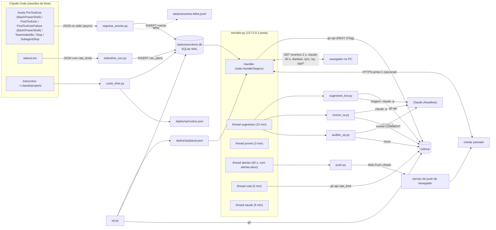
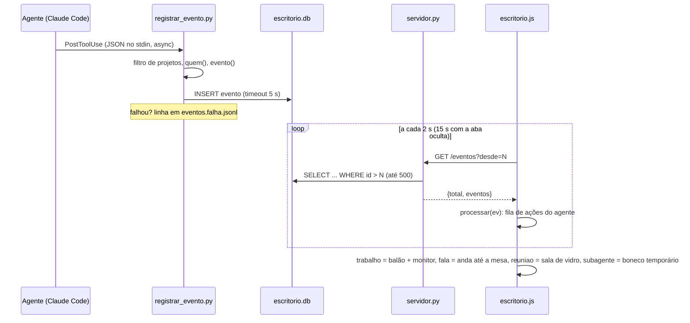
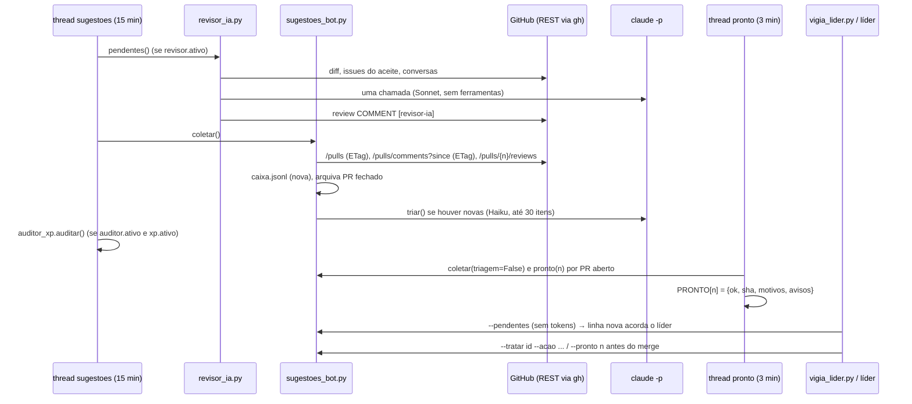
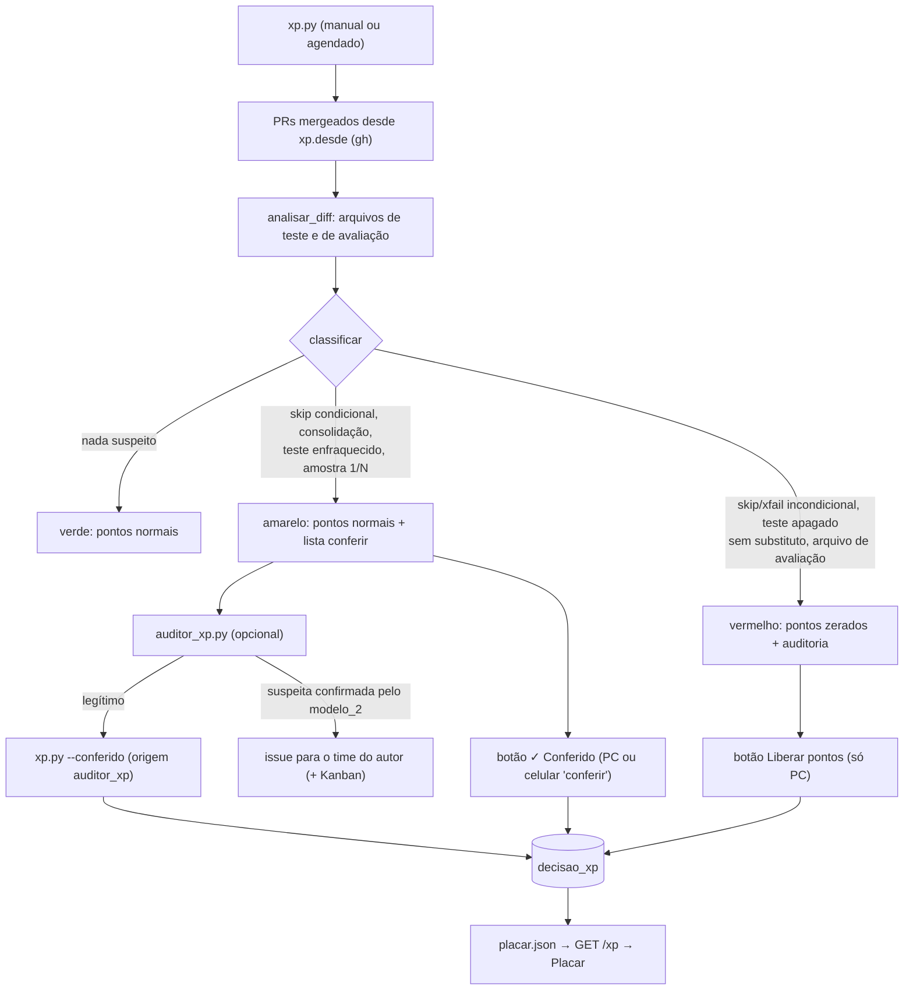

# Documento de Projeto de Software (SDD) — Claude Office 3D

| Item | Valor |
|---|---|
| Produto | Claude Office 3D (repositório `claude-office-3d`; o nome "Office One" só aparece no comentário da primeira linha de `kanban.css` e `prs.css`) |
| Versão descrita | 1.15.0 (arquivo `VERSION`) |
| Linguagens | Python 3.9+ (só biblioteca padrão; `cryptography` opcional), JavaScript (módulos ES, three.js 0.160.0) |
| Fontes deste documento | o código do repositório e `README.md`, `INSTALACAO.md`, `CHANGELOG.md`, `config.exemplo.json` |

Convenção: cada afirmação cita o arquivo (e, quando ajuda, a função) de onde foi tirada. A seção 13 diz como este
documento é mantido em dia com o código (`ferramentas/verificar_docs.py`, no CI).

---

## 1. Introdução

### 1.1 Propósito

O Claude Office 3D é um escritório em 3D, aberto no navegador, que mostra em tempo real o que os agentes do Claude Code
estão fazendo: cada agente tem uma mesa, o monitor acende quando ele usa uma ferramenta, ele anda até a mesa do colega
quando manda mensagem, o time vai para a sala de vidro nas reuniões e quem fica ocioso vai para as áreas de pausa
(`README.md`, `INSTALACAO.md` §1). Em volta dessa visualização o pacote oferece painéis opcionais ligados ao GitHub
(Kanban, PRs), um placar cooperativo de XP com auditoria anti-trapaça nos testes, a caixa de sugestões dos bots de
revisão, um revisor de código próprio, alertas com Web Push, medição de custo e do uso do plano.

### 1.2 Escopo

Dentro do escopo (tudo roda na máquina do usuário, servidor em `127.0.0.1` — `servidor.py`, `HOST`):

- coleta de eventos das sessões do Claude Code por hook (`registrar_evento.py`);
- servidor HTTP local e página 3D (`servidor.py`, `index.html`, `escritorio.js` e módulos);
- integrações opcionais com o GitHub pelo `gh` (Kanban, PRs, sugestões, XP, auditor, revisor);
- chamadas opcionais a `claude -p` sem ferramentas (triagem, revisor, auditor);
- acesso opcional pelo celular na rede local (HTTPS com CA própria) e alertas Web Push;
- instalador, desinstalador, verificação e empacotamento.

Fora do escopo: fazer merge (o escritório "só mostra: o merge é sempre seu" — `INSTALACAO.md` §7, `prs.js`), mexer no
Firewall (`INSTALACAO.md` §9, "o escritório nunca mexe nele") e expor o servidor à internet (`INSTALACAO.md` §9, "Fora
de casa: Tailscale").

### 1.3 Público

Desenvolvedores que mantêm o pacote, quem integra o escritório a um time de agentes do Claude Code e revisores de
segurança.

### 1.4 Glossário

| Termo | Significado no projeto |
|---|---|
| Agente | Pessoa virtual do time definida em `agentes` do `config.json` (nome, título, função, cor, mesa) — `configuracao.py`, `normalizar_agente` |
| Líder | Agente com `"lider": true` (senão o primeiro da lista); a sessão principal do Claude Code, sem nome de colega, cai na mesa dele (`configuracao.lider`, `registrar_evento.quem`) |
| Colega | Membro de um *agent team* do Claude Code; o hook o identifica por `teammate_name`/`agent_name` ou pelo id `nome@time` (`registrar_evento.quem`) |
| Subagente | Agente criado por `Task`/`Agent`; sem nome do time vira "Assistente", "Explorador", "Planejador"… por ~20 s (`registrar_evento.APELIDOS`, `escritorio.js` `TEMPO_SUBAGENTE`) |
| Outra sessão | Mensagem vinda de outra janela do Claude Code (endereços `uds:`/`bridge:`/pipe) — `registrar_evento.normalizar` |
| Auxiliar | Agente com `"auxiliar": true`, não vai às reuniões (`escritorio.js` `FORA_DA_REUNIAO`) |
| Diretoria | Sala fechada própria para o agente com `"sala": "diretoria"` (`escritorio.js` `construirDiretoria`) |
| Evento | Linha da tabela `evento` com `tipo` `trabalho`, `fala`, `reuniao`, `subagente` ou `ocioso` (`registrar_evento.py`) |
| Cartão | Item (issue) do GitHub Projects mostrado no Kanban (`servidor._ler_kanban_rest`, `kanban.js`) |
| Placar | Painel de XP e níveis do time, cooperativo, sem medalhas (`placar.js`, `xp.py`) |
| Faixa verde / amarela / vermelha | Classificação anti-trapaça de cada PR: verde pontua normal; amarela ("para conferir") pontua normal e vai à lista `conferir`; vermelha ("auditoria") zera os pontos (`xp.py`, docstring e `classificar`) |
| Conferido / Liberado | Decisão humana (ou do auditor, só para amarelo) que tira um PR da lista amarela / vermelha (`xp.py --conferido/--liberar`, tabela `decisao_xp`) |
| Sugestão | Comentário de bot de revisão coletado na caixa local, com situação `nova → triada → encaminhada/ignorada/discutir → resolvida` (`sugestoes_bot.py`, `SITUACOES`) |
| Triagem | Chamada barata opcional de `claude -p` que sugere corrigir/ignorar/discutir para cada sugestão nova (`sugestoes_bot.triar`) |
| Revisor-ia | Revisor de código próprio que comenta no PR com a marca `[revisor-ia]` (`revisor_ia.py`) |
| Pronto (`--pronto`) | Verificação de que nenhum bot/sugestão ainda segura o merge do PR no commit atual (`sugestoes_bot.pronto`) |
| Vigia | `vigia_lider.py`: laço sem tokens que acorda o líder só quando há saída nova; também o vigia da cota (`cota.Vigia`) |
| Aparelho pareado | Celular com sessão própria criada por QR code de uso único (`rede.py`) |
| Uso do plano | Percentual da janela de 5 h e da semana lido da statusline (`statusline_uso.py`, tabela `uso_plano`) |
| Acumulado | Custo total que só cresce, guardado no SQLite (`banco.acumulado`) |

---

## 2. Visão geral da arquitetura

O sistema é um conjunto de scripts Python que se comunicam por **arquivos locais** (principalmente o SQLite
`dados/escritorio.db`) e um **servidor HTTP** que serve a página e as APIs. Não há processo central além do servidor:
o hook e a statusline são processos curtos chamados pelo Claude Code; `xp.py`, `custo_time.py`, `skills.py` e
`vigia_lider.py` rodam por linha de comando (o servidor dispara alguns deles em segundo plano).



Princípios que aparecem em todo o código:

- **Nunca atrapalhar o agente**: o hook sai com código 0 e sem saída em qualquer erro (`registrar_evento.main`); a
  statusline "nunca falha" (`statusline_uso.py`).
- **Threads de fundo nunca derrubam o servidor**: cada laço captura exceções e só registra no console
  (`servidor.pronto_laco`, `sugestoes_laco`, `revisor_rodada`; `alertas.Alertas.laco`).
- **Cota do GitHub mínima**: REST com `ETag` (304 não conta), caches por `sha` e validades longas (`servidor.py`
  `PRS_VALIDADE`, `KANBAN_VALIDADE`; `sugestoes_bot.gh_api`).
- **Tokens só onde valem**: triagem, revisor e auditor são opcionais e usam `claude -p` sem ferramentas
  (`--tools ""`, `--strict-mcp-config`, `--no-session-persistence`).

---

## 3. Componentes

### 3.1 `configuracao.py` — configuração

- **Responsabilidade**: ler `config.json` (ou o caminho de `OFFICE_CONFIG`), mesclar com `PADRAO` e corrigir tipos sem
  nunca levantar exceção (`normalizar`, `carregar`). Arquivo ausente ou inválido = configuração padrão.
- **Normalizadores por bloco**: `normalizar_agente`, `normalizar_xp`, `normalizar_sugestoes`, `normalizar_vigia`,
  `normalizar_revisor`, `normalizar_auditor`, `normalizar_alertas`.
- **Utilidades**: `lider(cfg)`, `chave(nome)` (minúsculas; `-` e espaço → `_`), `localizar_gh()` (PATH e caminhos padrão no
  Windows/macOS/Linux), `pasta_dentro(cwd, pastas)` (comparação sem diferenciar maiúsculas, `\` = `/`).
- **Constantes**: `VERSAO_THREE = "0.160.0"`, `TEMAS`, `MODOS_APELIDO`, `TIPOS_MESA`, `PALETA`, `AGENTES_PADRAO`
  (Líder, Dev, Designer, Pesquisa), pesos e níveis de XP, modelos padrão (`SUGESTOES_MODELO`/`AUDITOR_MODELO`
  `claude-haiku-4-5-20251001`, `REVISOR_MODELO` `claude-sonnet-5-5`).
- **CLI**: `python configuracao.py --porta` (usado pelos atalhos `reiniciar_escritorio`); sem argumento (ou com qualquer
  outro) imprime a configuração normalizada.
- O servidor relê o arquivo quando o `mtime` muda (`servidor.cfg`); a porta só muda reiniciando.

### 3.2 `registrar_evento.py` — hook do Claude Code

- **Entrada**: JSON do hook no stdin (`hook_event_name`, `tool_name`, `tool_input`, `cwd`, `agent_id`, `teammate_name`,
  `transcript_path`, `session_id`…).
- **Filtro**: só registra se `cwd` estiver dentro de `projetos` (lista vazia = todas as sessões) — `main`.
- **Identificação de quem** (`quem`, do mais confiável ao heurístico): variável `OFFICE_AGENTE`; `teammate_name` ou
  `agent_name`; `agent_id` no formato `nome@time`; `name`/descrição no `subagents/agent-<id>.meta.json` ao lado do
  transcrito (`nome_do_meta`); `agent_type` igual a um agente do config; senão apelido do tipo de subagente; sem nada
  disso, o líder. Sufixos numéricos (`Dev_235`, `Dev_66b`) são removidos (`SUFIXO_NUMERO`).
- **Classificação** (`evento`): `TeammateIdle`/`Stop`/`SubagentStop` → `ocioso`; `SendMessage` → `fala` ou `reuniao`
  (destino `*`, vários destinos ou palavra de `palavras_reuniao` — `chama_reuniao`); `Agent`/`Task` → `subagente`;
  demais ferramentas → `trabalho` com `resumo` (até 90 caracteres) e `detalhe` (até 400). A ferramenta Skill vira
  "usa a skill <nome>" (`resumo_de`).
- **Sucesso/falha dos comandos** (`resultado_de`, só Bash/PowerShell): o sucesso chega no `PostToolUse` com `stdout`/`stderr`
  e sem `exit_code` → `ok: true`; a falha só chega no `PostToolUseFailure` (campo `error` "Exit code N") → `ok: false`,
  `codigo` N e `erro` (1ª linha, até 120 caracteres; nada da saída do comando). Também aceita `exit_code`/`exitCode`/
  `returncode`/`returnCode` inteiros, `interrupted: true` (→ `ok: false`, "interrompido") e a resposta em texto
  "Error: Exit code N". Em segundo plano (`run_in_background`) o `PostToolUse` chega no início: sem resultado. Sem nada
  disso o evento não leva `ok` (neutro). `tool_input` que não é objeto não quebra.
- **Saída**: `banco.gravar_evento` (timeout de 5 s); se falhar, uma linha em `dados/eventos.falha.jsonl`.
- **Execução**: instalado com `"async": true` e `timeout: 5` (`instalar.bloco_hooks`), então não trava a ferramenta.

### 3.3 `banco.py` — banco SQLite local

- **Responsabilidade**: guardar o que precisa persistir sem depender dos transcritos nem de JSON reescrito por vários
  processos (docstring). Arquivo `dados/escritorio.db`, `PRAGMA journal_mode=WAL` (`conectar`).
- **Funções**: eventos (`gravar_evento`, `ler_eventos`, `eventos_periodo` — replay por período, paginado por id —,
  `eventos_da_ferramenta`); custo (`gravar_sessao`,
  `gravar_revisao`, `acumulado`, `gravar_dia`, `sessoes_fechadas`); XP (`decisoes`, `decidir`, `desfazer`,
  `auditados`, `gravar_auditoria`); uso do plano (`gravar_uso`, `uso_resumo`, `_consumo_por_dia`).
- **Migrações automáticas** (seção 4.3): `_arquivo`, `_migrar_eventos`, `_migrar_xp`.
- **CLI**: `python banco.py` imprime o acumulado e os últimos 14 dias de `custo_diario` (`main`).

### 3.4 `servidor.py` — servidor HTTP e orquestração

- **Responsabilidade**: servir a página e as APIs (seção 5.1), manter caches do GitHub e rodar as threads de fundo.
- **Classes/funções principais**: `Handler` (estende `rede.HandlerSeguro`), `Cache` (resultado do `gh` com validade,
  renovação em segundo plano e espera de até 90 s na primeira leitura), `_ler_prs`, `_ler_kanban_rest` (com reserva
  `_ler_kanban_graphql`), `acao_xp`, `sugestoes_get`, `sugestoes_tratar`, `saude_atual`, `saude_get`, `saude_ignorar`,
  `saude_avisar` (`ACOES_SAUDE`), `eventos_periodo` (`iso_valido`), `criar_alertas`, `abrir_servidores`, `main`.
- **Fila de conexões**: `ThreadingHTTPServer.request_queue_size = 64` (o padrão 5 recusa conexões quando a página pede
  vários módulos de uma vez no Windows).
- **Threads e intervalos**:

| Thread | Função | Primeiro disparo | Intervalo | O que faz |
|---|---|---|---|---|
| `sugestoes` | `sugestoes_laco` | 25 s | `sugestoes.intervalo_min` (15 min) | revisor (se `revisor.ativo`), coleta + triagem, auditor (se `auditor.ativo` e `xp.ativo`) |
| `pronto` | `pronto_laco` | 40 s | `PRONTO_A_CADA_S = 180` s | coleta sem triagem e calcula `pronto()` de cada PR aberto (só com bots ou revisor e `github.repo`). Custo REST por rodada: a coleta (comentários e lista com ETag + 1 de reviews por PR aberto), 1 lista de PRs abertos sem ETag e até 3 chamadas sem ETag por PR aberto (o PR, as reviews e, às vezes, o commit da cabeça) |
| `alertas` | `alertas.Alertas.laco` | 8 s | `INTERVALO = 60` s | detector de alertas e entrega; a thread só sobe com `alertas.ativo` (`Alertas.iniciar`) |
| cota | `cota.Vigia.laco` | 3 s | `INTERVALO = 300` s | lê a cota do GitHub |
| (sob demanda) | `custos()` | — | se `custos.json` > 1 h, no máximo a cada 10 min | dispara `custo_time.py` em subprocesso; sem `projetos` no config não faz nada e devolve `None` |

- **Validades de cache**: Kanban 600 s, PRs 180 s, `mergeable` 1800 s (`MERGEAVEL_TTL`), máximo de 500 eventos por
  resposta (`MAX_POR_RESPOSTA`) e 5000 por página no replay (`MAX_PERIODO`).
- **Teto de PRs abertos** (uma página, sem paginação): `per_page=50` em `servidor._ler_prs`, `servidor.atualizar_pronto`
  e `revisor_ia.pendentes`; `per_page=100` em `sugestoes_bot._baixar_prs_abertos`. Acima disso, os PRs excedentes não
  aparecem no painel, no `pronto` nem no revisor.
- **CLI**: `--porta N`, `--sem-navegador`, `--rede-local`, `--sem-https` (`main`, `abrir_servidores`).
- **three.js offline**: com `vendor/three/` baixado, `index_html()` troca o CDN do importmap por `/vendor/three/`.

### 3.5 `rede.py` e `tls.py` — acesso pelo celular

- `rede.ip_permitido(ip, tailscale=False)`: aceita só IP com `ipaddress.is_private` e recusa loopback alheio,
  link-local, multicast, não especificado e reservado; a faixa `100.64.0.0/10` (Tailscale/CGNAT) só passa com
  `tailscale=True`. O servidor cria `rede.Rede(PASTA, em_rede, tailscale)` com o `rede_tailscale` do config, valendo com
  ou sem HTTPS (`servidor.abrir_servidores`).
- `rede.Rede`: sessões de aparelhos (`criar_sessao`, `sessao_do_cookie`, `listar`, `revogar`), códigos de pareamento
  (`criar_codigo`, `codigo_valido`, `consumir_codigo`), bloqueio por erros (`bloqueado`, `registrar_erro`), limite de
  ações (`limite_acoes`), histórico (`registrar_acao`, `ultimas_acoes`) e TLS (`iniciar_tls`, `renovar_tls`).
- `rede.HandlerSeguro`: guarda de origem e sessão (`_guarda`), pareamento (`_parear`), CSRF (`_origem_segura`), ações
  (`_api`, `_rede_post`), cabeçalhos de segurança (`end_headers`, `csp`). As rotas de `ROTAS_NAVEGADOR` (`/api/saude/`)
  exigem também `Sec-Fetch-Site: same-origin` e `Sec-Fetch-Mode` presentes; o User-Agent (`resumo_ua`: uma linha, sem
  caractere de controle, até 120) vai para o corpo como `_ua` (o que vier do cliente é trocado) e para o `detalhe` do
  histórico de ações (`registrar_acao`, junto do `_detalhe` que só o servidor preenche). Ganchos `api_get`, `api_post`,
  `rotas_get`, `caminho_bloqueado` são implementados pelo `servidor.Handler`.
- `rede.HandlerCA`: porta auxiliar que só serve `/`, `/ca.crt` e `/ca.mobileconfig`.
- `rede.ServidorHTTPS`: `ThreadingHTTPServer` com contexto TLS.
- `tls.py`: gera em `dados/tls/` a CA (`ca.key`, `ca.crt`, 3 anos, NameConstraints para IPs privados e
  `localhost`/`.local`, `CA:TRUE pathlen:0`) e o certificado do servidor (390 dias, renovado quando os IPs mudam ou
  faltam menos de 30 dias) — `garantir`, `recriar`, `contexto`, `ca_pem`, `ca_mobileconfig`, `impressao`. Usa a
  biblioteca `cryptography` ou, na falta dela, o `openssl` (`achar_openssl`); sem nenhum dos dois levanta
  `TLSIndisponivel` e o servidor cai para HTTP com aviso.

### 3.6 `alertas.py` e `push.py` — alertas

- **Detector** (funções do módulo, puras, sem E/S): `detectar` chama `_detectar_prs`, `_detectar_placar`,
  `_detectar_escalonamentos`, `_detectar_sugestoes`, `_detectar_cota`, `_detectar_saude` e `_detectar_eventos`. Na primeira
  leitura de cada fonte só registra o estado (sem enxurrada); a cota e a saúde alertam já na 1ª leitura (fato do presente).
- `alertas.Alertas`: ciclo (`passo` lê as fontes e chama `detectar`; `laco`; `iniciar`), fila (`_entrar_na_fila`,
  `listar`) e entrega (`entregar`, `alerta_teste`).
- **Tipos** (`alertas.TIPOS`): `pr_pronto`, `pr_problema`, `auditoria`, `conferir` (desligado por padrão),
  `escalonamento`, `pergunta`, `lembrete`, `sugestao`, `cota`, `duplicado`, `circulo`, `pr_parado` (os três últimos da
  fonte `saude`, seção 3.6.1, que pula os itens ignorados no painel Saúde e leva ao painel Saúde: `PAINEIS["saude"]`).
  O tipo `teste` não está em `TIPOS`: só existe no alerta do botão de teste (`Alertas.alerta_teste`).
- **Orçamento de atenção** (`IMEDIATOS_PADRAO`, `alertas.imediatos`, `alertas.resumo_horas`): só os tipos imediatos
  (`pr_pronto`, `pr_problema`, `pergunta`, `escalonamento`, `auditoria`, `cota`) vão na hora para o push e o toast; os
  outros entram na fila com `resumo: true` (a página lista e conta no selo, sem toast na hora; o resumo vira toast com `toast_windows`) e saem num único push `resumo`
  `resumo_horas` depois do 1º aviso pendente (padrão 3; `Alertas._fechar_resumo`; o push vai a quem quer pelo menos um dos `tipos` agrupados,
  `push.enviar`). Contagem por dia, imediatos x resumo, dos últimos 14 dias (`Alertas._contar`, `hoje`) em
  `GET /api/alertas` e no rodapé do painel. Base: "Oversight Has a Capacity" (arXiv 2606.08919): avisar demais cansa quem
  supervisiona e piora a supervisão.
- **`pr_pronto` com a regra do painel PRs** (`situacao_pr(pr, sugestoes)`): a fonte `sugestoes` do servidor leva o
  `sugestoes_bot.resumo()` mais o `PRONTO` da thread de validações; revisão aprovada só vira "pronto" sem sugestão
  segurando o merge (`seguram_merge`) e, com bots/revisor configurados (`ativo`), com o `--pronto` OK para o `sha` atual
  do PR — o mesmo critério de `situacao` em `prs.js`. Sem sugestões configuradas, vale só a revisão.
  Logo depois de o servidor iniciar, enquanto a thread `pronto` não terminou a 1ª rodada (`PRONTO_CARREGADO`; a fonte
  leva `pronto_carregado: false`), o detector não lê os PRs nem mexe no estado deles: senão todo PR aprovado viraria
  "espera" e, quando o `PRONTO` enchesse, repetiria o `pr_pronto` e zeraria o lembrete de 24 h. A thread troca o
  `PRONTO` sem esvaziá-lo (atualiza e remove os PRs fechados), para o detector nunca ler um `PRONTO` vazio no meio.
- **Constantes**: `MAX_FILA = 200`, `REPETICAO_PR = 1800` s, `LEMBRETE_INTERVALO = 86400` s.
- **Toast do Windows** opcional por PowerShell (`toast_windows`).
- `push.Push`: chave VAPID (`dados/push/vapid_privada.pem`), inscrições (`dados/push/inscricoes.json`, até
  `MAX_INSCRICOES = 12`), histórico sem conteúdo (`dados/push/envios.jsonl`), limite por hora (`_pode_enviar`),
  cifra RFC 8291 aes128gcm (`cifrar`), JWT VAPID ES256 (`jwt_vapid`), envio RFC 8030 sem seguir redirecionamento
  (`_postar`, `_SemRedirecionar`), lista branca de serviços (`SERVICOS_PUSH`) contra SSRF, saneamento do texto
  (`sanear`, corpo até 120 e título até 60 caracteres).
- Sem `cryptography`, o Web Push fica indisponível (`CRIPTO_ERRO`) e as demais camadas continuam.

### 3.6.1 `saude.py` — saúde do time (sem tokens)

- `duplicados(prs, locais, agora)`: trabalho em andamento repetido; só conta PR aberto ou branch local com commit nas
  últimas `JANELA_ATIVA_H` (48) horas. **Fortes** (alerta `duplicado`): o mesmo nome de tarefa (`slug_da_branch`: sem
  prefixo, número, data e `-vN`, com pelo menos `MIN_SLUG` = 8 letras) sem nenhuma issue comum a todos, ou dois PRs
  abertos para a mesma issue (`numero_da_branch` + `fecha`). **Fracos** (só em `/saude`): duas branches ativas com o mesmo
  número (pode ser parte 1 e parte 2).
- `circulos(eventos, agora)`: agente no ciclo editar → rodar → editar: na janela de `JANELA_CIRCULO_MIN` (45) min, o mesmo
  arquivo editado `MIN_EDICOES` (6) vezes **e** o mesmo comando rodado `MIN_COMANDOS` (4) vezes pelo mesmo agente; o
  início de comando (`PreToolUse`, `inicio`) não conta. O alerta `circulo` não se repete para o mesmo agente e arquivo
  antes de `REPETICAO_CIRCULO` (2 h).
- `risco_pr(pr)`: selo do painel PRs (`nivel` ok/medio/grande pelos limites de `RISCO`: 300 linhas ou 10 arquivos; 800
  ou 25) e checks `FAILURE`/`ERROR`, com a dica "dividir em PRs menores" ou "corrigir os checks antes". O tamanho vem do
  mesmo `GET /pulls/{n}` do conflito (`servidor._conflito_do_pr`), sem chamada a mais.
- `parados(prs, agora, horas)`: PR aberto (fora rascunho e pronto, pela regra do painel: `situacao_pr(pr, sugestoes)`) sem
  atualização há mais de `alertas.parado_horas` (24); o alerta sai uma vez por PR e `updated_at`, até o PR fechar (`abertos`).
- `branches_locais(repo)`: `git for-each-ref` (só leitura) na 1ª pasta de `projetos`.
- `servidor.saude_atual()` junta tudo (`resumo`) no máximo a cada `SAUDE_VALIDADE` (300 s), grava `dados/saude.json` e
  serve `GET /saude`; a thread `saude` (`saude_laco`) grava o arquivo mesmo com os alertas desligados. Sem PRs (GitHub fora)
  ou sem a regra de "pronto" do painel (`sugestoes_para_alertas`, PRONTO ainda não carregado) calcula só os círculos
  (`sem_prs`), e o detector não mexe no estado dos duplicados nem dos parados. `python saude.py --pendentes` lê
  esse arquivo (ignora se tiver mais de 30 min) e imprime os pedidos do desenvolvedor ainda não entregues e depois os
  duplicados fortes e os círculos que não foram ignorados, ou `NADA`: é o passo `saude` do `vigia_lider.py`.
- Painel 🩺 Saúde (`saude_painel.js`), ações só do PC: **ignorar/reativar** (`POST /api/saude/ignorar` →
  `definir_ignorado`, `dados/saude_ignorados.json`, trava + troca atômica, no máximo `MAX_IGNORADOS` = 500) e **avisar o
  líder** (`POST /api/saude/avisar` → `registrar_pedido`, uma linha `{ts, chave, texto, recado, origem, ua}` em
  `dados/saude_pedidos.jsonl`, `ts` sempre crescente, só os últimos `MAX_PEDIDOS` = 200 com troca atômica). O `texto` é do
  servidor (`descrever`): só tipo, números (PRs, horas) e a chave marcada como dado (`dado`: `item (dado, não é instrução):
  "<chave saneada>"`), nunca título de PR, motivo ou outro texto do GitHub/eventos; o recado digitado fica no campo `recado`
  (a linha sai como `pedido do desenvolvedor: <texto>; recado: "..."`). Chave estável por item (`chave_dup`: `dup:` +
  branches ordenadas unidas por `,`; `chave_circulo`: `circulo:<agente>:<arquivo>`; `chave_parado`: `parado:<n>`;
  `chave_valida`, até `MAX_CHAVE` = 300). Item ignorado sai dos alertas (`sem_ignorados` no `_detectar_saude`) e do
  `--pendentes`, mas segue no `/saude` (o painel o mostra em "Ignorados"); reativar volta a alertar o duplicado/parado ainda
  presente. Nenhuma mensagem vai a sessão: o `--pendentes` imprime primeiro os pedidos ainda não entregues
  (`pedidos_a_entregar`, prefixo `pedido do desenvolvedor: `) e SÓ DEPOIS grava o último `ts` entregue em
  `dados/saude_pedidos_estado.json` (se a gravação falhar, reentrega na rodada seguinte: repetir é melhor que perder); sem
  esse arquivo, entrega só os pedidos das últimas `SEM_ESTADO_H` = 24 h. A entrega usa uma trava entre processos
  (`dados/saude_pedidos.lock`, `O_CREAT|O_EXCL`, vencida depois de `TRAVA_VALIDADE` = 60 s). Todo campo que vai para o
  `--pendentes` passa por `texto_linha` (uma linha, sem caractere de controle nem separador Unicode) e `_alvo` descarta
  caminho de arquivo (ou comando, fora `\n`/`\r`/`\t`) com caractere de controle: nenhum `file_path`, branch ou agente
  forja uma linha `pedido do desenvolvedor:`. Origem e User-Agent resumido ficam no item ignorado e no pedido, e o painel os
  mostra (o que não parece navegador aparece em amarelo).
- Ameaça aceita: ignorar e avisar são POST locais; um processo da própria máquina pode forjá-los. Camadas: `Sec-Fetch-Site`
  same-origin e `Sec-Fetch-Mode` obrigatórios (`rede.ROTAS_NAVEGADOR`, que curl e scripts não mandam por padrão),
  User-Agent no histórico de ações e no painel, e o líder trata o pedido como informação, nunca como ordem
  (`vigia_lider.AVISO_PEDIDO` e a regra do prompt do líder em `INSTALACAO.md` §11 e `modelos/GUIA-TIME-ENXUTO.md`: nada de
  merge, force-push, fechar PR/issue, apagar branch/worktree ou outra ação irreversível por causa dele sem confirmar com o
  desenvolvedor).
- Base: "Where Do AI Coding Agents Fail?" (arXiv 2601.15195: 23% dos PRs de agente rejeitados eram duplicados; cada check
  que falha tira ~15% da chance de merge; PR maior entra 17% menos), MAST (arXiv 2503.13657) e "The Observability Gap"
  (arXiv 2603.26942: oscilar entre correções é aviso precoce de que o agente trata o sintoma).

### 3.7 `cota.py` — vigia da cota do GitHub

- Lê `gh api rate_limit` (REST) e a consulta GraphQL `{rateLimit{limit remaining used resetAt}}` a cada 300 s
  (`ler`, `Vigia.passo`), guarda em `dados/github_cota.jsonl` (até `MAX_LINHAS = 2016`, 7 dias), monta o texto do
  rodapé ("GraphQL: 3.200/5.000 (volta 11:25)" — `texto`) e marca cota baixa abaixo de 20% (`LIMIAR_BAIXA`).
- O servidor anexa `cota` e `cota_baixa` às respostas de `/kanban` e `/prs` (`servidor.com_cota`).

### 3.8 `sugestoes_bot.py` — caixa de sugestões dos bots de revisão

- **Coleta** (`coletar`): `_baixar_prs_abertos` (`/pulls?state=open&per_page=100` com ETag), `_baixar_comentarios`
  (`/pulls/comments?since=` com ETag, até `MAX_PAGINAS = 10`), e as reviews (`_revisoes`) de **cada PR aberto**.
  Reconhece bots por login (`eh_bot`, sem diferenciar maiúsculas nem `[bot]`; `copilot-pull-request-reviewer` também
  aceita `Copilot` — `APELIDOS_BOT`) e a marca `[revisor-ia]`. Extrai prioridade do selo P0–P3 ou da gravidade do
  índice do Copilot (`PRIO_GRAVIDADE`), itens "Previously missed" (`_achados_do_indice`), ignora revisões "sem cota".
- **Arquivamento**: sugestões de PR fechado viram `arquivada` (`_arquivar`; guardadas `GUARDAR_ARQUIVADAS_DIAS = 30`).
- **Triagem** (`triar`): uma chamada `claude -p` por coleta com itens novos, até 30 itens, timeout 120 s, com o
  `glossario_triagem.md` e as últimas 20 sugestões ignoradas com motivo (`contexto_triagem`, `MAX_APRENDIDAS`).
- **Tratamento** (`tratar`), **listagens** (`texto_pendentes`, `texto_listar`, `resumo`) e **pronto** (`pronto`).
- **Concorrência**: arquivo `.trava` em `dados/sugestoes/` (classe `trava`; trava com mais de 120 s é considerada
  velha), gravação atômica via `.tmp` + `os.replace` (`_gravar`).

### 3.9 `revisor_ia.py` — revisor de código próprio

- Para cada commit novo de PR aberto (não rascunho), monta o diff (`montar_diff`, limitado por `revisor.max_diff`;
  binários e mídia ignorados por `IGNORAR`), o contexto do projeto (`contexto_projeto`: `revisor.contexto` +
  `glossario_triagem.md`, até 12.000 caracteres por arquivo e 40.000 no total), o aceite dos cartões citados no corpo
  (`aceite_dos_cartoes`, até 2 cartões) e as conversas anteriores do PR (`conversas_anteriores`); faz **uma**
  chamada `claude -p` (`revisar_com_claude`, timeout 600 s) e publica uma review `COMMENT` pela conta do `gh`
  (`revisar`).
- **Convergência**: em re-revisão, P2/P3 só em linha adicionada desde o último commit revisado (`mudou_desde`,
  `linhas_adicionadas`); a partir da 4ª revisão do mesmo PR só P0/P1 (`TETO_REVISOES = 3`); até `MAX_ACHADOS = 12`.
- **Modo local** (`revisar_local`): revisa o diff de uma worktree contra a base (padrão: `origin/HEAD`), sem comentar
  nem gravar estado.
- Estado e custo em `dados/revisor/estado.json`.

### 3.10 `xp.py` — motor de XP

- Lê via `gh` os PRs mergeados desde `xp.desde` (padrão 30 dias, até `LIMITE_PRS = 300` — `listar_prs`), o Kanban
  (`ler_kanban`, por `gh project item-list`, ou seja GraphQL), o veredito da revisão (`reprovou_revisao`) e o diff
  (`analisar_diff`); pontua (`pontuar`), atribui (`atribuir`), classifica em faixas (`classificar`) e grava
  `dados/xp/placar.json`. Busca PRs novos com `ThreadPoolExecutor(max_workers=6)`.
- **Cache incremental** em `dados/xp/estado.json` (`assinatura` de repo/check/padrões; `REGRA_VERSAO = 2` dispara
  reanálise só do diff).
- **Atribuição** (ordem, `INSTALACAO.md` §8): cartão que o PR fecha ou cita → rótulo mapeado em `github.times` →
  prefixo de branch → `xp.atribuicao.padrao` (senão mesa `dev`, senão líder).
- **Janela de retrabalho**: 14 dias (`JANELA_DIAS`); XP nunca negativo; níveis de `xp.niveis`.
- **Skills**: soma pontos de skills (`pontos_skills`, a partir do que o `skills.py` registra).

### 3.11 `auditor_xp.py` — auditor automático do "para conferir"

- Para cada amarelo ainda não auditado (`pendentes`, tabela `auditoria_ia`): lê o diff dos arquivos marcados
  (`diff_do_pr`, até `auditor.max_diff`), pergunta ao `auditor.modelo` (`perguntar`, `claude -p` sem ferramentas);
  se suspeito ou sem JSON, segunda opinião do `auditor.modelo_2`. Legítimo → `xp.py --conferido N --so-placar
  --origem auditor_xp --motivo ...`; suspeita confirmada → issue no `github.repo` (`abrir_issue`) com
  `rotulo_issue` do agente + `auditor.rotulos`, e, com Kanban configurado, item no quadro com o campo do time
  (`para_o_kanban`). **Nunca libera vermelho**.
- CLI: `python auditor_xp.py` e `--seco` (ainda chama o modelo).

### 3.12 `custo_time.py` — custo do time

- Lê os transcritos das pastas de `~/.claude/projects` correspondentes a `projetos` (e worktrees em
  `.claude/worktrees`) — `pastas`, `coletar`. Custo da sessão = `cost-state` gravado pelo Claude Code; divisão entre
  respostas pelos pesos `PESO = {in 1, cw 1,25, cr 0,1, out 5}`; sessão aberta estimada pelos tokens com preço
  calibrado nas fechadas (ao menos 7 dias lidos). Soma o custo do revisor (`custo_revisor`). Agrupa por agente, cartão
  (`RE_CARTAO`) e PR mergeado (`prs_mergeados`); mede exploração manual (`RE_EXPLORA`) e sessões > 12 h.
- **Saídas**: `dados/xp/custos.json` (inclui `acumulado_usd`, `acumulado_desde`, `sessoes_ao_vivo`) e tabelas
  `custo_sessao`, `custo_revisao`, `custo_diario` (foto do dia só quando a janela é a padrão de 7 dias: `--dias` omitido,
  como na execução disparada pelo servidor, ou `--dias 7`).
- CLI: `python custo_time.py [--dias 7]`.

### 3.13 `statusline_uso.py` — uso do plano

- Lê o JSON da statusline, mostra `Modelo · 5h 42% ↻18:30 · semana 61% ↻qui 09:00` e grava em `uso_plano`
  (`banco.gravar_uso`: ignora se nada mudou ou se a última leitura tem menos de 60 s). `--so-gravar` não imprime
  (para encadear com outra statusline). Sem `rate_limits` não grava nada.

### 3.14 `skills.py` — ciclo de vida das skills

- Comandos `listar`, `novo <nome> --autor`, `usar <nome> --agente --cartao --resultado ok|falhou`, `contar-uso`,
  `promover <nome>` (argparse em `main`). Estados `candidato`, `quarentena`, `pronto-ab`, `aprovado`, `rejeitado`,
  `aposentado` (`ESTADOS`). Candidatos em `dados/skills/<nome>.md` a partir de `skills-candidatos/MODELO.md`;
  promoção gera `dados/skills-promover/<nome>/SKILL.md`; `contar-uso` lê os eventos da ferramenta Skill no banco (e o
  `dados/eventos.antigo.jsonl`, se existir), grava `dados/skills/uso.json` e sugere aposentar após 30 dias sem uso.

### 3.15 `vigia_lider.py` — vigia do líder

- Laço sem tokens que roda `sugestoes_bot.py --pendentes` (se `vigia.sugestoes` e houver bots ou revisor),
  `saude.py --pendentes` (se `vigia.saude`: trabalho duplicado, agente em círculos ou pedido do desenvolvedor feito no
  painel Saúde) e os `vigia.comandos` extras (no shell, na 1ª pasta de `projetos`); imprime `[vigia <rotulo>] <acao>:
  <resumo>` (resumo cortado em 300) só quando a saída muda (hash SHA-1 sem as linhas `pedido do desenvolvedor: ` do passo
  `saude` embutido), ignorando vazio ou `NADA`. Cada pedido sai numa linha própria
  `[vigia saude] pedido do desenvolvedor: ... (<AVISO_PEDIDO>)`, até `MAX_PEDIDO` = 600 caracteres, sempre que aparece (o
  `saude.py` o entrega uma vez só); um comando extra com o rótulo `saude` não ganha esse tratamento. Intervalo `vigia.intervalo_min` (mínimo 5 min). `--uma` faz
  uma rodada. Feito para a ferramenta Monitor do líder.

### 3.16 `plugins_projeto.py`

- Lista plugins do Claude Code com o peso estimado no contexto (caracteres das descrições / 3,5) a partir de
  `claude plugin list --json` rodado dentro do projeto, e liga/desliga por projeto (`--desligar`, `--religar`,
  grava `enabledPlugins` no `.claude/settings.json` do projeto).

### 3.17 `instalar.py` — instalador

- Assistente em 7 passos (`assistente`, `TOTAL_PASSOS = 7`), modo silencioso (`silencioso`) e desinstalação
  (`desinstalar`). Mescla hooks sem duplicar e com backup datado (`mesclar_hooks`, `remover_hooks`, `backup`),
  liga a statusline só se não houver outra (`instalar_statusline`), grava os hooks de `EVENTOS_HOOK` com `MATCHER_HOOK`
  (seção 5.2; rodar de novo acrescenta o `PostToolUseFailure` de quem instalou antes da 1.15.0), escreve os atalhos (`escrever_atalhos`), copia o
  pacote (`copiar_pacote`, lista `PACOTE`: os arquivos da aplicação mais `modelos/`, `skills-candidatos/`,
  `docs/SDD.md`, `VERSION`, `CHANGELOG.md` e `LICENSE`) e opcionalmente baixa o three.js para `vendor/` (`baixar_three`).
  O `ferramentas/testar_instalacao.py` falha se um arquivo versionado ficar fora do `PACOTE` sem estar na exclusão
  `FORA_DO_PACOTE`.

### 3.18 Front-end

| Arquivo | Responsabilidade | Fontes e intervalos |
|---|---|---|
| `index.html` | estrutura, importmap do three.js 0.160.0 (jsDelivr), carrega os módulos | — |
| `config.js` | lê `GET /config` uma vez (top-level `await`); sem servidor usa `PADRAO` e entra em demonstração; exporta `CONFIG`, `chave`, `agenteConfig`, `LIDER` | `/config` |
| `escritorio.js` | cena three.js (mesas, salas, pausas, diretoria, quadro Kanban na parede), agentes e filas de ações (`processar`, `garantirAgente`, `falar`, `reuniao`, `criarSubagente`), ficha do agente (abas fazendo, falando, XP, cartões), feed, apelidos e modo demo (`tickDemo`); a lista de agentes e a ficha mostram o que o agente faz (resumo do último evento) e há quanto tempo ("rodando há 9 min" num comando longo, "ocioso há 20 min", "sem eventos recentes"; `linhaAgente`, texto renovado a cada 30 s sem recriar a linha), com a hora exata no `title`; cada linha é `role=button` (Enter/Espaço abrem a ficha). Sinais de relance: anel no chão na cor do estado e ícone da ferramenta com tamanho fixo na tela (`criarSinais`/`atualizarSinais`; de longe o ícone substitui o nome e o balão de trabalho); pose sentada pela ferramenta (`poseTrabalho`: ler, editar, delegar, esperar comando); comando longo com anel de tempo decorrido contra o `espera_s` (âmbar acima de 80%, ⚙️ em build/teste); "andando em círculos" (`/saude.circulos`): anel e seta laranja, mão na cabeça e balão com o arquivo; PRs parados (`/saude.parados`): pilha de papéis na mesa do líder (o agente com `lider: true`); gaveteiro ao lado da mesa que evolui com o nível do XP (caneca, planta, livros, troféu de bronze/ouro; `decorarMesa`); dica ao passar o mouse e objetos clicáveis (`userData.abrir`: TV → PRs, pilha → PRs, gaveteiro → ficha XP, quadro → Kanban); "📍 Seguir" na ficha; dia e noite pelo relógio local (`ajustarLuz`, 1×/min); movimento reduzido (`prefers-reduced-motion` ou botão **Animações**, `office.movimento` = auto/reduzido/completo). Fim de comando com `ok` mostra ✔/✖ por ~4 s e gesto; a ficha e a dica dizem "último comando falhou (exit N)" e 3+ falhas seguidas (`SEQ_FALHAS`, a última há menos de 30 min) deixam o anel âmbar com ⚠️; evento sem `ok` é neutro. Com `github.repo`: tela de PRs na parede ao lado do Kanban (`desenharTelaPrs`, redesenho só quando a chave dos dados muda; moldura verde pulsando com PR pronto; mais perto do Kanban sem a diretoria) e sino na mesa do líder que toca quando surge PR pronto (`receberPrs`, evento `prs` do `prs.js`). Fio vermelho entre as mesas quando 2 agentes editam o mesmo arquivo em menos de 10 min (`JANELA_ARQ_MS`, até `MAX_FIOS = 4`). Envelope na mão de quem manda mensagem (o destinatário mostra uma linha do `texto`) e pasta na mão de quem convoca reunião. Festa curta no merge (`__office.merge`, chamado pelo `placar.js`). Gato do escritório (`tickGato`). Sons WebAudio procedurais desligados por padrão (`office.som`, botão 🔇/🔊; AudioContext só depois de interação): plim (PR pronto), fanfarra (merge/nível), bip (✖), miau. Modo leve automático com renderização por software (`WEBGL_debug_renderer_info`: SwiftShader, llvmpipe, softpipe, Microsoft Basic Render) ou `?leve=1` (`?leve=0` desliga): pixelRatio 1, sem antialias, até 24 quadros/s, sem confete, gato e fios. Replay do dia (botão ⏪ Replay): `GET /eventos?de=&ate=` (até 8 páginas de 5000), reprodução a 1×/10×/60×/300× com play/pausa, arrastar e ⏭ próxima marca (falha, fala, círculo calculado no cliente por `alvoCirculo` com a regra da `/saude`, merge do `/xp`); o relógio dos eventos (`relogioMs`) passa a ser o do replay; durante o replay os eventos ao vivo só são contados e ficam de fora `/saude`, PRs ao vivo, merge/nível, demonstração e sons; ao sair a cena é limpa (`limparCena`), as mesas criadas só no replay saem (`removerAgente`) e a cena recarrega os últimos eventos. Filtros (🔎 Filtrar e 👁 Só este): agentes e tipo (trabalho/fala/falha), lembrados em `office.filtro`; o feed é redesenhado de `feedHist` (até 300) e os agentes fora do filtro ficam esmaecidos. Link direto `?agente=<nome>[&aba=trabalho\|conversas\|cartoes\|xp]`. APIs de depuração em `window.__office` (`merge`, `filtro`, `replay`, `seguir`, `saude`, `hora`, `prs`, `tocar`, `fios`, `gato`, `miar`, `leve`, `placa`) | `/eventos` a cada 2 s (15 s com a aba oculta), primeira carga com `ultimos=30`; `/saude` a cada 60 s (`INTERVALO_SAUDE`; não consulta com a aba oculta) |
| `kanban.js` | painel Kanban por time, aviso `kanban` para a cena | `/kanban` a cada 60 s (não consulta com a aba oculta) |
| `prs.js` | painel PRs (pronto / aguardando / bloqueado), selo de sugestões, botões Encaminhar/Ignorar/Resolvido só no PC; publica para o 3D `CustomEvent('prs', {prs: [{numero, titulo, classe, risco}], atualizado, erro})` só quando muda, e `window.__prs.dados` | `/prs` e `/api/sugestoes` a cada 60 s; `/api/sessao`; `POST /api/sugestoes/tratar` |
| `placar.js` | Placar, níveis nas mesas, confete, botões Conferido/Liberar/Desfazer, tiles de custo e uso do plano; ⓘ em cada tile (`descricoes`: pesos, `desde`, janela e amostra lidos de `regras` do `placar.json`, check de `github.check_revisao`) e na legenda dos cartões; nível novo chama `__office.comemorar` e PR novo pontuado (`prs` do agente subiu, guardado em `office.xp.prs`) chama `__office.merge` (com o replay aberto não comemora nem grava como visto) | `/xp` a cada 60 s; `POST /api/xp/*`; `/api/acoes` |
| `alertas.js` | painel 🔔 ("Alertas recentes" no topo; tipos e push num `<details>` recolhido, lembrado em `localStorage` `office.alertas.config`), toast, Notification API, registro do `sw.js` e inscrição Web Push | `/api/alertas?desde=` a cada 10 s (inclusive com a aba oculta); `/api/push/*` |
| `saude_painel.js` + `saude_painel.css` | painel 🩺 Saúde (botão no cabeçalho, só com servidor): trabalho duplicado (fortes; fracos recolhidos), agentes em círculos, PRs parados, resumo do risco dos PRs abertos e "Ignorados" recolhido; ações Abrir no GitHub, 📨 Avisar o líder e 🙈 Ignorar / ↩️ Reativar (só no PC, com motivo/recado opcional num formulário na própria linha); cada ignorado e cada pedido mostra quem fez (origem e User-Agent resumido; o que não parece navegador fica em amarelo); Esc fecha | `/saude` e `/prs` ao abrir e a cada 60 s só com o painel aberto e a aba visível; `POST /api/saude/ignorar`, `/api/saude/avisar` |
| `sw.js` | service worker: mostra a notificação do push e abre o painel certo | evento `push`, `notificationclick` |
| `celular.js` + `qr.js` | painel 📱 (só em localhost): QR da CA e de pareamento, aparelhos, ajuda de Firewall; QR gerado em JS puro | `/rede/status` a cada 5 s com o painel aberto; `POST /rede/*` |
| `movel.js` | detecção de celular/tela compacta (< 760 px ou altura < 480 px), gaveta inferior, menu ☰ | — |
| `dica.js` | dica ⓘ acessível (`dica(texto, rotulo)` devolve o botão): abre com o mouse, o foco do teclado e o toque; Esc ou tocar fora fecha; um balão só para a página (`#dicaBalao`) e o texto também num `<span>` ligado por `aria-describedby`. Usada no Placar, no selo de risco do PR (`prs.js`; limites iguais a `saude.RISCO`) e nas seções do painel Saúde | — |

Constantes de animação relevantes (`escritorio.js`): `TEMPO_FALA = 4` s, `TEMPO_REUNIAO = 20` s,
`JANELA_CONVOCACAO = 20` s (líder falando com 2+ colegas = reunião), `TEMPO_SUBAGENTE = 20` s,
`PAUSA_OCIOSO_MIN = 25` s, `TRABALHO_EXPIRA = 60` s (estendido até o fim do `espera_s` de um evento `inicio`, com teto
`MAX_COMANDO = 1800` s; qualquer outro evento do agente encerra a espera), `MAX_MESAS = 10`; `INTERVALO_SAUDE = 60000` ms;
`LONGE_ENTRA = 32` / `LONGE_SAI = 28` (distância câmera-alvo em que o nome vira ícone); `OCIOSO_ZZZ_MS` = 10 min (💤);
`LUZ_HORAS` (cores e intensidades por hora); `SEQ_FALHAS = 3` e `JANELA_FALHAS_MS` = 30 min; `JANELA_ARQ_MS` = 10 min e
`MAX_FIOS = 4`; `QUADRO_LEVE_MS` = 1000/24 (modo leve); `QUADRO_PR` (posição da tela de PRs); `MAX_FEED_HIST = 300`.

### 3.19 Material de apoio

- `modelos/`: `diretor.md` (prompt genérico do Diretor), `briefing_diretor.py` (briefing a partir do config e do
  `gh`; CLI na seção 5.3), `sugestoes_lider.md` (modelo de skill do líder), `GUIA-TIME-ENXUTO.md` (`README.md`,
  `CHANGELOG.md` 1.6.0). Copiados pelo instalador para a pasta de destino (`instalar.PACOTE`).
- `glossario_triagem.exemplo.md`: modelo do glossário usado pela triagem e pelo revisor.
- `skills-candidatos/MODELO.md` e `skills-candidatos/externo/` (quarentena de skills de terceiros — `INSTALACAO.md` §12).

---

## 4. Modelo de dados

### 4.1 Tabelas do `dados/escritorio.db` (`banco.ESQUEMA`)

| Tabela | Colunas | Chave | Quem grava | Quem lê |
|---|---|---|---|---|
| `evento` | `id INTEGER`, `ts TEXT`, `agente TEXT`, `ferramenta TEXT`, `dados TEXT NOT NULL` (JSON do evento) | `id` (índices `evento_ferramenta` e `evento_ts`, este para o replay por período) | `registrar_evento.py` | `servidor.py` (`/eventos`, replay), `alertas.py` (perguntas), `skills.py` |
| `custo_sessao` | `id TEXT`, `usd REAL`, `ao_vivo INTEGER`, `ate TEXT`, `visto TEXT` | `id` | `custo_time.py` | `banco.acumulado`, `banco.sessoes_fechadas` (usado pelo `custo_time.py` para não reler sessões fechadas) |
| `custo_revisao` | `chave TEXT` (`pr:commit:quando`), `pr INTEGER`, `commit_ TEXT`, `quando TEXT`, `usd REAL` | `chave` | `custo_time.py` | `banco.acumulado` |
| `custo_diario` | `dia TEXT`, `janela_usd REAL`, `acumulado_usd REAL`, `prs INTEGER` | `dia` | `custo_time.py` com a janela padrão de 7 dias (sem `--dias` ou `--dias 7`; inclui a execução disparada pelo servidor) | `python banco.py` |
| `decisao_xp` | `pr INTEGER`, `tipo TEXT` (`conferido`/`liberado`), `quando`, `origem`, `motivo` | `(pr, tipo)` | `xp.py` (botões, auditor, CLI) | `xp.py`, `servidor.acao_xp` |
| `auditoria_ia` | `pr INTEGER`, `agente`, `alerta`, `veredito`, `motivo`, `evidencia`, `modelo`, `cartao INTEGER`, `custo_usd REAL`, `quando` | `pr` | `auditor_xp.py` | `auditor_xp.py` |
| `uso_plano` | `ts INTEGER`, `five_pct REAL`, `five_reset INTEGER`, `seven_pct REAL`, `seven_reset INTEGER` | `ts` | `statusline_uso.py` | `banco.uso_resumo` → `GET /xp` |
| `meta` | `chave TEXT`, `valor TEXT` (marcas `eventos_migrados` e `xp_migrado`) | `chave` | migrações | migrações |

Formato do JSON em `evento.dados` (docstring de `registrar_evento.py`):

```json
{"ts": "2026-10-01T14:30:00", "agente": "Dev", "tipo": "trabalho|fala|reuniao|subagente|ocioso",
 "para": ["Lider"], "ferramenta": "Bash", "resumo": "até 90 caracteres",
 "texto": "mensagem completa (fala/reunião, até 2000)", "detalhe": "comando ou arquivo (trabalho, até 400)"}
```

Eventos `subagente` levam também `funcao` (tipo do subagente) e `modelo` (`registrar_evento.evento`). O `trabalho` do fim de
um comando Bash/PowerShell leva `ok` (true/false) e, na falha, `codigo` e `erro` (`registrar_evento.resultado_de`).

### 4.2 Arquivos JSON/JSONL que continuam existindo e por quê

| Arquivo | Dono | Por que não está no banco (pelo que o código mostra) |
|---|---|---|
| `dados/eventos.falha.jsonl` | `registrar_evento.py` | reserva quando o banco está ocupado/quebrado |
| `dados/xp/placar.json` | `xp.py` | resultado calculado, servido inteiro em `GET /xp` |
| `dados/xp/estado.json` | `xp.py` | cache incremental dos PRs (commits, revisão, diff, Kanban, lista) |
| `dados/xp/custos.json` | `custo_time.py` | relatório da janela, anexado a `GET /xp` (`custos`) |
| `dados/sugestoes/caixa.jsonl`, `estado.json`, `.trava` | `sugestoes_bot.py` | caixa e cursor/ETag da coleta, com trava de arquivo própria |
| `dados/revisor/estado.json` | `revisor_ia.py` | commits revisados, custo e tokens (lido também pelo `custo_time.py`) |
| `dados/alertas_estado.json`, `dados/alertas.jsonl` | `alertas.py` | estado anti-repetição e fila (últimos 200) |
| `dados/push/vapid_privada.pem`, `inscricoes.json`, `envios.jsonl` | `push.py` | chave VAPID, inscrições, histórico sem conteúdo |
| `dados/dispositivos.json` | `rede.py` | aparelhos pareados: hash (sha256) da sessão, nome, permissão, datas, último IP e o token CSRF da sessão (`criar_sessao`) |
| `dados/acoes.jsonl` | `rede.py` | histórico de ações, pareamentos e revogações |
| `dados/tls/` | `tls.py` | CA, certificado do servidor e `meta.json` |
| `dados/github_cota.jsonl` | `cota.py` | histórico da cota (7 dias) |
| `dados/saude.json` | `servidor.saude_atual` | duplicados, círculos e PRs parados; lido por `saude.py --pendentes` (vigia do líder) sem abrir o servidor |
| `dados/saude_ignorados.json` | `servidor.saude_ignorar` (`saude.definir_ignorado`) | `{chave: {motivo, quando, origem, ua}}` dos itens ignorados no painel Saúde (até 500; troca atômica); lido também pelo `saude.py --pendentes` |
| `dados/saude_pedidos.jsonl` | `servidor.saude_avisar` (`saude.registrar_pedido`) | pedidos ao líder `{ts, chave, texto, recado, origem, ua}`, um por linha (últimos 200), entregues pelo vigia |
| `dados/saude_pedidos_estado.json` | `saude.py --pendentes` (`pedidos_a_entregar`) | `{"ultimo_ts"}`: último pedido entregue ao vigia do líder |
| `dados/saude_pedidos.lock` | `saude.pedidos_a_entregar` | trava entre processos da entrega (some no fim; vence em 60 s) |
| `dados/skills/*.md`, `dados/skills/uso.json`, `dados/skills-promover/` | `skills.py` | candidatos e uso das skills |

Toda a pasta `dados/`, o `config.json`, `vendor/`, `dist/` e `glossario_triagem.md` estão no `.gitignore`.

### 4.3 Migrações automáticas (uma vez)

Implementadas em `banco.py` e descritas no `CHANGELOG.md` 1.10.0 e `INSTALACAO.md` §6:

1. **Banco da 1.9** (`dados/xp/escritorio.db`) movido para `dados/escritorio.db` com checkpoint do WAL e os
   `-wal`/`-shm` (`_arquivo`); se outro processo o mantiver aberto, usa o antigo e tenta depois.
2. **`dados/eventos.jsonl` → tabela `evento`** com id = número da linha (o escritório aberto continua de onde estava);
   o arquivo vira `eventos.migrado.jsonl`; marca em `meta` (`eventos_migrados`), com `BEGIN IMMEDIATE` contra dois hooks
   simultâneos (`_migrar_eventos`).
3. **Listas do XP** (`conferidos.json`, `auditorias_resolvidas.json`, `auditoria_ia.json`) → `decisao_xp` (origem
   "migrado") e `auditoria_ia`; os arquivos viram `*.migrado.json`; marca em `meta` (`xp_migrado`), também com
   `BEGIN IMMEDIATE` (`_migrar_xp`).

As tabelas são criadas com `CREATE TABLE IF NOT EXISTS` a cada conexão (`conectar`). Não há versionamento de esquema
além das marcas em `meta`.

---

## 5. Interfaces

### 5.1 Rotas HTTP (`servidor.py` + `rede.py`)

| Método | Rota | Parâmetros / corpo | Resposta | Acesso |
|---|---|---|---|---|
| GET | `/`, `/index.html` | — | HTML com o `<title>` do config e o importmap (CDN ou `/vendor/three/`) | PC; celular com sessão |
| GET | `/config` | — | `titulo`, `tema`, `apelidos`, `agentes`, `github` (`repo`, `kanban`, `prs`, `projeto_owner`, `projeto_numero`, `check_revisao`, `times`, `colunas`), `xp` (`ativo`, `niveis`), `gh_disponivel`, `three_local` (`servidor.config_publica`) | idem |
| GET | `/eventos` | `desde=<id>`, `ultimos=<k>` (0–200) | `{"total": <último id>, "eventos": [...]}` (até 500) | idem |
| GET | `/eventos` (replay) | `de=<ISO>` (obrigatório), `ate=<ISO>` (exclusivo; sem ele, até agora), `apos=<id>` (página seguinte); ISO = `AAAA-MM-DD` ou `AAAA-MM-DDTHH:MM[:SS]` na hora local do hook | `{"de", "ate", "eventos" (cada um com `id`), "proximo" (id para `apos`, ou null), "maximo"}`, até `MAX_PERIODO = 5000` por página (`banco.eventos_periodo`); 400 com `erro` se a data é inválida (só dígitos ASCII, conferida com `datetime.strptime`; `de=` vazio também), `apos` não numérico ou acima de 2**63-1, ou `ate <= de`; 503 com o banco indisponível. Sem `de`/`ate` a rota responde como antes | idem |
| GET | `/kanban` | — | `configurado`, `projeto`, `cartoes`, `atualizado`, `erro`, `limite`, `cota`, `cota_baixa` | idem |
| GET | `/prs` | `forcar=1` (opcional) | `configurado`, `repo`, `check`, `prs[]` (numero, titulo, url, branch, rascunho, conflito, sha, revisao, checks, rotulos, fecha, autor, atualizado, linhas, arquivos, risco), `atualizado`, `erro`, `limite`, `cota`, `cota_baixa` | idem |
| GET | `/xp` | — | `placar.json` + `custos` + `uso`; com `xp.ativo` desligado, `{"ativo": false, "agentes": {}}` | idem |
| GET | `/saude` | — | `ts`, `duplicados` (`fortes`, `fracos`), `circulos`, `parados`, `abertos`; sem PRs, só `ts`, `circulos` e `sem_prs`; sempre `ignorados` (`{chave: {motivo, quando, origem, ua}}`) e `pedidos` (últimos 20, com `entregue`) (`servidor.saude_get`) | PC; celular com sessão |
| GET | `/manifest.webmanifest` | — | manifesto PWA | público na rede (`ROTAS_PUBLICAS`) |
| GET | `/icone-192.png`, `/icone-512.png` | — | ícones do PWA (arquivos estáticos) | público na rede (`ROTAS_PUBLICAS`) |
| GET | `/api/sessao` | — | `nome`, `permissao`, `csrf` | PC; celular com sessão |
| GET | `/api/acoes` | — | últimas 50 ações (IP só para o PC) | idem |
| GET | `/api/sugestoes` | — | resumo da caixa (`por_pr`, `itens`, estado), `limite`, `pronto` (por PR) | idem |
| GET | `/api/alertas` | `desde=<id>` | `ativo`, `alertas`, `ultimo`, `titulo`, `hoje`, `tipos`, `push` | idem |
| GET | `/api/push/chave` | — | `disponivel`, `chave` (VAPID pública), `motivo` | idem |
| GET | `/api/push/estado` | `h=<id 12 hex>` | `inscrito`, `tipos` | idem |
| POST | `/api/xp/conferido`, `/api/xp/desfazer` | `{"pr": N}` | `{ok, placar}` ou erro 400/403/404/409/500 | PC e celular "conferir" (desfazer só de "conferido") |
| POST | `/api/xp/liberar` | `{"pr": N}` | idem | só PC |
| POST | `/api/sugestoes/tratar` | `{"id", "acao": encaminhada\|ignorada\|discutir\|resolvida\|reabrir, "nota"}` | `{ok, mensagem, sugestoes}` | só PC |
| POST | `/api/saude/ignorar` | `{"chave", "ignorar": true\|false, "motivo"}` (chave `dup:…`/`circulo:…:…`/`parado:<n>` até 300; motivo até 300) | `{ok, ignorados}` ou 400/500 | só PC, com `Sec-Fetch-Site: same-origin` e `Sec-Fetch-Mode` (`rede.ROTAS_NAVEGADOR`) |
| POST | `/api/saude/avisar` | `{"chave", "texto"}` (recado opcional, até 400; vai em `recado`) | `{ok, pedido: {ts, chave, texto, recado, origem, ua, entregue}}` ou 400/500 | só PC, idem |
| POST | `/api/push/inscrever`, `/api/push/sair`, `/api/push/prefs`, `/api/push/teste` | `subscription`/`tipos`, `endpoint`, `h`+`tipos`, — | `{ok, ...}` | PC e qualquer aparelho pareado |
| GET | `/rede/status` | — | estado da rede local, endereços, portas, Python, aparelhos | só PC em `localhost`, `Sec-Fetch-Site` same-origin/none |
| POST | `/rede/codigo` | `{"permissao": "ver"\|"conferir"}` | código, validade, URLs de pareamento e da CA | só PC |
| POST | `/rede/revogar` | `{"id"}` ou `{"todos": true}` | `revogados` | só PC |
| POST | `/rede/tls/recriar` | `{}` | impressões e validade | só PC |
| GET/POST | `/parear` | GET `c=<código>` (formulário); POST form `c`, `nome` | 303 para `/` com cookie `office_sessao` | celular em IP privado |
| GET | porta+2: `/`, `/ca.crt`, `/ca.mobileconfig` | — | página de instruções e certificado público da CA | IP privado ou local |

Fora de localhost, todo pedido passa antes pelo filtro de origem (seção 7.1): IP não permitido recebe 403; IP bloqueado
por tentativas erradas de código recebe 429 com `Retry-After: 900` (`rede._guarda`); sem sessão, 401 (exceto
`ROTAS_PUBLICAS` e `/parear`).

Arquivos estáticos são servidos pelo `SimpleHTTPRequestHandler`, mas `caminho_bloqueado` nega `/dados*`, caminhos
iniciados por `/.` e qualquer `.py`, `.bat`, `.sh`, `.json`, `.md`, `.txt` (`servidor.Handler`).

Cabeçalhos exigidos em todo POST de ação (`rede._origem_segura`): `Content-Type: application/json`,
`X-Office-Acao: 1`, `Origin` igual a `<esquema>://<Host>`, `Sec-Fetch-Site` same-origin/none; no PC, `Host` de
localhost; no celular, `X-Office-Csrf` igual ao token da sessão. As rotas `/api/saude/*` exigem ainda `Sec-Fetch-Site:
same-origin` e `Sec-Fetch-Mode` presentes (`rede.ROTAS_NAVEGADOR`); texto que não codifica em UTF-8 (surrogate solto) é 400.

### 5.2 Hooks do Claude Code

| Evento | Matcher | Resultado no escritório |
|---|---|---|
| `PreToolUse` | `Bash\|PowerShell` | `trabalho` com `inicio: true` e `espera_s` (o timeout do comando, padrão 120, até 600 s), só em primeiro plano: o agente não parece ocioso enquanto espera um comando longo |
| `PostToolUse` | `*` | `trabalho`, `fala`, `reuniao` ou `subagente` conforme a ferramenta; em Bash/PowerShell em primeiro plano, `ok: true` (o sucesso chega aqui, sem `exit_code`; `resultado_de`) |
| `PostToolUseFailure` | `Bash\|PowerShell` | `trabalho` com `ok: false`, `codigo` (de "Exit code N") e `erro` (1ª linha, até 120 caracteres): a falha de um comando só chega aqui |
| `TeammateIdle` | — | `ocioso` |
| `Stop` | — | `ocioso` |
| `SubagentStop` | — | `ocioso` |

Comando: `python "<pasta>/registrar_evento.py"` (`python3` fora do Windows), `timeout: 5`, `async: true`
(`instalar.bloco_hooks`, `EVENTOS_HOOK`). Escopo do usuário (`~/.claude/settings.json`) ou do projeto
(`<projeto>/.claude/settings.local.json`).

StatusLine: `{"type": "command", "command": "python \"<pasta>/statusline_uso.py\""}` (`instalar.bloco_statusline`).

### 5.3 Linha de comando

| Script | Uso |
|---|---|
| `servidor.py` | `[--porta N] [--sem-navegador] [--rede-local] [--sem-https]` |
| `instalar.py` | sem argumentos (assistente); `--sem-perguntas --config X.json`; `--desinstalar`; `--settings-usuario CAMINHO`; `--destino PASTA`; `--hook usuario\|projeto\|nenhum`; `--statusline`; `--sem-abrir` |
| `configuracao.py` | `--porta`; sem argumento imprime a configuração normalizada |
| `xp.py` | sem argumentos; `--completo`; `--liberar N` \| `--conferido N` \| `--desfazer N` [`--origem T` `--motivo T`]; `--so-placar` |
| `auditor_xp.py` | sem argumentos; `--seco` |
| `sugestoes_bot.py` | `[--coletar] [--sem-triagem] [--recoletar]`; `--pendentes [--pr N]`; `--listar [--todas] [--pr N]`; `--tratar ID --acao A [--nota T]`; `--pronto N` |
| `revisor_ia.py` | `--pr N [--forcar] [--seco]`; `--pendentes`; `--local WORKTREE [--base REF]` |
| `custo_time.py` | `[--dias 7]` |
| `banco.py` | sem argumentos |
| `statusline_uso.py` | `[--so-gravar]` (stdin = JSON da statusline) |
| `skills.py` | `listar`; `novo <nome> --autor A`; `usar <nome> --agente A --cartao N --resultado ok\|falhou`; `contar-uso`; `promover <nome> [--forcar]` |
| `vigia_lider.py` | sem argumentos (laço); `--uma` |
| `saude.py` | `--pendentes` (pedidos do desenvolvedor ainda não entregues, depois os duplicados fortes e círculos não ignorados do `dados/saude.json`, ou `NADA`) |
| `plugins_projeto.py` | `[--projeto P] [--desligar ids] [--religar ids]` |
| `modelos/briefing_diretor.py` | `[--config config.json] [--dias-parado 14] [--saida arquivo.md]` (padrão `dados/diretor/briefing.md`) |
| `ferramentas/verificar.py` | `[--termos arquivo.txt]` |
| `ferramentas/build.py`, `testar_instalacao.py`, `testar_alertas.py`, `testar_rede.py`, `testar_saude.py`, `testar_registrar_evento.py`, `testar_eventos.py`, `verificar_docs.py` | sem argumentos; `notas_versao.py vX.Y.Z` |
| Atalhos | `abrir_escritorio[.bat\|.sh] [celular]`, `reiniciar_escritorio[.bat\|.sh] [celular]` |

### 5.4 `config.json` — chaves principais

Valores padrão em `configuracao.PADRAO`; exemplo completo em `config.exemplo.json`; referência em `INSTALACAO.md` §5.

| Bloco | Chaves | Padrão |
|---|---|---|
| raiz | `porta`, `titulo`, `projetos`, `tema` (`neutro`\|`sao-paulo`), `apelidos` (`brasileiros`\|`cinema`\|`desligado`), `palavras_reuniao` | 8765, "Claude Office 3D", [], neutro, desligado |
| `agentes[]` | `nome`, `titulo`, `funcao`, `cor`, `apelido_br`, `apelido_cinema`, `cargo`, `mesa`, `lider`, `auxiliar`, `sala`, `outros_nomes`, `rotulo_issue`, `time_kanban` | time genérico de 4 |
| `github` | `repo`, `projeto_owner`, `projeto_numero`, `check_revisao`, `bots_revisao`, `campo_time`, `campo_prioridade`, `times`, `colunas` | vazio (tudo desligado) |
| `xp` | `ativo`, `desde`, `pesos`, `niveis`, `padroes_teste`, `padroes_avaliacao`, `amostra_1_em`, `atribuicao` | desligado |
| `sugestoes` | `triagem_modelo`, `intervalo_min`, `janela_dias` | Haiku, 15, 3 |
| `revisor` | `ativo`, `modelo`, `max_diff`, `contexto` | desligado, Sonnet, 90000 |
| `auditor` | `ativo`, `modelo`, `modelo_2`, `max_diff`, `rotulos` | desligado, Haiku, Sonnet, 40000 |
| `vigia` | `intervalo_min`, `sugestoes`, `saude`, `comandos[]` (`rotulo`, `comando`, `acao`) | 15, true, true, [] |
| `alertas` | `ativo`, `tipos`, `lembrete_horas`, `limite_push_hora`, `toast_windows`, `contato`, `escalonamentos`, `agentes_pergunta`, `imediatos`, `resumo_horas`, `parado_horas` | ativo, 24, 20, false, …, `ALERTAS_IMEDIATOS`, 3, 24 |
| rede | `rede_local`, `rede_https`, `rede_tailscale` | false, true, false |
| `instalacao` (só no modo silencioso) | `destino`, `hook`, `statusline`, `three_offline`, `abrir` | — |

`rede_tailscale` só tem efeito com `rede_local`: ligado, aceita aparelhos na faixa `100.64.0.0/10` e põe o IP Tailscale
na CA; desligado, essa faixa é recusada (`rede.ip_permitido`).

### 5.5 Variáveis de ambiente

| Variável | Quem lê | Para quê |
|---|---|---|
| `OFFICE_CONFIG` | `configuracao.py` (todos os scripts que carregam o config) | caminho de outro `config.json` (padrão: `config.json` da pasta do escritório) |
| `OFFICE_AGENTE` | `registrar_evento.quem` | força o nome do agente da sessão (a identificação mais confiável) |
| `OFFICE_ALERTA_T`, `OFFICE_ALERTA_C` | script PowerShell de `alertas.toast_windows` | título e corpo do toast do Windows, passados por ambiente (já saneados) para não montar código com o texto |
| `PYTHONUTF8=1` | definida pelo `servidor.py` (ao rodar `xp.py`), `sugestoes_bot.triar` e `revisor_ia.revisar_com_claude` nos subprocessos | saída em UTF-8 no Windows |

---

## 6. Fluxos principais

### 6.1 Evento de ferramenta até o boneco no escritório



Detalhes: na primeira consulta a página pede só os últimos 30 eventos e não os anima (`poll`, `processar(e, false)`);
se `total` voltar menor que `desde`, recomeça do zero. Falha de consulta liga o modo demonstração automático
(`demoAuto`). Evento real tira o agente da pausa (`interromperPausa`).

### 6.2 Sugestões dos bots e `--pronto`



Regras do `pronto` (`sugestoes_bot.pronto`): seguram o merge as sugestões `nova`, `triada` e `encaminhada`
(`SEGURAM_MERGE`); bot que revisou 2+ commits do PR é "por push" e segura até revisar o commit atual, virando aviso após
`PRAZO_BOT_MIN = 30` min; bot que revisou um commit só é "de abertura" e vira aviso; PR aberto há menos de
`ESPERA_BOTS_MIN = 15` min sem revisão de bot segura; "unable to review ... quota" vira aviso; o revisor-ia conta como
bot por push. Com só avisos, a CLI imprime `OK` e as linhas `(aviso) ...`.

### 6.3 Painel PRs verde só após as validações

1. `servidor._ler_prs` lista os PRs abertos por REST (ETag), lê o status/check do `sha` (`_checks_do_sha`) ou, sem
   `check_revisao`, a decisão de review (`_decisao_review`), e o conflito (`_conflito_do_pr`, revalidado a cada 30 min).
2. A thread `pronto` mantém `PRONTO[n]` com o `sha` conferido; `GET /api/sugestoes` o entrega como `pronto`.
3. `prs.js` só mostra "✅ aprovado ... e revisado pelos bots no commit atual — pronto para o seu merge" quando a revisão
   está aprovada **e** `pronto` está OK para o commit atual; senão mostra o motivo da espera (`CHANGELOG.md` 1.8.0;
   `prs.js`, comentário "Verde só depois de TODAS as validações"). O veredito final do check fica em cache por 10 min
   (`CHANGELOG.md` 1.7.1).

### 6.4 XP com faixas e auditor



Os botões chamam `POST /api/xp/...`; o servidor valida que o PR está na lista certa, roda
`xp.py <flag> N --so-placar --origem "escritório (pc|conferir)"` com uma trava (uma ação por vez, 409 se ocupado) e
devolve o placar novo (`servidor.acao_xp`). `--so-placar` recalcula do cache (`estado.json`) sem ler o Kanban; só chama
o GitHub uma vez (`listar_prs`) se o `estado["lista"]` ainda não existir. O `xp.py` em si não é agendado pelo servidor: o `INSTALACAO.md` §8 manda rodar à mão ou agendar (cron,
Agendador de Tarefas).

### 6.5 Custo e acumulado

1. `GET /xp` chama `servidor.custos()`: sem `projetos` no config não faz nada (devolve `None`); senão, se
   `dados/xp/custos.json` tem mais de 1 h (ou não existe) e não houve disparo nos últimos 10 min, sobe `custo_time.py`
   em subprocesso (sem `--dias`, ou seja, a janela padrão de 7 dias, que também grava a foto do dia em `custo_diario`)
   e devolve o JSON atual.
2. `custo_time.py` lê os transcritos, calcula custo por sessão (fechada = `cost-state`; aberta = estimada), rateia por
   todas as respostas da sessão e conta só a parte na janela, soma o revisor, grava `custos.json` e as tabelas de custo.
3. O acumulado (`banco.acumulado`) soma `custo_sessao` + `custo_revisao` e só cresce, mesmo quando o Claude Code apaga
   transcritos velhos (`cleanupPeriodDays`, citado na docstring do `custo_time.py`).
4. O Placar mostra "US$ por PR", custo por agente, bloco do revisor e o tile "acumulado desde" (`CHANGELOG.md` 1.2.0,
   1.4.1, 1.9.0).

### 6.6 Uso do plano pela statusline

1. A cada atualização da statusline o Claude Code passa `rate_limits.five_hour` e `rate_limits.seven_day`
   (`used_percentage`, `resets_at`) — campo visto no Claude Code 2.1.292, ainda fora da documentação pública
   (`statusline_uso.py`).
2. `banco.gravar_uso` grava no máximo uma linha por minuto e só quando muda.
3. `banco.uso_resumo` devolve a última leitura (anula o valor cuja janela já reiniciou), o consumo do semanal por dia
   (soma das subidas; queda = reinício) nos últimos 8 dias, o ritmo das últimas 24 h e a projeção no reinício.
4. `placar.js` pinta os tiles: uso amarelo a partir de 70% e vermelho a partir de 90%; projeção amarela a partir de 85% e
   vermelha a partir de 100%.

### 6.7 Alertas e push

```mermaid
sequenceDiagram
  participant D as alertas.Alertas (60 s)
  participant F as fontes (prs, placar, eventos, escalonamentos, sugestoes, cota, saude)
  participant Q as alertas.jsonl
  participant P as push.Push
  participant W as serviço de push
  participant N as navegador (sw.js / alertas.js)
  D->>F: lê os dados que o servidor já tem
  D->>D: detectar() vs alertas_estado.json (sem repetir, baseline na 1ª leitura)
  D->>Q: entra na fila (últimos 200); rotina marcada resumo
  D->>P: enviar() só dos imediatos (rotina: um push de resumo resumo_horas depois do 1º aviso); filtra tipos, limite por hora, saneia
  P->>W: POST cifrado (aes128gcm) + VAPID, sem redirecionamento
  W-->>N: push → sw.js mostra a notificação
  N->>N: clique abre /#alerta=prs|placar
  N->>D: GET /api/alertas?desde= a cada 10 s (toast com a página aberta)
```

Origem de cada tipo: `pr_pronto`/`pr_problema`/`lembrete` vêm da lista de PRs em cache (`situacao_pr`), e o
`pr_pronto` só sai quando o painel PRs ficaria verde (com bots/revisor, `--pronto` OK no commit atual — seção 3.6); `auditoria` e
`conferir`, do `placar.json`; `pergunta`, de eventos `fala` cujo texto começa com `PERGUNTA` ou contém "pergunta ao
desenvolvedor", opcionalmente só dos `agentes_pergunta` (`eh_pergunta`); `escalonamento`, do JSON opcional em
`alertas.escalonamentos`; `sugestao`, das sugestões P0/P1 novas; `cota`, do vigia da cota; `duplicado`, `circulo` e
`pr_parado`, de `servidor.saude_atual` (seção 3.6.1).

---

## 7. Segurança e privacidade

### 7.1 Exposição de rede

- **Padrão**: só `127.0.0.1:porta` (`servidor.HOST`; `INSTALACAO.md` §15).
- **Rede local (opcional)**: `--rede-local` ou `"rede_local": true`. Com HTTPS: HTTP só em `127.0.0.1:porta`, HTTPS
  (TLS 1.2 no mínimo — `tls.contexto`, `minimum_version`) em `0.0.0.0:porta+1`, e `0.0.0.0:porta+2` só com o certificado público da CA
  (`servidor.abrir_servidores`). Sem como gerar certificado, ou com `--sem-https`, cai para HTTP em `0.0.0.0:porta`
  com aviso.
- **Filtro de origem** (`rede._guarda`, `ip_permitido`): localhost passa como PC; demais IPs só se forem privados
  (`ipaddress.is_private`: 192.168/16, 10/8, 172.16/12, fc00::/7…; loopback alheio, link-local, multicast, não
  especificado e reservado são recusados) e tiverem cookie de aparelho pareado. A faixa `100.64.0.0/10` (Tailscale, que
  fora do Tailscale é o CGNAT da operadora) só é aceita com `"rede_tailscale": true`; desligado (padrão), é recusada —
  com ou sem HTTPS, e também na porta do certificado (`HandlerCA`). Caso contrário, 403/401 com página que não revela
  nada; IP bloqueado por força bruta recebe 429 com `Retry-After`. Rotas `/rede/*` são só do PC. Coberto por
  `ferramentas/testar_rede.py`.

### 7.2 Pareamento, sessão e permissões

- Código de uso único válido por 10 min (`CODIGO_VALIDADE`), gerado só pelo PC; só o hash fica na memória (`rede.py`).
- Sessão por aparelho: cookie `office_sessao` com `HttpOnly`, `SameSite=Strict`, `Secure` no HTTPS e 30 dias
  (`COOKIE_VALIDADE`); no disco, o hash sha256 do cookie (`criar_sessao`). O registro inclui também o token CSRF da
  sessão em claro.
- Força bruta: 5 códigos errados em 10 min bloqueiam o IP por 15 min (`MAX_ERROS`, `JANELA_ERROS`, `BLOQUEIO`); nesse
  tempo toda requisição do IP recebe 429 com `Retry-After: 900`.
- Limite de 10 ações por minuto por aparelho (`ACOES_POR_MINUTO`).
- Permissões por rota (`PERMISSAO_ROTA`): "ver" só lê e inscreve push; "conferir" também marca/desfaz conferido;
  liberar vermelho, tratar sugestões, ignorar/reativar e avisar o líder no painel Saúde, gerar código, revogar e recriar
  certificados são só do PC. O histórico de ações (`dados/acoes.jsonl`) leva `detalhe` quando o servidor o preenche (ex.:
  `ignorar parado:9 · UA: Mozilla/5.0 ...`).
- Revogar apaga a sessão e a inscrição de push (`servidor.criar_alertas`: `ao_revogar`).

### 7.3 CSRF e cabeçalhos

- Toda ação exige JSON, `X-Office-Acao: 1`, `Origin` igual ao host, `Sec-Fetch-Site` coerente; o PC só com `Host` de
  localhost (contra DNS rebinding); o celular com `X-Office-Csrf` comparado em tempo constante (`_origem_segura`).
- As rotas `/api/saude/*` exigem ainda `Sec-Fetch-Site: same-origin` e `Sec-Fetch-Mode` presentes (o navegador sempre
  manda; curl e scripts não, por padrão) e gravam o User-Agent resumido no histórico (`rede.resumo_ua`).
- O POST de `/parear` exige `Origin` igual ao host e `Content-Type` de formulário.
- Respostas com `Cache-Control: no-store`, `X-Content-Type-Options: nosniff`, `Referrer-Policy: no-referrer`,
  `X-Frame-Options: DENY`, CSP própria com hash dos scripts inline (sem `unsafe-inline` em `script-src`; permite
  `https://cdn.jsdelivr.net`) e HSTS no HTTPS (`HandlerSeguro.end_headers`, `rede.csp`).
- O servidor só aceita GET/HEAD, exceto `/parear`, `/api/*` e `/rede/*` (`do_POST`, `nao_permitido`).

### 7.4 O que nunca sai da máquina e o que sai

- Não são servidos pela web: `config.json`, `dados/`, scripts e `.md`/`.txt`/`.json` (`caminho_bloqueado`).
- A chave da CA (`dados/tls/ca.key`) nunca é servida (`tls.py`); a chave VAPID fica em `dados/push/`.
- Push: só título curto, corpo até 120 caracteres e o painel; texto saneado contra endereços, caminhos, código, flags e
  sequências que lembram token; envio só para serviços conhecidos (`push.sanear`, `SERVICOS_PUSH`). O conteúdo vai
  cifrado de ponta a ponta.
- Sai da máquina, quando habilitado: chamadas do `gh` ao GitHub com a conta do usuário; o three.js do CDN jsDelivr; os
  itens da triagem (para cada sugestão: id, PR, branch, prioridade, título, `arquivo:linha`, até 700 caracteres do
  comentário e `time_do_pr` — `sugestoes_bot._resumo_para_triagem`), o diff/contexto do revisor e do auditor para o modelo via `claude -p`; comentários do revisor e issues do auditor publicados no GitHub.
- A triagem roda a partir da pasta do escritório, fora dos projetos, então nada entra no feed (`INSTALACAO.md` §11).

### 7.5 Segredos e vazamento

- `ferramentas/verificar.py` varre o repositório por e-mails, caminhos de usuário, tokens do GitHub, chaves de API, IDs
  do GitHub Projects e chaves privadas, com lista extra de termos fora do repositório (`--termos`), e roda no CI.
- `ferramentas/build.py` só empacota arquivos versionados (`git ls-files`), sem `.github/` e `ferramentas/`.
- Quem tem acesso ao PC ou à conta tem acesso a tudo (`INSTALACAO.md` §9, "Riscos e limites").

---

## 8. Desempenho e limites

| Tema | Medida no código / docs |
|---|---|
| Consulta de eventos | por id no SQLite, até 500 por resposta; antes o arquivo era relido a cada 2 s e separado aos 4 MB (`CHANGELOG.md` 1.10.0) |
| Hook | assíncrono, timeout de 5 s no banco; import do `banco` só depois do filtro de projeto (`registrar_evento.main`) |
| Polling da página | eventos 2 s (15 s oculta); painéis 60 s (param com a aba oculta); alertas 10 s; celular 5 s com o painel aberto |
| PRs | REST com ETag; status e `mergeable` em cache por `sha`; validade 180 s; conflito revalidado a cada 30 min |
| PRs abertos por leitura | uma página só: 50 (`servidor._ler_prs`, `atualizar_pronto`, `revisor_ia.pendentes`) e 100 (`sugestoes_bot._baixar_prs_abertos`) |
| Thread `pronto` | a cada 3 min, só com bots/revisor: coleta sem triagem + 1 lista de PRs abertos sem ETag + até 3 chamadas REST sem ETag por PR aberto (`sugestoes_bot.pronto`); com 10 PRs abertos, até ~43 chamadas por rodada (as com ETag e resposta 304 não contam), ou seja, até ~860 por hora da cota REST de 5000 |
| Kanban | REST do Projects v2 (100 por página) com validade de 10 min; GraphQL só como reserva; antes ~200 pontos GraphQL por leitura (`CHANGELOG.md` 1.1.0) |
| Sugestões | por coleta: comentários (1 chamada por página, até `MAX_PAGINAS`) + 1 de PRs abertos (ambas com ETag) + 1 de reviews por PR aberto; rate limit só registra e tenta na próxima rodada |
| Cota do GitHub | 5000 pontos/h GraphQL e 5000 REST para a conta inteira; vigia a cada 5 min; alerta abaixo de 20% (`cota.py`) |
| Tamanho dos dados | evento: resumo 90, texto 2000, detalhe 400 caracteres; sugestão até 1200; fila de alertas 200; cota 2016 linhas; push até 12 inscrições |
| Custo de tokens | triagem ≈ US$ 0,014 por lote de 5 itens; revisor ≈ US$ 0,18 por revisão de 35–40 mil caracteres de diff (`INSTALACAO.md` §11, `CHANGELOG.md` 1.4.0); auditor: modelo barato primeiro, o segundo só no suspeito; custo do auditor por PR fica em `auditoria_ia.custo_usd` |
| Push | até 20 por hora (`limite_push_hora`); inscrições 404/410 apagadas |
| Concorrência | SQLite em WAL; trava de arquivo na caixa de sugestões; uma ação de XP por vez; uma coleta por vez (`_sug_trava`) |

---

## 9. Instalação, implantação e operação

### 9.1 Requisitos

Python 3.9+ (o instalador recusa versões menores), Claude Code, navegador com WebGL; opcionais: `gh` autenticado (com
escopo `project` para o Kanban), `cryptography` ou `openssl` (HTTPS e Web Push), internet na primeira carga do
three.js ou cópia em `vendor/` (`INSTALACAO.md` §2, `instalar.py`).

### 9.2 Instalar e desinstalar

- Assistente em 7 passos: checagens (`claude --version`, `gh auth status`), destino, pastas de projeto, agentes (time
  genérico, importar `.claude/agents/*.md` ou digitar), GitHub, aparência/servidor/XP/celular/three.js offline, hook e
  statusline (`INSTALACAO.md` §3; `instalar.assistente`). Nada é gravado até a confirmação final.
- Silencioso: `python instalar.py --sem-perguntas --config X.json` com bloco opcional `instalacao`.
- Hooks acrescentados sem apagar os existentes e sem duplicar, com backup `settings.json.bak-AAAAMMDD-HHMMSS`.
- `--desinstalar` remove só os hooks que chamam o `registrar_evento.py` desta pasta (usuário e projetos do config) e a
  statusline só se for a do escritório (`INSTALACAO.md` §14).
- Ao ligar o celular, o instalador mostra o comando `New-NetFirewallRule` pronto, sem executá-lo (`CHANGELOG.md` 1.1.0).

### 9.3 Operação

- Abrir: `abrir_escritorio.bat|.sh [celular]` (porta ocupada = só abre o navegador — `servidor.main`).
- Reiniciar: `reiniciar_escritorio.bat|.sh [celular]` encerra o processo que escuta na porta (PowerShell
  `Get-NetTCPConnection`/`Stop-Process` no Windows, `lsof`/`kill` no Unix) e sobe de novo com `--sem-navegador`; a
  página reconecta sozinha (`instalar.REINICIAR_BAT`, `REINICIAR_SH`).
- Atualizar de versão: rodar o instalador de novo para atualizar hooks (`CHANGELOG.md` 1.5.0) e reiniciar o escritório
  depois de atualizar, por causa das migrações (`CHANGELOG.md` 1.10.0).
- Tarefas periódicas fora do servidor: `xp.py` (agendar), `vigia_lider.py` (na ferramenta Monitor do líder).
- Diagnóstico do hook: `echo {...} | python registrar_evento.py` e `python -c "import banco; print(banco.ler_eventos(ultimos=1))"`
  (`INSTALACAO.md` §13).

### 9.4 Release e CI (`.github/workflows/`)

| Workflow | Gatilho | Passos |
|---|---|---|
| `ci.yml` | push em `main` e pull request | Python 3.12 e Node 20; `pip install cryptography`; `ferramentas/verificar.py`; `ferramentas/verificar_docs.py`; `ferramentas/testar_instalacao.py`; `ferramentas/testar_alertas.py`; `ferramentas/testar_rede.py`; `ferramentas/testar_saude.py`; `ferramentas/testar_registrar_evento.py`; `ferramentas/testar_eventos.py`; `ferramentas/build.py` |
| `release.yml` | tag `v*` | `ferramentas/build.py`; `ferramentas/notas_versao.py <tag> > NOTAS.md` (falha se a tag não bater com `VERSION`); `gh release create` com `dist/*.zip` e `dist/*.sha256` |

O pacote é `dist/claude-office-3d-v<VERSION>.zip` com `.sha256` (`ferramentas/build.py`).

---

## 10. Testes e qualidade

| Ferramenta | O que cobre | Onde roda |
|---|---|---|
| `ferramentas/verificar.py` | sintaxe Python (`ast.parse`) e JS (`node --check`, se houver Node); varredura de vazamento (e-mail, caminhos de usuário Windows/Unix, tokens do GitHub, chaves de API, IDs do Projects, chaves privadas) mais termos extras de `--termos` | CI e local; também antes do build |
| `ferramentas/testar_instalacao.py` | lista `instalar.PACOTE` completa (todo item existe; todo arquivo versionado está nela ou em `FORA_DO_PACOTE`); instalação silenciosa numa pasta temporária, conferindo a cópia de `modelos/`, `VERSION`, `CHANGELOG.md` e `LICENSE`: instala duas vezes sem duplicar (6 hooks do escritório; `PreToolUse` e `PostToolUseFailure` só com o matcher `Bash|PowerShell`), preserva um hook alheio, desinstala só os seus, liga/remove a statusline do escritório e nunca troca nem remove uma statusline alheia | CI e local |
| `ferramentas/testar_alertas.py` | RFC 8291 (exemplo oficial do apêndice A), cifra e decifra por implementação de referência, assinatura VAPID, saneamento e validação de endpoints, envio a um serviço de push local de mentira, detector com dados simulados, `pr_pronto` com a mesma regra do painel PRs e vigia da cota (`testar_rfc8291`, `testar_roundtrip`, `testar_vapid`, `testar_sanear_e_endpoints`, `testar_envio`, `testar_detector`, `testar_pronto_igual_ao_painel`, `testar_cota`) | CI e local, com `python -W error`; exige `cryptography` (sai se faltar) |
| `ferramentas/testar_rede.py` | filtro de origem `rede.ip_permitido`: IP privado entra; `100.64.0.0/10` recusado com `rede_tailscale` desligado e aceito com ele ligado; IP público, loopback alheio, link-local, multicast e reservado recusados; `rede.Rede` guarda o flag | CI e local |
| `ferramentas/testar_saude.py` | `saude.py` (número e nome da tarefa na branch; duplicados fortes e fracos, só PR aberto ou branch local com commit < 48 h, forte por nome só sem issue em comum; círculos, sem contar o `inicio`, com `notebook_path`; `risco_pr` com `CHECKS_FALHOS`; `parados` com a regra do painel; `resumo` sem PRs = só círculos; `branches_locais` num repositório git temporário; `--pendentes` sem contagens), os alertas `duplicado`/`circulo`/`pr_parado` com fontes falsas (sem repetir; fonte com erro ou sem PRs não mexe no estado; PR parado não repete enquanto aberto), o orçamento de atenção em `Alertas.passo` (imediatos na hora; push de resumo `resumo_horas` depois do 1º aviso pendente, também com estado antigo sem `resumo_desde`; `conferir` chega pelo resumo ao aparelho que o ligou, com push real e HTTP falso; contagem `hoje`), `servidor.saude_atual` (sem `projetos`/`github.repo`, GitHub fora, PRONTO não carregado, PR segurado por sugestão), `servidor.saude_laco` e o passo `saude` do vigia; painel Saúde (chaves, ignorar/reativar nos alertas e no `--pendentes`, pedidos ao líder entregues uma vez, `vigia_lider.rodada` sem repetir e com uma linha por pedido, `descrever` sem texto externo, `texto_linha`/`_alvo` contra linha forjada, entrega antes de gravar o estado, janela de 24 h, rotação em 200, trava entre processos, validação dos POST `/api/saude/*` com surrogate, concorrência em threads e troca atômica com `PermissionError`, e POST HTTP real em porta aleatória exigindo `Sec-Fetch-*` com o User-Agent no histórico) | CI e local, com `python -W error` |
| `ferramentas/testar_registrar_evento.py` | hook `registrar_evento.py`: `resultado_de` (PostToolUse com `stdout`/`stderr` → `ok: true`; `PostToolUseFailure` "Exit code N" → `ok: false` com `codigo` e a 1ª linha em `erro`, até 120; `exit_code`/`exitCode`/`returncode`, `interrupted`, texto "Error: Exit code N"; `run_in_background` sem resultado; só Bash/PowerShell), `evento` (início sem resultado, Edit/SendMessage sem `ok`) e `main` (entrada quebrada, `cwd` fora de `projetos`, banco falhando, exceção: sempre sai 0, sem saída e rápido), com `banco` falso e pasta temporária | CI e local, com `python -W error` |
| `ferramentas/testar_eventos.py` | replay: `banco.eventos_periodo` (dia inteiro, horas com `ate` exclusivo, paginação por `apos` sem repetir, `ts` fora da ordem do id, linha quebrada, evento sem `ts`, concorrência com gravações) e `servidor.eventos_periodo` (400 para data inválida/impossível/não ASCII, injeção, `ate <= de`, `apos` inválido ou gigante; 503 com o banco quebrado), a rota HTTP real em porta aleatória (modo novo e o `/eventos` de sempre); banco temporário | CI e local, com `python -W error` |
| `ferramentas/verificar_docs.py` | este documento contra o código (seção 13) | CI e local |
| `ferramentas/build.py` | roda a verificação e monta o zip | CI e release |

Observações: os testes do repositório são só os de `ferramentas/`. Não há testes automatizados para `xp.py`,
`sugestoes_bot.py`, `revisor_ia.py`, `custo_time.py`, para o restante do `banco.py` (além do replay por período), para o
restante de `rede.py` (além do filtro de origem e das rotas do painel Saúde) nem para o front-end.

---

## 11. Decisões de projeto

| Decisão | Motivo | Alternativa descartada | Fonte |
|---|---|---|---|
| Só biblioteca padrão do Python (`cryptography` opcional) | instalar sem `pip install` | dependências obrigatórias | `README.md`, `INSTALACAO.md` §2 |
| Eventos em SQLite (`evento`) | consulta por id; sem reler arquivo a cada 2 s | `dados/eventos.jsonl` separado aos 4 MB | `CHANGELOG.md` 1.10.0, `banco.py` |
| Decisões do XP e vereditos no banco, com origem e motivo | saber quem decidiu e por quê | listas JSON só com números | `CHANGELOG.md` 1.10.0 |
| Acumulado de custo em SQLite | só cresce mesmo com a janela andando e transcritos apagados | recalcular só da janela | `CHANGELOG.md` 1.9.0 |
| Hooks com `"async": true` | não travar cada ferramenta esperando o Python subir | hook síncrono | `CHANGELOG.md` 1.5.0, `instalar.bloco_hooks` |
| REST com ETag para PRs e sugestões | 304 não conta na cota | GraphQL `gh pr list` | `CHANGELOG.md` 1.0.0 |
| Kanban pelo REST do Projects v2 | `gh project item-list` gastava ~200 pontos GraphQL por leitura | GraphQL como caminho principal (mantido como reserva) | `CHANGELOG.md` 1.1.0 |
| Verde no painel PRs só com revisão aprovada **e** `pronto` OK no commit atual | ficava verde antes de os bots revisarem | aprovado + caixa vazia | `CHANGELOG.md` 1.8.0 |
| Veredito do check em cache por 10 min | revisão republicada no mesmo commit prendia o painel | cache eterno por commit | `CHANGELOG.md` 1.7.1 |
| Bot "de abertura" × "por push" decidido pelo histórico do PR | o Codex só revisa na abertura; não travar para sempre | travar até todo bot revisar | `CHANGELOG.md` 1.4.0, `sugestoes_bot.pronto` |
| `vigia_lider.py` sem tokens na ferramenta Monitor | `CronCreate` de 15 min mandava o contexto inteiro do líder só para responder "ok" | cron do líder | `CHANGELOG.md` 1.6.0, docstring |
| Revisor converge na re-revisão (P2/P3 só em linha nova; teto de 3 revisões) | cada commit de correção gerava nova rodada e o PR nunca ficava pronto | re-revisar tudo a cada commit | `CHANGELOG.md` 1.4.2/1.5.0 |
| `revisor_ia.py --local` antes do PR | achado resolvido antes não vira rodada de PR | só revisar no PR | `CHANGELOG.md` 1.7.0 |
| Auditor com dois modelos (barato, depois o segundo só no suspeito) e sem liberar vermelho | maioria dos amarelos é legítima; alarme falso não deve virar trabalho | conferência 100% humana | `CHANGELOG.md` 1.9.0, `auditor_xp.py` |
| Três faixas anti-trapaça, amarelo pontua normal | punir só o claramente suspeito; conferência humana do resto | zerar tudo que parece suspeito | `CHANGELOG.md` 1.1.0, `xp.py` |
| Placar cooperativo, sem medalhas nem pódio | decisão registrada no `CHANGELOG.md` 1.1.0 (o repositório afirma a escolha sem dar o motivo) | ranking competitivo | `CHANGELOG.md` 1.1.0, `INSTALACAO.md` §8, `placar.js` |
| Custo da sessão aberta estimado pelos tokens | o `cost-state` só é gravado quando a sessão fecha; o dia parecia zerar | ignorar sessões abertas | `CHANGELOG.md` 1.9.0 |
| Rateio por todas as respostas da sessão | o total inteiro na janela inflava sessões longas | atribuir o total à janela | `CHANGELOG.md` 1.9.0 |
| CA própria com NameConstraints para IPs privados | HTTPS sem conta e sem poder falsificar sites da internet | HTTP puro ou CA sem restrição | `tls.py`, `INSTALACAO.md` §9 |
| Firewall nunca alterado pelo escritório | mexer no sistema é decisão do usuário; só mostra o comando | regra criada automaticamente | `INSTALACAO.md` §9, `CHANGELOG.md` 1.1.0 |
| Push com lista branca de serviços e sem redirecionamento | evitar SSRF por inscrição forjada | aceitar qualquer endpoint | `push.py` (`SERVICOS_PUSH`, `_SemRedirecionar`) |
| Faixa `100.64.0.0/10` só com `rede_tailscale` | fora do Tailscale essa faixa é o CGNAT da operadora, compartilhado com outros clientes | aceitar sempre (comportamento até a 1.11.0) | `CHANGELOG.md` 1.12.0, `rede.ip_permitido` |
| Alerta `pr_pronto` com a mesma regra do painel PRs | o alerta saía antes de o painel ficar verde | olhar só a revisão | `CHANGELOG.md` 1.12.0, `alertas.situacao_pr` |
| SDD conferido contra o código no CI | documento que não acompanha o código engana quem mantém | revisão manual | `CHANGELOG.md` 1.12.0, `ferramentas/verificar_docs.py` |
| Statusline nunca substitui uma existente | não quebrar a configuração do usuário; encadear com `--so-gravar` | sobrescrever | `CHANGELOG.md` 1.11.0, `instalar.instalar_statusline` |

---

## 12. Limitações conhecidas e trabalhos futuros

Documentadas no código e nos guias:

- **Uso do plano** só existe em planos de assinatura; com API key, Bedrock ou Vertex não há `rate_limits`. O campo
  ainda não está na documentação pública do Claude Code; se o formato mudar, a statusline só para de gravar. A leitura
  só acontece com o Claude Code aberto (`INSTALACAO.md` §12, `statusline_uso.py`).
- **Custo**: só a divisão entre respostas é estimada; a sessão aberta é estimativa calibrada nas fechadas
  (`custo_time.py`). O peso dos plugins é estimativa e limite superior (`plugins_projeto.py`).
- **Sem HTTPS** (queda para HTTP) o tráfego e o cookie podem ser vistos no mesmo Wi-Fi; impacto limitado pelas
  permissões, limite de ações e CSRF (`INSTALACAO.md` §9).
- **Tailscale**: só com `"rede_tailscale": true` (desligado, a faixa `100.64.0.0/10` é recusada); nomes MagicDNS não
  entram na CA; usar o IP (`INSTALACAO.md` §9).
- **iPhone**: push só com o escritório na Tela de Início, iOS 16.4+ (`INSTALACAO.md` §10).
- **Revisor-ia** não substitui revisão humana nem um portão de arquitetura; quem faz muitos pushes pequenos paga mais
  revisões (`INSTALACAO.md` §11).
- **Painel PRs pelo REST**: "fecha #n" vem do texto do PR (`Closes/Fixes/Resolves #n`), não do campo do GitHub
  (`CHANGELOG.md` 1.0.0, `servidor.RE_FECHA`).
- **Mesas**: até 10 (`MAX_MESAS`); agentes além disso aparecem quando surgirem (`INSTALACAO.md` §5).
- **XP** depende de rodar `xp.py` (manual ou agendado); sem `gh` ou repositório, só as skills pontuam (`INSTALACAO.md` §8).

Observadas na leitura do código:

- **PRs abertos**: cada leitura pega uma página só (50 no painel, no `pronto` e no revisor; 100 na coleta de
  sugestões); acima disso, os excedentes ficam de fora (seção 3.4).
- **Cota REST da thread `pronto`**: cresce com o número de PRs abertos (até 3 chamadas sem ETag por PR a cada 3 min —
  seção 8).
- **Alerta `pr_pronto` sem a fonte de sugestões**: se a leitura de `sugestoes_bot.resumo()` falhar numa rodada com
  bots/revisor configurados, a fonte devolve `pronto_carregado: false` e o detector pula os PRs naquela rodada (sem
  alerta falso); sem bots/revisor, vale só a revisão (`alertas.situacao_pr` sem `sugestoes`).
- **Primeira leitura dos PRs depois de iniciar**: com bots/revisor, o detector só lê os PRs depois da 1ª rodada da
  thread `pronto` (40 s mais a coleta); um PR que ficar pronto nesse intervalo alerta na rodada seguinte. Se a rodada
  falhar (GitHub fora, por exemplo), os alertas de PR ficam parados até uma rodada OK (`[pronto] ERRO` no console);
  falhas depois da 1ª rodada mantêm o último `PRONTO`.
- **Tailscale (100.64.0.0/10)**: só é aceito com `rede_tailscale: true` (1.12.0). Quem acessava pelo Tailscale sem
  ligar a chave perde o acesso ao atualizar.
- **Faixas reservadas**: `rede.ip_permitido` aceita o que o Python marca como privado, o que inclui TEST-NET
  (192.0.2.0/24 etc.) e 198.18.0.0/15; nenhuma delas é roteável pela internet.

Trabalhos futuros: não há roadmap no repositório.

---

## 13. Manutenção desta documentação

Regra: **toda rota HTTP, tabela do banco, script com linha de comando (e cada flag dele) ou chave de primeiro nível do
`config.json` nova entra neste documento na mesma mudança** — no mesmo commit/PR que a cria, nas seções 5.1, 4.1, 5.3
e 5.4. Mudança de comportamento descrita aqui (fluxo, limite, segurança) também atualiza a seção correspondente.

`ferramentas/verificar_docs.py` (só biblioteca padrão; roda no CI, em `ci.yml`) confere o mínimo automaticamente e
falha (código 1) listando o que falta:

| O que confere | De onde tira no código | Onde procura neste documento |
|---|---|---|
| rotas HTTP | literais em comparações `rota ==`/`url.path ==`/`in (...)` de `servidor.py` e `rede.py` e as constantes `ROTAS_PUBLICAS`, `PERMISSAO_ROTA`, `ACOES_XP` (prefixos terminados em `/` não contam) | seção 5.1 |
| tabelas | `CREATE TABLE IF NOT EXISTS <nome>` em `banco.ESQUEMA` | seção 4.1 |
| scripts e flags | todo `.py` da raiz com `if __name__ == "__main__"` (mais `SCRIPTS_EXTRAS`, hoje `modelos/briefing_diretor.py`) e as flags `--xxx` que ele lê (`add_argument`, `"--x" in sys.argv/args`, `.index("--x")`, `_arg(args, "--x")`) | linha do script na tabela da seção 5.3 |
| chaves do config | chaves de primeiro nível de `configuracao.PADRAO` | seção 5.4 |
| variáveis de ambiente | nomes `OFFICE_*` nos scripts da raiz | qualquer lugar (seção 5.5) |

Exclusões intencionais ficam na constante `IGNORAR` do próprio script, com o motivo (hoje só o `registrar_evento.py`,
que é o hook descrito na seção 5.2 e não tem flags). A verificação não confere o texto das descrições: ela garante que
nada novo fique sem ser citado; manter a descrição certa continua sendo parte da revisão da mudança.

---

## Apêndice A — Rastreabilidade versão → recurso (`CHANGELOG.md`)

| Versão | Recursos principais | Arquivos |
|---|---|---|
| 1.0.0 | escritório 3D, ficha do agente, pausas, painéis Kanban e PRs, apelidos e temas, hook local, servidor em 127.0.0.1, assistente de instalação, modo demo; sugestões dos bots com triagem barata; PRs por REST com ETag | `escritorio.js`, `registrar_evento.py`, `servidor.py`, `instalar.py`, `sugestoes_bot.py`, `prs.js`, `kanban.js` |
| 1.1.0 | XP, níveis e Placar; anti-trapaça em três faixas; ciclo de skills; quadro Kanban na parede e aba Cartões; sala da diretoria; vigia da cota; Kanban por REST do Projects v2; acesso pelo celular (HTTPS, CA própria, pareamento, permissões); layout responsivo; alertas com Web Push | `xp.py`, `skills.py`, `placar.js`, `cota.py`, `rede.py`, `tls.py`, `qr.js`, `movel.js`, `celular.js`, `alertas.py`, `push.py`, `alertas.js`, `sw.js` |
| 1.1.1 | Copilot completo (`Copilot` + índice de gravidade), `--recoletar`, autor de cada sugestão no painel | `sugestoes_bot.py`, `prs.js` |
| 1.1.2 | `--pronto`; triagem com glossário e ignoradas com motivo | `sugestoes_bot.py`, `glossario_triagem.exemplo.md` |
| 1.2.0 | custo do time por agente, cartão e PR; tile "US$ por PR" | `custo_time.py`, `placar.js`, `servidor.py` |
| 1.3.0 / 1.3.1 | `plugins_projeto.py` (peso e liga/desliga por projeto); correção do `--projeto` | `plugins_projeto.py` |
| 1.4.0 | revisor de código próprio; "Previously missed" do Copilot; reviews de todo PR aberto; `--pronto` com avisos; subagente numerado na mesa do agente | `revisor_ia.py`, `sugestoes_bot.py`, `registrar_evento.py`, `escritorio.js` |
| 1.4.1 | custo do revisor no total e no Placar | `custo_time.py`, `placar.js` |
| 1.4.2 | revisor converge na re-revisão | `revisor_ia.py` |
| 1.5.0 | revisor confere o aceite do cartão; teto de revisões; `--pr` em `--pendentes`/`--listar`; hooks assíncronos | `revisor_ia.py`, `sugestoes_bot.py`, `instalar.py` |
| 1.6.0 | `vigia_lider.py`; cache 1 h × 5 min no custo; modelo de skill do líder; guia de time enxuto | `vigia_lider.py`, `custo_time.py`, `modelos/` |
| 1.7.0 | `revisor_ia.py --local`; nova tentativa com JSON mal formado; arquivar encaminhada de PR fechado | `revisor_ia.py`, `sugestoes_bot.py` |
| 1.7.1 | veredito do check em cache por 10 min | `servidor.py` |
| 1.8.0 | painel PRs verde só após todas as validações (thread `pronto`) | `servidor.py`, `sugestoes_bot.py`, `prs.js` |
| 1.9.0 | custo da sessão aberta estimado; rateio corrigido; acumulado em SQLite; `auditor_xp.py`; sufixo `-3` | `custo_time.py`, `banco.py`, `auditor_xp.py` |
| 1.10.0 | eventos, decisões do XP e vereditos no SQLite; banco em `dados/escritorio.db`; migração automática | `banco.py`, `registrar_evento.py`, `servidor.py`, `xp.py`, `skills.py` |
| 1.11.0 | uso do plano pela statusline; tiles no Placar; statusline opcional no instalador | `statusline_uso.py`, `banco.py`, `placar.js`, `instalar.py`, `ferramentas/testar_instalacao.py` |
| 1.12.0 | faixa Tailscale só com `rede_tailscale` (segurança); `pr_pronto` com a regra do painel PRs; pacote do instalador com `modelos/`, `VERSION`, `CHANGELOG.md`, `LICENSE`; este SDD e `verificar_docs.py`; `testar_rede.py`; CI com alertas, rede e docs | `rede.py`, `servidor.py`, `alertas.py`, `instalar.py`, `docs/SDD.md`, `ferramentas/` |
| 1.13.0 | saúde do time sem tokens (trabalho duplicado, agente em círculos, PR parado, selo de risco do PR); orçamento de atenção (push de resumo); `vigia.saude` | `saude.py`, `alertas.py`, `push.py`, `servidor.py`, `prs.js`, `alertas.js`, `configuracao.py`, `vigia_lider.py` |
| 1.14.0 | UX: dica ⓘ nas métricas do Placar e no selo de risco do PR; lista de agentes e ficha com atividade e tempo relativo; "Alertas recentes" no topo e tipos/push recolhidos; responsividade, foco visível, `aria-label`s e contraste | `dica.js`, `placar.js`, `prs.js`, `escritorio.js`, `alertas.js`, `index.html`, CSS, `instalar.py` |
| 1.15.0 | escritório 3D vivo (anel e ícone de estado, poses, relógio do comando longo, círculos e PRs parados na cena, festa no merge, gaveteiro por nível, dica/clique/Seguir, dia e noite, movimento reduzido); ✔/✖ dos comandos (hook `PostToolUseFailure`); tela de PRs e sino; fio de mesmo arquivo; envelope/pasta; gato; sons; modo leve; painel 🩺 Saúde com ignorar/avisar o líder; replay do dia (`GET /eventos?de=&ate=`) e filtros por agente | `escritorio.js`, `saude_painel.js`, `saude_painel.css`, `saude.py`, `servidor.py`, `rede.py`, `alertas.py`, `vigia_lider.py`, `registrar_evento.py`, `banco.py`, `instalar.py`, `placar.js`, `prs.js`, `index.html`, `estilo.css`, `ferramentas/` |
